# Diffusion Models — From First Principles to Modern Text-to-Image Systems

> A complete study note. Read it top to bottom the first time. After that, Section 23 (End-to-End Mental Model) and Section 26 (Cheat Sheet) are the fastest way to reload the whole picture into your head.

---

## Table of Contents

1. [The Fundamental Problem](#1-the-fundamental-problem)
2. [Prerequisites](#2-prerequisites)
3. [Core Intuition (No Mathematics)](#3-core-intuition-no-mathematics)
4. [Forward Diffusion Process](#4-forward-diffusion-process)
5. [Reparameterization](#5-reparameterization)
6. [Reverse Diffusion Process](#6-reverse-diffusion-process)
7. [Why Predict Noise?](#7-why-predict-noise)
8. [DDPM Training Algorithm](#8-ddpm-training-algorithm)
9. [U-Net Architecture](#9-u-net-architecture)
10. [Timestep Embeddings](#10-timestep-embeddings)
11. [DDPM Mathematical Objective](#11-ddpm-mathematical-objective)
12. [Complete DDPM Sampling Process](#12-complete-ddpm-sampling-process)
13. [Training vs Sampling](#13-training-vs-sampling)
14. [DDIM](#14-ddim)
15. [Conditioning](#15-conditioning)
16. [Text-to-Image Diffusion](#16-text-to-image-diffusion)
17. [Latent Diffusion](#17-latent-diffusion)
18. [Complete Modern Diffusion Pipeline](#18-complete-modern-diffusion-pipeline)
19. [Important Schedulers](#19-important-schedulers)
20. [Common Misconceptions](#20-common-misconceptions)
21. [Limitations](#21-limitations)
22. [Important Trade-offs](#22-important-trade-offs)
23. [Complete End-to-End Mental Model](#23-complete-end-to-end-mental-model)
24. [Final Knowledge Map](#24-final-knowledge-map)
25. [Knowledge Check](#25-knowledge-check)
26. [Final Cheat Sheet](#26-final-cheat-sheet)
27. [References](#27-references)

---

# 1. The Fundamental Problem

Before we can understand *how* a diffusion model works, we must be very clear about *what job it is trying to do*. Everything in this document is a consequence of that job.

## 1.1 What is a generative model?

A **generative model** is a model that learns what a collection of data "looks like" well enough that it can produce **new examples** that could plausibly have come from the same collection.

Compare two kinds of models:

| Model type | Question it answers | Example |
|---|---|---|
| Discriminative | "Given this image, what is it?" | Cat vs dog classifier |
| Generative | "What do images of this kind look like, and can you make me a new one?" | Produce a new cat photo that has never existed |

The generative task is strictly harder. To classify a cat you only need to notice a few distinguishing features (ear shape, whisker texture). To *generate* a cat you must know everything: fur texture, how light falls, how legs connect to a body, what a plausible background looks like, how a camera blurs the background. You need the full structure, not just a decision boundary.

## 1.2 What is a data distribution?

Imagine every possible 256×256 colour image. Each such image is just a list of numbers — $256 \times 256 \times 3 = 196{,}608$ numbers, one per colour channel per pixel. So an image is a **point in a 196,608-dimensional space**.

Now, almost every point in that space is meaningless static. Only a vanishingly small fraction of points look like photographs. "Real photographs" occupy a thin, complicated, curved region inside this enormous space.

The **data distribution**, written $p_{\text{data}}(x)$, is a function that assigns high values to points inside that region (realistic images) and near-zero values to points outside it (static, garbage).

> **Key mental image:** the data distribution is not a list of images. It is a *landscape* over the whole space, with mountains where realistic images live and flat zero-valued deserts everywhere else. Our dataset is just a finite set of samples drawn from that landscape.

**Why the landscape is hard to describe:**

- It is astronomically high-dimensional.
- It is highly structured — neighbouring pixels are strongly correlated, and long-range structure matters (two eyes must match).
- We can never write it down in closed form. We only ever get **samples** (our training images).

## 1.3 What does it mean to "learn a distribution"?

We build a model with parameters $\theta$ that defines its own distribution $p_\theta(x)$. Learning means adjusting $\theta$ until $p_\theta$ is close to $p_{\text{data}}$.

There are two *different* abilities a model might have, and it is important to separate them:

1. **Density evaluation** — given an image $x$, tell me $p_\theta(x)$ (how likely is this image?).
2. **Sampling** — produce a fresh $x$ drawn from $p_\theta$.

Some model families are good at one and bad at the other. For image generation, we mostly care about **sampling**.

## 1.4 What does it mean to "generate a new sample"?

Generating a sample means: *land on a point inside the realistic region that is not simply a copy of a training image.*

Every practical generative model does this the same way at a high level:

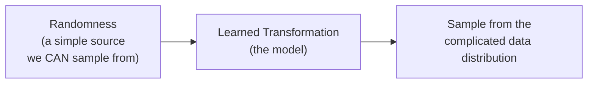

We cannot sample directly from "the distribution of realistic images" — we have no formula for it. But we *can* trivially sample from a Gaussian. So every generative model is, in essence, a machine for **converting easy randomness into hard structure**. The families differ only in *how* they build that converter.

## 1.5 Why generating images is difficult

Four concrete reasons:

1. **Dimensionality.** Hundreds of thousands of numbers must all be jointly consistent. A single wrong region ruins the whole image; humans are extremely good at spotting it.
2. **Multi-scale structure.** Realism requires correctness at every scale simultaneously — global layout (a body has one head), mid-scale (a face has two eyes at the right spacing), and fine texture (skin pores, fabric weave).
3. **The likelihood is intractable.** For most interesting models, computing $p_\theta(x)$ requires an integral over hidden variables that cannot be computed exactly, so we cannot simply do straightforward maximum likelihood.
4. **Multimodality.** There are millions of equally valid "cat photos". A model that averages over them produces a blurry non-cat. The model must commit to *one* coherent option, not the mean of all options.

Keep reason 4 in mind — it is exactly the failure mode that diffusion models avoid so elegantly.

## 1.6 What came before: three earlier approaches

We will look at each briefly. The goal is not history — it is to see **which specific pain each approach has**, so that when diffusion arrives you can see precisely which pain it removes.

### 1.6.1 Autoregressive models

**Basic idea.** Break the image into an ordered sequence of pixels (say, left-to-right, top-to-bottom) and use the chain rule of probability to factor the joint distribution exactly:

$$
p(x) = p(x_1)\, p(x_2 \mid x_1)\, p(x_3 \mid x_1, x_2) \cdots p(x_N \mid x_1,\dots,x_{N-1})
$$

Here $x_i$ is the $i$-th pixel value and $N$ is the number of pixels. Each factor is a small, learnable conditional distribution.

**How generation works.** Sample pixel 1. Feed it back in, sample pixel 2. Repeat $N$ times. (PixelRNN, PixelCNN, and today image-token transformers all work this way.)

**Main strength.** Exact, tractable likelihood. Training is stable and is just next-token prediction — the same well-understood recipe as language models.

**Main limitation.** Generation requires $N$ sequential network calls, one per pixel. For a 256×256 image that is ~196,000 forward passes that cannot be parallelised. Also, the pixel ordering is arbitrary and unnatural — images have no intrinsic "reading order", so the model must carry all global structure through a 1-D scan.

**Why diffusion went elsewhere.** Diffusion also uses many sequential steps, but each step **refines the entire image at once**. The number of steps is a design choice (tens to thousands), not forced to equal the number of pixels. Diffusion decouples "number of refinement steps" from "image resolution".

### 1.6.2 Variational Autoencoders (VAEs)

**Basic idea.** Assume each image $x$ was produced from a small hidden code $z$ (the **latent variable**). Learn two networks:

- an **encoder** $q_\phi(z \mid x)$ that guesses the code for a given image,
- a **decoder** $p_\theta(x \mid z)$ that reconstructs an image from a code.

Train them jointly to maximise a lower bound on the likelihood (the **ELBO** — we will meet it properly in Section 11, and it is the *same* mathematical tool that gives us the DDPM objective).

**How generation works.** Sample a code from a simple prior, $z \sim \mathcal{N}(0, I)$, then run the decoder once: $x = \text{decoder}(z)$. **One** network call.

**Main strength.** Very fast sampling, a meaningful continuous latent space, and stable likelihood-based training.

**Main limitation.** Outputs are typically **blurry**. The reason is reason 4 from §1.5: a single small code $z$ is forced to explain a whole image in one shot, and the reconstruction loss pushes the decoder toward the *average* of all images consistent with $z$. The average of many sharp cats is a blurry cat.

**Why diffusion went elsewhere.** Diffusion replaces "one giant leap from noise to image" with "many small, easy steps". Each step only has to make a *slightly* better guess, so no single step is forced to average over a hugely multimodal set. (Note: VAEs did not disappear — Section 17 shows modern systems use a VAE as a compression layer *around* a diffusion model. The two are complementary.)

### 1.6.3 Generative Adversarial Networks (GANs)

**Basic idea.** Two networks compete. A **generator** $G$ maps noise $z$ to an image. A **discriminator** $D$ tries to tell real images from generated ones. $G$ is trained to fool $D$; $D$ is trained not to be fooled.

**How generation works.** Sample $z \sim \mathcal{N}(0,I)$, run $x = G(z)$. **One** network call — even faster than a VAE in practice.

**Main strength.** Extremely sharp images and very fast single-step sampling. For years GANs held the state of the art on image realism.

**Main limitation.** Training is a min–max game, not a minimisation, so it is notoriously unstable: it can oscillate, diverge, or collapse. The classic failure is **mode collapse** — the generator finds a handful of images that reliably fool the discriminator and produces only those, ignoring most of the data distribution. There is also no straightforward likelihood to monitor, so it is hard to tell how well training is going.

**Why diffusion went elsewhere.** Diffusion training is a **plain regression problem** — predict a known target with mean-squared error. There is no adversary, no game, no instability, and no mode collapse, because the training objective explicitly covers the whole data distribution rather than whatever fools an opponent.

### 1.6.4 Summary comparison

| Family | Sampling cost | Training stability | Sample quality | Mode coverage | Core weakness |
|---|---|---|---|---|---|
| Autoregressive | $O(N)$ passes, $N$ = #pixels | Very stable | High | Good | Painfully slow at image scale |
| VAE | 1 pass | Stable | Blurry | Good | Averaging → blur |
| GAN | 1 pass | Unstable (min–max) | Very sharp | Often poor (collapse) | Fragile training, dropped modes |
| **Diffusion** | $O(T)$ passes, $T$ = #steps (tunable) | Very stable (regression) | Very sharp | Very good | Slow sampling (the price paid) |

**The one-sentence reason diffusion won:** it buys the stability and mode coverage of likelihood-based training *and* the sharpness of GANs, by paying in **inference time** — and inference time turned out to be the easiest of the three currencies to optimise later (Sections 14, 17, 19 are largely the story of paying that bill down).

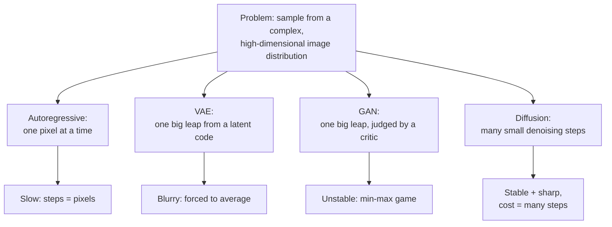

---

# 2. Prerequisites

This section covers the **minimum** mathematics needed. Every item follows the same four-part pattern: plain language → definition → tiny example → why diffusion needs it. If you already know an item, skim its "why diffusion needs it" line, since that framing is used later.

## 2.1 Random variable

**Plain language.** A quantity whose value is decided by chance. Before you look, it has no single value — only a set of possible values with associated chances.

**Definition.** A random variable $X$ is a function from outcomes of a random experiment to numbers. We write $X \sim p$ to say "$X$ is distributed according to $p$".

**Example.** Roll a die: $X \in \{1,\dots,6\}$, each with probability $1/6$.

**Why diffusion needs it.** In diffusion, the *image itself* is a random variable. $x_0$ is a random variable (a random training image), and each noisy version $x_1, x_2, \dots, x_T$ is a random variable too. The entire method is a statement about how these random variables relate.

## 2.2 Probability distribution and probability density

**Plain language.** A description of how likely each possible value is.

**Definition.** For **discrete** variables, a probability mass function $p(x)$ gives $P(X = x)$, with $\sum_x p(x) = 1$.
For **continuous** variables (like pixel intensities), we use a **probability density function** $p(x) \ge 0$ with

$$
\int p(x)\,dx = 1,
\qquad
P(a \le X \le b) = \int_a^b p(x)\,dx .
$$

**Important subtlety.** A density is *not* a probability. $p(x)$ can exceed 1. Only the area under the curve over an interval is a probability, and the probability of any single exact point is zero.

**Example.** A density that is $2$ on $[0, 0.5]$ and $0$ elsewhere is valid: the area is $2 \times 0.5 = 1$, even though the height is 2.

**Why diffusion needs it.** Images are continuous, so $p_{\text{data}}(x)$ is a density. All the $q(\cdot)$ and $p_\theta(\cdot)$ objects you will see are densities. The goal "make $p_\theta$ close to $p_{\text{data}}$" is a statement about densities.

## 2.3 Mean (expectation)

**Plain language.** The long-run average value.

**Definition.** For a continuous random variable,

$$
\mathbb{E}[X] = \int x\, p(x)\, dx .
$$

More generally, for any function $f$,

$$
\mathbb{E}_{x \sim p}[f(x)] = \int f(x)\, p(x)\, dx .
$$

**The single most useful property:** expectation is **linear**:

$$
\mathbb{E}[aX + bY] = a\,\mathbb{E}[X] + b\,\mathbb{E}[Y]
$$

— this holds *always*, even when $X$ and $Y$ are dependent.

**Example.** Fair die: $\mathbb{E}[X] = \tfrac{1}{6}(1+2+3+4+5+6) = 3.5$. Note that 3.5 is not a possible outcome — a mean need not be attainable.

**Why diffusion needs it.** Every loss function in this document is an expectation. The training loss is $\mathbb{E}_{x_0, t, \epsilon}[\,\|\epsilon - \epsilon_\theta(x_t,t)\|^2\,]$, and the practical meaning of "minimise an expectation" is "average the loss over many random samples and do gradient descent" — which is exactly what a training loop does.

## 2.4 Variance and standard deviation

**Plain language.** How spread out the values are around the mean.

**Definition.**

$$
\operatorname{Var}(X) = \mathbb{E}\!\left[(X - \mathbb{E}[X])^2\right] = \mathbb{E}[X^2] - (\mathbb{E}[X])^2,
\qquad
\sigma = \sqrt{\operatorname{Var}(X)} .
$$

**Two rules used constantly below:**

$$
\operatorname{Var}(aX) = a^2 \operatorname{Var}(X)
$$

$$
\operatorname{Var}(X + Y) = \operatorname{Var}(X) + \operatorname{Var}(Y) \quad \text{(only if } X, Y \text{ are independent)}
$$

Notice the **$a^2$**: scaling a variable by $a$ scales its *standard deviation* by $a$ but its *variance* by $a^2$. Forgetting this is the most common error when following diffusion derivations.

**Example.** If $\epsilon \sim \mathcal{N}(0,1)$ then $\operatorname{Var}(\epsilon)=1$, and $3\epsilon$ has variance $9$, standard deviation $3$.

**Why diffusion needs it.** The forward process is defined entirely by *how much variance is injected at each step*. The derivation of the closed-form $q(x_t \mid x_0)$ in Section 4 is, at its heart, just repeated application of these two rules.

## 2.5 Gaussian (normal) distribution

**Plain language.** The classic bell curve. It is the distribution that shows up whenever many small independent effects add together.

**Definition (one dimension).** $X \sim \mathcal{N}(\mu, \sigma^2)$ means

$$
p(x) = \frac{1}{\sqrt{2\pi\sigma^2}} \exp\!\left(-\frac{(x-\mu)^2}{2\sigma^2}\right)
$$

where $\mu$ is the mean and $\sigma^2$ the variance. The **standard normal** is $\mathcal{N}(0,1)$.

**Three properties that make the whole of diffusion work:**

1. **Closed under scaling and shifting.** If $\epsilon \sim \mathcal{N}(0,1)$ then $\mu + \sigma\epsilon \sim \mathcal{N}(\mu, \sigma^2)$. *(This is the reparameterization trick — Section 5.)*
2. **Closed under addition of independents.** If $X \sim \mathcal{N}(0,\sigma_1^2)$ and $Y \sim \mathcal{N}(0,\sigma_2^2)$ are independent, then $X+Y \sim \mathcal{N}(0,\sigma_1^2 + \sigma_2^2)$. **The variances add — not the standard deviations.** *(This is what collapses $T$ noising steps into one formula — Section 4.)*
3. **KL divergence between two Gaussians has a simple closed form.** *(This is what makes the DDPM loss computable — Section 11.)*

**Example.** $\mathcal{N}(0,1)$: about 68% of samples fall in $[-1,1]$, 95% in $[-2,2]$.

**Why diffusion needs it.** Gaussians are the *only* reason diffusion is tractable. Every other choice of noise would leave us with integrals we cannot solve. Property 2 lets us jump to any timestep in one line; property 1 lets gradients flow through sampling; property 3 turns the theoretical objective into a simple squared error.

## 2.6 Multivariate Gaussian

**Plain language.** A bell curve in many dimensions at once.

**Definition.** $\mathbf{x} \sim \mathcal{N}(\boldsymbol{\mu}, \Sigma)$ where $\boldsymbol{\mu} \in \mathbb{R}^d$ is the mean vector and $\Sigma \in \mathbb{R}^{d \times d}$ is the covariance matrix ($\Sigma_{ij}$ = covariance between components $i$ and $j$).

**The special case we always use: isotropic.** When $\Sigma = \sigma^2 I$ (identity matrix scaled), the dimensions are **independent and identically distributed**. Then sampling a $d$-dimensional Gaussian is just sampling $d$ independent 1-D Gaussians. All the 1-D rules above apply component-wise.

**Notation you will see everywhere:** $\mathcal{N}(x_t; \mu, \Sigma)$ means "the density of the multivariate Gaussian with mean $\mu$ and covariance $\Sigma$, evaluated at the point $x_t$". The semicolon separates *the point being evaluated* from *the parameters*.

**Example.** $\mathcal{N}(0, I)$ in 3 dimensions: draw three independent standard normals and stack them into a vector.

**Why diffusion needs it.** The noise added to an image is isotropic Gaussian: independent noise per pixel per channel, all with the same variance. This means all our scalar reasoning carries over unchanged to a 196,608-dimensional image, which is why the maths stays readable.

## 2.7 Conditional probability

**Plain language.** The probability of one thing given that another thing is known.

**Definition.**

$$
p(A \mid B) = \frac{p(A, B)}{p(B)}, \qquad p(B) > 0 .
$$

**Example.** $p(\text{image is a cat} \mid \text{the image has whiskers})$ is much higher than $p(\text{image is a cat})$ alone.

**Why diffusion needs it.** The whole model is a chain of conditionals. $q(x_t \mid x_{t-1})$ = "given the image at step $t-1$, what does step $t$ look like". $p_\theta(x_{t-1} \mid x_t)$ = "given the noisy image now, what did it look like one step earlier". Text conditioning adds another: $p_\theta(x_{t-1} \mid x_t, c)$ where $c$ is the prompt.

## 2.8 Bayes' theorem

**Plain language.** A rule for reversing a conditional — turning "probability of evidence given cause" into "probability of cause given evidence".

**Definition.**

$$
p(A \mid B) = \frac{p(B \mid A)\, p(A)}{p(B)} .
$$

**Example.** A test is 99% accurate for a disease affecting 1 in 10,000 people. Given a positive test, the probability of actually having the disease is only about 1%, because the **prior** $p(A) = 0.0001$ is so small it dominates. Bayes forces you to account for the prior.

**Why diffusion needs it.** This is the exact formal reason the reverse process is hard. We know the forward conditional $q(x_t \mid x_{t-1})$ perfectly. The reverse we want is

$$
q(x_{t-1} \mid x_t) = \frac{q(x_t \mid x_{t-1})\, q(x_{t-1})}{q(x_t)} .
$$

The numerator's first term is known — but $q(x_{t-1})$ is the marginal distribution of *all slightly-noised real images*, which is exactly the intractable thing we were trying to learn in the first place. **Bayes tells us the reverse exists but is uncomputable — hence a neural network.** (Section 6, and the crucial escape hatch in Section 11.3.)

## 2.9 Markov chain

**Plain language.** A sequence of random states where the next state depends only on the current one — the past is irrelevant once you know the present. "Memorylessness."

**Definition.** A sequence $x_0, x_1, \dots, x_T$ is a Markov chain if

$$
p(x_t \mid x_{t-1}, x_{t-2}, \dots, x_0) = p(x_t \mid x_{t-1}) \quad \text{for all } t .
$$

This lets the joint distribution factor into a product of one-step transitions:

$$
p(x_0, x_1, \dots, x_T) = p(x_0) \prod_{t=1}^{T} p(x_t \mid x_{t-1}) .
$$

**Example.** Weather modelled as "tomorrow depends only on today". Knowing last week adds nothing.

**Why diffusion needs it.** Both the forward noising process and the learned reverse process are Markov chains. This is a *design decision*, and a load-bearing one:

- It means the network never needs history — at step $t$ it sees only $x_t$ and $t$. That makes the network small and the training loop simple.
- It makes the joint distribution factor into a product, so the log-likelihood becomes a **sum** of per-step terms. That is what makes the objective decompose into $T$ independent, separately-trainable pieces (Section 11).

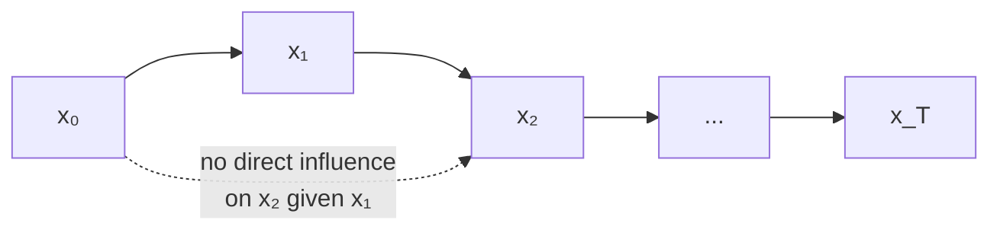

## 2.10 Vectors and tensors

**Plain language.** Containers of numbers with a shape.

**Definition.**
- **Scalar** — a single number (rank 0).
- **Vector** — a 1-D list, $\mathbb{R}^d$ (rank 1).
- **Matrix** — a 2-D grid, $\mathbb{R}^{m\times n}$ (rank 2).
- **Tensor** — the general case, any number of dimensions.

**Example.** A batch of RGB images has shape $[B, 3, H, W]$: batch, channels, height, width. A $64\times64$ RGB image flattened is a vector in $\mathbb{R}^{12288}$.

**Why diffusion needs it.** $x_t$, $\epsilon$, and $\epsilon_\theta(x_t,t)$ all have the *same shape as the image*. That shape-matching is a useful sanity check: the network is an image-to-image map, not an image-to-label map. Text embeddings have a different shape, $[B, L, d]$ (batch, token count, embedding dimension), which is why they must enter via cross-attention rather than by simple addition (Section 15).

## 2.11 Neural networks

**Plain language.** A large parameterised function built from alternating linear transformations and simple non-linear functions, flexible enough to approximate almost any mapping given enough data.

**Definition.** A feed-forward network with parameters $\theta = \{W_i, b_i\}$:

$$
h_0 = x, \qquad h_i = \sigma(W_i h_{i-1} + b_i), \qquad f_\theta(x) = h_L
$$

where $\sigma$ is a non-linearity such as ReLU ($\max(0,z)$) or SiLU. Convolutional layers replace the dense $W_i$ with a small kernel slid across the image, which shares parameters and respects spatial locality.

**Example.** A network mapping a $28\times28$ digit image to 10 class scores.

**Why diffusion needs it.** The network is the *only* learned component in the entire system. Everything else — the noise schedule, the forward process, the sampling update rule — is fixed mathematics chosen by the designer. The network's single job is: **given a noisy image and a timestep, output the noise that is in it.** That is all.

## 2.12 Loss functions

**Plain language.** A number that measures how wrong the model currently is. Lower is better.

**Definition.** Mean squared error (MSE) for a prediction $\hat{y}$ of a target $y$ in $\mathbb{R}^d$:

$$
\mathcal{L} = \frac{1}{d}\sum_{i=1}^{d} (y_i - \hat{y}_i)^2 = \frac{1}{d}\|y - \hat{y}\|^2 .
$$

**A fact worth internalising:** minimising MSE makes the model predict the **conditional mean** of the target, $\mathbb{E}[y \mid \text{input}]$. This is exactly why VAEs blur (§1.6.2) — and understanding why diffusion does *not* blur despite also using MSE is a real insight (see §7.5).

**Example.** Target $\epsilon = [1.0, -0.5]$, prediction $\hat\epsilon = [0.8, -0.3]$. MSE $= \frac{1}{2}(0.04 + 0.04) = 0.04$.

**Why diffusion needs it.** The DDPM training loss is plain MSE between true and predicted noise. No adversary, no likelihood ratio, no reconstruction term — one of the simplest losses in all of generative modelling.

## 2.13 Gradient descent

**Plain language.** Repeatedly nudge the parameters in the direction that most reduces the loss.

**Definition.**

$$
\theta \leftarrow \theta - \eta \, \nabla_\theta \mathcal{L}(\theta)
$$

where $\nabla_\theta \mathcal{L}$ is the gradient (the vector of partial derivatives) and $\eta$ is the **learning rate**. In practice we use **stochastic** gradient descent: estimate the gradient on a small random minibatch rather than the whole dataset, and use an adaptive optimiser such as Adam.

**Example.** $\mathcal{L}(\theta) = \theta^2$, so $\nabla \mathcal{L} = 2\theta$. From $\theta = 3$ with $\eta = 0.1$: $\theta \leftarrow 3 - 0.1(6) = 2.4$. Repeat and it converges to 0.

**Why diffusion needs it.** It is the only training mechanism. Crucially, stochastic gradient descent lets us estimate the loss — which is an expectation over $x_0$, over $t$, *and* over $\epsilon$ — by simply drawing one random sample of each per training example. We never need to sum over all $T$ timesteps.

## 2.14 KL divergence

**Plain language.** A measure of how different one distribution is from another. Zero when identical, larger when more different.

**Definition.**

$$
D_{\mathrm{KL}}(p \parallel q) = \mathbb{E}_{x \sim p}\!\left[\log \frac{p(x)}{q(x)}\right] = \int p(x) \log\frac{p(x)}{q(x)}\,dx .
$$

**Properties.** $D_{\mathrm{KL}} \ge 0$ always, with equality iff $p = q$. It is **not symmetric**: $D_{\mathrm{KL}}(p\|q) \ne D_{\mathrm{KL}}(q\|p)$ in general, so it is not a distance.

**The special case that matters.** For two Gaussians with the *same* covariance $\sigma^2 I$:

$$
D_{\mathrm{KL}}\big(\mathcal{N}(\mu_1, \sigma^2 I) \,\|\, \mathcal{N}(\mu_2, \sigma^2 I)\big) = \frac{\|\mu_1 - \mu_2\|^2}{2\sigma^2} .
$$

**Read that carefully — it is the hinge of the entire DDPM derivation.** A KL divergence between distributions collapses into a *squared distance between their means*. Section 11 uses this to turn an intimidating variational objective into simple MSE.

**Example.** $D_{\mathrm{KL}}(\mathcal{N}(0,1)\|\mathcal{N}(1,1)) = \frac{(0-1)^2}{2} = 0.5$.

**Why diffusion needs it.** The theoretical objective compares the true reverse transition $q$ to the learned one $p_\theta$ at every timestep. That comparison is a KL divergence — and because both are Gaussians with matched variance, it becomes MSE.

## 2.15 Maximum likelihood

**Plain language.** Choose the parameters that make the observed data as probable as possible.

**Definition.**

$$
\theta^\star = \arg\max_\theta \sum_{i=1}^{N} \log p_\theta(x^{(i)})
$$

over training examples $x^{(1)},\dots,x^{(N)}$. We use $\log$ because it turns products into sums (numerically stable, and differentiable-friendly).

**Connection to KL.** Maximising likelihood is equivalent to minimising $D_{\mathrm{KL}}(p_{\text{data}} \parallel p_\theta)$. So "fit the data well" and "make my distribution match the true one" are the same objective. Note the argument order — this direction of KL is **mode-covering**: it heavily penalises assigning near-zero probability to data that actually occurs, so the model is pushed to cover *all* modes. This is the formal reason diffusion (and VAEs) do not mode-collapse the way GANs can.

**Why diffusion needs it.** Diffusion is a likelihood-based model. We cannot compute $\log p_\theta(x_0)$ exactly, so we maximise a lower bound on it (the ELBO). That bound is the starting point of Section 11.

## 2.16 Prerequisite → usage map

| Prerequisite | Where it is used |
|---|---|
| Gaussian: scale/shift closure | Reparameterization (§5) |
| Gaussian: variances add | Closed-form $q(x_t\mid x_0)$ (§4.6) |
| Gaussian: closed-form KL | DDPM objective → MSE (§11.5) |
| Variance rules $\operatorname{Var}(aX)=a^2\operatorname{Var}(X)$ | Every forward-process derivation (§4) |
| Markov property | Factorised joint, per-step losses (§11.2) |
| Bayes' theorem | Why the reverse is intractable (§6.3); why $q(x_{t-1}\mid x_t, x_0)$ *is* tractable (§11.3) |
| KL divergence | ELBO terms (§11.4) |
| Maximum likelihood / ELBO | Justifies the whole training objective (§11) |
| MSE + gradient descent | The actual training loop (§8) |
| Expectation + SGD | Why we can sample one $t$ per example (§8.3) |
| Tensors | Shapes of $x_t$, $\epsilon$, text embeddings (§9, §15) |

---
# 3. Core Intuition (No Mathematics)

Put every formula aside. This section is the idea. If you understand this section, the rest of the document is just making it precise.

## 3.1 The central observation

**Destroying information is easy. Creating it is hard.**

Take a photograph and sprinkle a little random static on it. Easy — anyone can do it. Do it again. And again. After enough repetitions, the photograph is gone and you are looking at pure static. There was nothing clever about any step.

Now try the opposite: start from pure static and produce a photograph. That seems impossible. Static contains no information about any particular photograph.

The diffusion insight is to notice that **the reverse of a very small destructive step is not impossible — it is merely difficult, and it is learnable.**

## 3.2 The key move: make each step tiny

Consider two versions of the reverse problem:

- **Hard version:** "Here is pure static. Produce a photograph." — There is no information to work with. Hopeless as a single deterministic mapping.
- **Easy version:** "Here is a photograph with 3% static added. Remove the static." — This is a routine image-processing task. The image is still clearly visible. A network can learn it from examples easily.

Diffusion models only ever solve the easy version. They solve it **a thousand times in a row.**

Each individual step asks: *"this is slightly noisier than it should be — clean it up a little."* No single step is asked to invent an image. But chained together, a thousand tiny clean-up steps carry you all the way from pure static to a sharp photograph.

> **The analogy that sticks:** sculpting. A block of marble contains no statue. But a sculptor never tries to produce a statue in one blow — each chisel strike is a small, locally-obvious decision. The statue emerges from the accumulation of easy decisions. Diffusion is the same: noise is the marble, and each denoising step is one chisel strike. Nobody ever solves the hard problem.

## 3.3 Where does the creativity come from?

Here is the part that confuses people, so let us be precise about it.

During **training**, we show the network a noisy image and ask it to recover the noise. That is a supervised task with a known answer. No creativity involved.

During **generation**, we hand the network pure random static. The network has never seen this exact static before. It does its job anyway: it looks at the random pattern and says "if this were a slightly-noised real image, the noise component would be roughly *this*." Removing that estimated noise nudges the static a tiny bit toward the realistic region.

Repeat. Each step nudges further into the region of realistic images. The **specific** image you land on is determined by the initial random static — different static, different image. The network supplies the *structure*; the random seed supplies the *choice*.

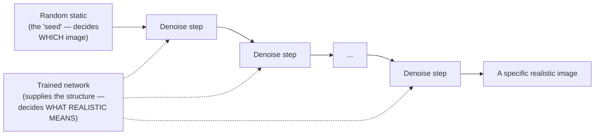

## 3.4 Why the forward process is easy

Three reasons:

1. **It requires no learning.** We *choose* the noising rule. It is a fixed formula, not something fitted to data.
2. **It has no free parameters to get wrong.** We pick how much noise to add at each step (the "schedule") and that is it.
3. **It is exactly computable.** Because the noise is Gaussian, we can skip ahead: we can compute what the image looks like at step 500 directly, without simulating steps 1 through 499. (Section 4.6 proves this; it is the single most important practical fact in the whole method.)

## 3.5 Why the reverse process is hard

Because noising **loses information**, and lost information cannot be recovered with certainty.

Suppose a noisy image has a grey smudge in one region. What was there originally? A shadow? A dark shirt? A dog's nose? Many different clean images, when noised, could produce this exact noisy image. So the reverse is not a function — it is a **distribution over possibilities**.

That is precisely why the reverse step must be *learned* and must be *probabilistic*. The network's job is to characterise that distribution of possibilities — to say "given this noisy input, here is the centre of the cloud of clean images that could have produced it." And crucially, because each step is small, that cloud is *narrow*, so the centre of the cloud is still a sharp image rather than a blurry average. (Compare with the VAE, where one giant step means one enormous cloud and therefore genuine blur — §1.6.2.)

## 3.6 The full picture in one diagram


The two halves are linked by one idea: **the forward process manufactures unlimited labelled training data for the reverse process.** Take any image, add a known amount of noise, and you have an input/target pair for free. No human labelling, no adversary, no tricks. That is why diffusion training is so stable.

## 3.7 What to carry forward

| Question | Answer |
|---|---|
| What is destroyed? | Image structure, gradually, by Gaussian noise |
| Who decides how? | We do — a fixed noise schedule |
| What does the network learn? | To estimate the noise present in a noisy image |
| Where do training labels come from? | The forward process generates them for free |
| Where does novelty come from? | The random starting noise at generation time |
| Why not one big step? | One big step forces averaging over too many possibilities → blur |

---

# 4. Forward Diffusion Process

Now we make Section 3's "add a little noise" precise.

## 4.1 The objects and their names

Define everything before using it:

| Symbol | Meaning |
|---|---|
| $x_0$ | The **clean data sample** — a real training image. Subscript 0 = "zero noise added". Shape $[C,H,W]$. |
| $T$ | The total number of diffusion steps. In original DDPM, $T = 1000$. |
| $t$ | The **timestep**, an integer in $\{1,\dots,T\}$. It is a *noise level index*, not physical time. |
| $x_t$ | The data sample after $t$ noising steps. Same shape as $x_0$. |
| $x_T$ | The fully noised endpoint, designed to be indistinguishable from pure Gaussian noise. |
| $\epsilon$ | A sample of standard Gaussian noise, $\epsilon \sim \mathcal{N}(0, I)$. Same shape as $x_0$. |
| $\beta_t$ | The **noise schedule** — how much variance is injected at step $t$. A small positive number. |
| $\alpha_t$ | Defined as $1 - \beta_t$. The fraction of "signal variance" surviving step $t$. |
| $\bar{\alpha}_t$ | Defined as $\prod_{s=1}^{t} \alpha_s$. The fraction of signal surviving *all* steps up to $t$. |

A note on conventions: images are scaled to $[-1, 1]$ rather than $[0,1]$, so that the data is roughly zero-centred with variance near 1 — the same scale as the noise we add. This matters, as §4.5 will show.

## 4.2 One forward step

**The rule.** To go from $x_{t-1}$ to $x_t$: shrink the current image slightly, then add a little fresh Gaussian noise.

$$
q(x_t \mid x_{t-1}) = \mathcal{N}\!\left(x_t;\ \sqrt{1-\beta_t}\, x_{t-1},\ \beta_t I\right)
$$

**Read this out loud:** "the distribution of $x_t$ given $x_{t-1}$ is a Gaussian whose mean is $\sqrt{1-\beta_t}$ times $x_{t-1}$, and whose covariance is $\beta_t$ times the identity."

In sampling form (using the reparameterization idea of §2.5, property 1):

$$
x_t = \sqrt{1-\beta_t}\, x_{t-1} + \sqrt{\beta_t}\, \epsilon_t,
\qquad \epsilon_t \sim \mathcal{N}(0, I)
$$

Two things happen at each step:

1. **Shrink:** multiply the signal by $\sqrt{1-\beta_t} < 1$. The image fades slightly toward zero.
2. **Inject:** add noise with standard deviation $\sqrt{\beta_t}$.

The whole forward process is a Markov chain (§2.9):

$$
q(x_{1:T} \mid x_0) = \prod_{t=1}^{T} q(x_t \mid x_{t-1})
$$

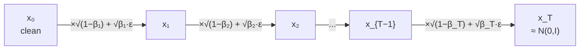

## 4.3 Why the shrink factor is $\sqrt{1-\beta_t}$ and not 1

This is the first "why is this step necessary" question, and it has a clean answer.

Suppose we did **not** shrink — we just added noise: $x_t = x_{t-1} + \sqrt{\beta_t}\epsilon_t$. Then variance would grow without bound:

$$
\operatorname{Var}(x_T) = \operatorname{Var}(x_0) + \sum_{t=1}^{T}\beta_t \longrightarrow \text{large and schedule-dependent}
$$

The endpoint would be a Gaussian of unknown, ever-growing scale. At generation time we would not know what distribution to start sampling from.

Now redo it *with* the shrink. Assume $\operatorname{Var}(x_{t-1}) = 1$ (per component). Using $\operatorname{Var}(aX) = a^2\operatorname{Var}(X)$ and independence (§2.4):

$$
\operatorname{Var}(x_t) = (1-\beta_t)\cdot 1 + \beta_t = 1
$$

**The variance is exactly preserved.** This is called a **variance-preserving** process. The shrink factor is chosen precisely so that the total variance stays pinned at 1 forever. That is why the endpoint is reliably $\mathcal{N}(0,I)$ — a distribution we can sample from trivially at generation time.

> **The design logic:** we need the forward process to end somewhere *we can start from*. $\mathcal{N}(0,I)$ is the obvious choice. Variance preservation is what guarantees we land there.

## 4.4 The noise schedule: $\beta_t$, $\alpha_t$, $\bar\alpha_t$

The **noise schedule** is the sequence $\beta_1, \beta_2, \dots, \beta_T$. It is a design choice, fixed before training.

Original DDPM used a **linear schedule**: $\beta_t$ increasing linearly from $\beta_1 = 10^{-4}$ to $\beta_T = 0.02$ over $T=1000$ steps.

Why start small and increase? Early steps operate on a nearly-clean image, where even a little noise destroys a lot of relative detail; later steps operate on an already-noisy image, where a lot of noise makes little difference. A gently increasing schedule spreads the *perceptual* destruction evenly across timesteps, which means every timestep is equally informative to train on.

Now the two derived quantities:

$$
\alpha_t := 1 - \beta_t
\qquad\text{(signal variance retained at step } t)
$$

$$
\bar{\alpha}_t := \prod_{s=1}^{t}\alpha_s
\qquad\text{(signal variance retained across ALL steps up to } t)
$$

$\bar\alpha_t$ is the star of the show. It starts at $\bar\alpha_0 = 1$ (no noise) and decays monotonically toward $\bar\alpha_T \approx 0$ (all noise). **$\bar\alpha_t$ is the single number that fully characterises "how noisy is timestep $t$".**

| Quantity | Range | Interpretation |
|---|---|---|
| $\beta_t$ | small, e.g. $10^{-4} \to 0.02$ | noise added at this one step |
| $\alpha_t = 1-\beta_t$ | close to 1 | signal kept at this one step |
| $\bar\alpha_t = \prod \alpha_s$ | $1 \to 0$ | signal kept cumulatively |
| $\sqrt{\bar\alpha_t}$ | $1 \to 0$ | multiplier on the clean image |
| $\sqrt{1-\bar\alpha_t}$ | $0 \to 1$ | multiplier on the noise |

## 4.5 Signal-to-noise ratio

Anticipating §4.6's result, $x_t$ will turn out to be $\sqrt{\bar\alpha_t}x_0 + \sqrt{1-\bar\alpha_t}\epsilon$. The **signal-to-noise ratio** is the ratio of signal variance to noise variance:

$$
\mathrm{SNR}(t) = \frac{\bar{\alpha}_t}{1-\bar{\alpha}_t}
$$

- $t$ small → $\bar\alpha_t \approx 1$ → SNR is huge → the image dominates, noise is a faint film.
- $t$ large → $\bar\alpha_t \approx 0$ → SNR $\approx 0$ → noise dominates, the image is invisible.

**Why this concept is worth having a name for:** SNR is what the noise schedule is *really* controlling. Two different $\beta$ schedules that produce the same SNR curve are equivalent processes. When you later hear that "the cosine schedule is better for high resolutions", the actual claim is: *the linear schedule drives SNR to zero too early, so the last ~20% of timesteps are pure noise and contribute nothing to training*. Thinking in SNR makes schedule design intuitive rather than arbitrary.

## 4.6 Deriving the closed form $q(x_t \mid x_0)$

**The problem this solves.** Training needs noisy images at random timesteps. If we had to simulate — run 700 sequential steps to get $x_{700}$ — training would be hopelessly slow. We want to jump straight to any $t$. Let us derive that.

**Step 1 — write the recursion using $\alpha_t = 1-\beta_t$:**

$$
x_t = \sqrt{\alpha_t}\, x_{t-1} + \sqrt{1-\alpha_t}\; \epsilon_t, \qquad \epsilon_t \sim \mathcal{N}(0,I)
$$

**Step 2 — substitute the same rule for $x_{t-1}$:**

$$
x_{t-1} = \sqrt{\alpha_{t-1}}\, x_{t-2} + \sqrt{1-\alpha_{t-1}}\; \epsilon_{t-1}
$$

Plug it in:

$$
x_t = \sqrt{\alpha_t}\left(\sqrt{\alpha_{t-1}}\,x_{t-2} + \sqrt{1-\alpha_{t-1}}\;\epsilon_{t-1}\right) + \sqrt{1-\alpha_t}\;\epsilon_t
$$

$$
x_t = \sqrt{\alpha_t \alpha_{t-1}}\; x_{t-2}
\;+\; \underbrace{\sqrt{\alpha_t(1-\alpha_{t-1})}\;\epsilon_{t-1} \;+\; \sqrt{1-\alpha_t}\;\epsilon_t}_{\text{two independent Gaussian terms}}
$$

**Step 3 — merge the two noise terms.** This is where §2.5 property 2 earns its keep. Both terms are zero-mean Gaussians and they are independent, so their sum is a zero-mean Gaussian whose **variance is the sum of the variances**:

$$
\operatorname{Var} = \alpha_t(1-\alpha_{t-1}) + (1-\alpha_t)
= \alpha_t - \alpha_t\alpha_{t-1} + 1 - \alpha_t
= 1 - \alpha_t \alpha_{t-1}
$$

Beautiful cancellation. So the two noises collapse into a single one:

$$
x_t = \sqrt{\alpha_t\alpha_{t-1}}\; x_{t-2} + \sqrt{1 - \alpha_t\alpha_{t-1}}\;\bar\epsilon,
\qquad \bar\epsilon \sim \mathcal{N}(0,I)
$$

> **Do not skip past the cancellation.** Notice the pattern: the coefficient on the image is $\sqrt{\text{product of }\alpha}$, and the coefficient on the noise is $\sqrt{1 - \text{that same product}}$. The two coefficients are *locked together* — their squares sum to 1. That is variance preservation (§4.3) showing up again, and it is what makes the recursion collapse so cleanly.

**Step 4 — induct.** The structure is now self-similar. Repeating all the way down to $x_0$ replaces the product $\alpha_t\alpha_{t-1}$ with the full product $\prod_{s=1}^{t}\alpha_s = \bar\alpha_t$:

$$
\boxed{\;x_t = \sqrt{\bar{\alpha}_t}\, x_0 + \sqrt{1-\bar{\alpha}_t}\;\epsilon, \qquad \epsilon\sim\mathcal{N}(0,I)\;}
$$

In distribution form:

$$
q(x_t \mid x_0) = \mathcal{N}\!\left(x_t;\ \sqrt{\bar{\alpha}_t}\,x_0,\ (1-\bar{\alpha}_t)I\right)
$$

**What this says in words:** the noisy image at *any* timestep is just a weighted blend of the original image and one draw of pure noise, with weights $\sqrt{\bar\alpha_t}$ and $\sqrt{1-\bar\alpha_t}$. A crossfade.

## 4.7 Why the closed form matters so much

Three consequences, all essential:

1. **$O(1)$ training data generation.** To build a training example at $t = 700$, draw one $\epsilon$ and compute one weighted sum. No simulation. Without this, DDPM training would be ~1000× slower and the method would be impractical.
2. **Random timestep sampling.** Because any $t$ costs the same, each training example can use a *randomly chosen* $t$. This is what lets a single network learn all $T$ noise levels from one simple loop (§8).
3. **The noise $\epsilon$ is known exactly.** We *drew* it. So we have a perfect supervision target for free — which is the seed of the noise-prediction objective (§7).

## 4.8 A small numerical example

Take a single pixel with value $x_0 = 0.8$, and a toy schedule with $T=4$:

| $t$ | $\beta_t$ | $\alpha_t = 1-\beta_t$ | $\bar\alpha_t = \prod\alpha_s$ | $\sqrt{\bar\alpha_t}$ | $\sqrt{1-\bar\alpha_t}$ | SNR $=\frac{\bar\alpha_t}{1-\bar\alpha_t}$ |
|---|---|---|---|---|---|---|
| 1 | 0.1 | 0.90 | 0.9000 | 0.9487 | 0.3162 | 9.00 |
| 2 | 0.2 | 0.80 | 0.7200 | 0.8485 | 0.5292 | 2.57 |
| 3 | 0.3 | 0.70 | 0.5040 | 0.7099 | 0.7042 | 1.02 |
| 4 | 0.5 | 0.50 | 0.2520 | 0.5020 | 0.8649 | 0.34 |

Now suppose at $t=3$ we draw noise $\epsilon = 1.2$. Then:

$$
x_3 = \sqrt{0.5040}\cdot 0.8 + \sqrt{0.4960}\cdot 1.2 = 0.7099 \times 0.8 + 0.7042 \times 1.2 = 0.5679 + 0.8450 = 1.413
$$

Observations worth noting:

- At $t=3$ the SNR has already dropped to ~1: the noise contribution (0.845) now exceeds the signal contribution (0.568). The pixel value 1.413 tells you almost nothing about the original 0.8.
- The network's task at $t=3$ is: given the input $1.413$ (and $t=3$), output $1.2$. It cannot do this exactly — many $(x_0,\epsilon)$ pairs give $1.413$ — so it outputs the best average guess. That is fine, and §7.5 explains why.
- Notice $\bar\alpha_t$ decays *multiplicatively*. Even modest $\beta$ values drive it to zero quickly, which is why real schedules use $\beta \sim 10^{-4}$ and $T \sim 1000$.

## 4.9 Two views of the forward process

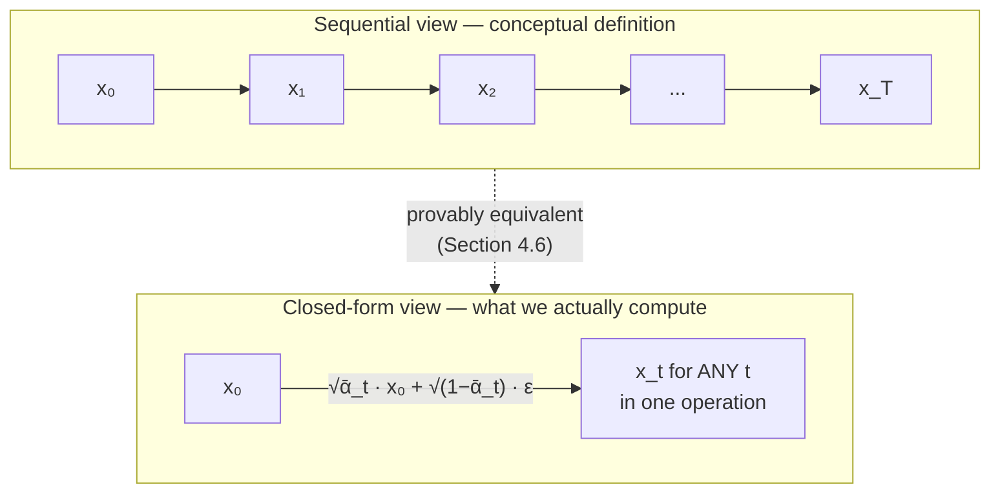

Both describe the same distribution. The sequential view defines the process and makes the Markov structure visible; the closed-form view is what the training loop uses. Being able to move between them freely is a sign you have understood the forward process.

---

# 5. Reparameterization

Section 4.6 already used this trick twice. Now let us name it and understand why it is indispensable.

## 5.1 The problem it solves

We want to write "draw a sample from $\mathcal{N}(\mu, \sigma^2)$" in a way that is:

1. **Differentiable** — gradients must flow back through the sampling operation to whatever produced $\mu$ and $\sigma$.
2. **Algebraically manipulable** — we want to substitute and simplify, as we did in §4.6.

A raw "sample from this distribution" operation is a black box. You cannot differentiate through it, and you cannot do algebra with it.

## 5.2 The trick

Separate the randomness from the parameters:

$$
z \sim \mathcal{N}(\mu, \sigma^2)
\quad\Longleftrightarrow\quad
z = \mu + \sigma\,\epsilon, \quad \epsilon \sim \mathcal{N}(0, I)
$$

All the randomness now lives in $\epsilon$, which is a **fixed, parameter-free** source of noise. Everything else ($\mu$, $\sigma$) is a deterministic function that we can differentiate and manipulate.

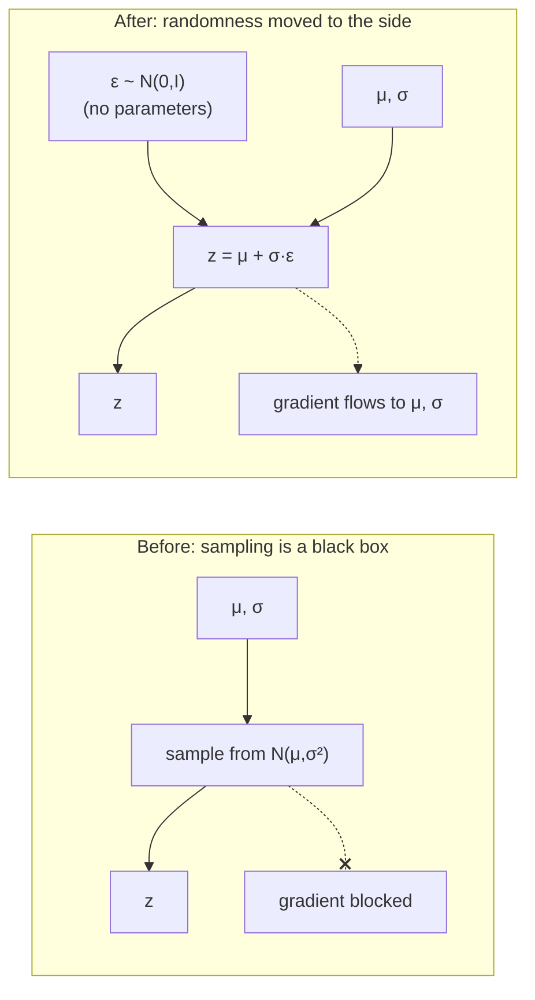

## 5.3 Applying it to the forward process, step by step

**Start with the one-step definition:**

$$
q(x_t \mid x_{t-1}) = \mathcal{N}\!\left(x_t;\ \sqrt{\alpha_t}\,x_{t-1},\ (1-\alpha_t)I\right)
$$

**Identify mean and standard deviation:**

- mean $\mu = \sqrt{\alpha_t}\, x_{t-1}$
- variance $\sigma^2 = 1-\alpha_t$, so standard deviation $\sigma = \sqrt{1-\alpha_t}$

**Apply the trick:**

$$
x_t = \underbrace{\sqrt{\alpha_t}\, x_{t-1}}_{\text{scaled clean-ish sample}} + \underbrace{\sqrt{1-\alpha_t}}_{\text{noise scaling}} \cdot \underbrace{\epsilon_t}_{\text{standard Gaussian}}
$$

**Now do the same for the closed form** derived in §4.6:

$$
q(x_t \mid x_0) = \mathcal{N}\!\left(x_t;\ \sqrt{\bar\alpha_t}\,x_0,\ (1-\bar\alpha_t)I\right)
\quad\Longrightarrow\quad
x_t = \sqrt{\bar{\alpha}_t}\,x_0 + \sqrt{1-\bar{\alpha}_t}\,\epsilon
$$

## 5.4 Anatomy of the equation

$$
x_t \;=\; \underbrace{\sqrt{\bar{\alpha}_t}}_{\text{signal scale}} \; \underbrace{x_0}_{\text{clean sample}} \;+\; \underbrace{\sqrt{1-\bar{\alpha}_t}}_{\text{noise scale}} \; \underbrace{\epsilon}_{\text{Gaussian noise}}
$$

| Component | Role | Behaviour as $t$ grows |
|---|---|---|
| $x_0$ | the clean sample | fixed |
| $\sqrt{\bar\alpha_t}$ | how loud the image is | $1 \to 0$ |
| $\epsilon$ | one draw of standard noise | fixed once drawn |
| $\sqrt{1-\bar\alpha_t}$ | how loud the noise is | $0 \to 1$ |
| $x_t$ | the result | clean image $\to$ pure noise |

Because $(\sqrt{\bar\alpha_t})^2 + (\sqrt{1-\bar\alpha_t})^2 = 1$, the two coefficients trace a quarter circle as $t$ goes from 0 to $T$. It is exactly an audio crossfade between two tracks: "image" fading out, "noise" fading in, with total power held constant.

## 5.5 Why this enables direct sampling of $x_t$

Without reparameterization, "get me $x_{700}$" means: sample $x_1$ from $q(\cdot\mid x_0)$, then sample $x_2$ from $q(\cdot \mid x_1)$, … 700 nested sampling operations, each depending on the last. Sequential, slow, and impossible to simplify algebraically.

With reparameterization, each step became an **algebraic expression**, so the steps could be substituted into one another and simplified (§4.6). Seven hundred nested sampling operations collapsed into one line with two multiplications and one addition.

**This is not a minor convenience — it is the reason DDPM training is feasible at all.** It is what allows the training loop to pick a random $t$ for each image and construct the training pair instantly.

## 5.6 The second, subtler payoff

Reparameterization also **exposes $\epsilon$ as an explicit variable in the equation**.

Look again: $x_t = \sqrt{\bar\alpha_t}x_0 + \sqrt{1-\bar\alpha_t}\,\epsilon$. Three quantities appear — $x_t$, $x_0$, $\epsilon$ — and knowing any two determines the third. In particular:

$$
x_0 = \frac{x_t - \sqrt{1-\bar{\alpha}_t}\,\epsilon}{\sqrt{\bar{\alpha}_t}}
$$

**This rearrangement is the bridge to everything that follows.** It says: *if you know the noise, you know the clean image.* So "predict the noise" and "predict the clean image" are the same task wearing different clothes. Section 7 explains why we choose the noise version, and Section 12 uses this exact formula inside the sampler.

---

# 6. Reverse Diffusion Process

## 6.1 The central question

> If adding noise is easy, how do we learn to remove it?

We have a forward chain $x_0 \to x_1 \to \dots \to x_T$ that we fully understand. To generate, we need to run it backwards: start at $x_T \sim \mathcal{N}(0,I)$ and walk back to $x_0$.

Formally, to take one step backwards we need the distribution

$$
q(x_{t-1} \mid x_t)
$$

— "given the noisy image at step $t$, what was it at step $t-1$?"

## 6.2 A remarkable fact that makes this plausible

Before showing why it is hard, here is why it is *possible at all*.

**Theorem (Feller, 1949).** If the forward step is Gaussian with sufficiently small variance $\beta_t$, then the reverse step $q(x_{t-1}\mid x_t)$ is **also approximately Gaussian**.

This is a deep and non-obvious result, and the entire method rests on it:

- It tells us what *shape* the reverse distribution has. We don't have to represent an arbitrary distribution over images — just a Gaussian, which needs only a mean and a variance.
- Therefore a neural network only needs to output a **mean vector** (and optionally a variance). That is a manageable regression task.
- **The condition "$\beta_t$ small" is why $T$ must be large.** If we tried $T=10$ with huge $\beta_t$, the true reverse would be wildly non-Gaussian (multi-modal — "this smudge was either a nose or a shadow") and a Gaussian approximation would fail badly.

> **This is the formal version of §3.2's "make each step tiny".** Small steps → reverse is Gaussian → learnable by a network. Big steps → reverse is multi-modal → a Gaussian model would average the modes → blur. It is the same tension that limits VAEs, and diffusion resolves it by taking many small steps.

## 6.3 Why the reverse is nonetheless intractable

We know the shape is Gaussian. Why can't we just compute its mean? Apply Bayes' theorem (§2.8):

$$
q(x_{t-1}\mid x_t) = \frac{q(x_t \mid x_{t-1})\; q(x_{t-1})}{q(x_t)}
$$

Examine each piece:

| Term | Status |
|---|---|
| $q(x_t \mid x_{t-1})$ | **Known** — we defined it |
| $q(x_{t-1})$ | **Unknown** — the marginal distribution over all slightly-noised real images |
| $q(x_t)$ | **Unknown** — same problem |

The marginal is

$$
q(x_{t-1}) = \int q(x_{t-1}\mid x_0)\, p_{\text{data}}(x_0)\, dx_0
$$

an integral over the *entire data distribution* — the very object we set out to learn in Section 1. **We are going in a circle.**

**The intuitive statement of the same fact:** to denoise well you must know what realistic images look like. There is no way around it. Denoising and knowing-the-data-distribution are the same knowledge.

And that is precisely why we need a neural network: it will **learn** that knowledge from data, absorbing $p_{\text{data}}$ into its weights.

## 6.4 The learned reverse process

We define a parameterised family and fit it:

$$
p_\theta(x_{t-1}\mid x_t) = \mathcal{N}\!\left(x_{t-1};\ \mu_\theta(x_t, t),\ \Sigma_\theta(x_t,t)\right)
$$

where:

- $\theta$ — the neural network's weights;
- $\mu_\theta(x_t,t)$ — the predicted **mean** of the previous step, computed by the network from the current noisy image and the timestep;
- $\Sigma_\theta(x_t,t)$ — the **covariance**. Original DDPM fixes this to $\sigma_t^2 I$ with $\sigma_t^2 = \beta_t$ (or $\tilde\beta_t$, see §11.3), rather than learning it — this works well and simplifies everything. Later work (improved DDPM) learns it to get better likelihoods.

The full generative model is this chain plus a fixed starting point:

$$
p_\theta(x_{0:T}) = p(x_T)\prod_{t=1}^{T} p_\theta(x_{t-1}\mid x_t),
\qquad p(x_T) = \mathcal{N}(x_T; 0, I)
$$

**Note what is learned and what is not.** $p(x_T) = \mathcal{N}(0,I)$ is *not* learned — it is free, given to us by the variance-preserving design of §4.3. All the learning is concentrated in $\mu_\theta$.

## 6.5 What the network actually learns

Strip away the notation. The network learns a single skill:

> **Given a noisy image and a statement of how noisy it is, identify which part is noise and which part is structure.**

To do that well across all timesteps, it must internalise:

- **Low noise levels ($t$ small):** fine texture statistics. What does real skin/fabric/foliage grain look like versus random static?
- **Medium noise levels:** object parts and their arrangement. Edges, shapes, plausible geometry.
- **High noise levels ($t$ large):** global composition. Overall colour balance, layout, where a subject should sit in the frame.

This is why a single network must be **conditioned on $t$** — it is really performing $T$ different jobs, and $t$ tells it which one (Section 10).

## 6.6 Forward vs reverse: the fundamental asymmetry

| Aspect | Forward diffusion | Reverse diffusion |
|---|---|---|
| **Status** | **Known / fixed** | **Learned** |
| Defined by | Our chosen noise schedule $\beta_t$ | Neural network weights $\theta$ |
| Direction | $x_0 \to x_T$ | $x_T \to x_0$ |
| Needs training? | No | Yes |
| Computable in closed form? | Yes — jump to any $t$ instantly | No — must step one at a time |
| Information | Destroys it | Restores it (approximately) |
| Distribution | $q(x_t\mid x_{t-1})$, exact | $p_\theta(x_{t-1}\mid x_t)$, approximate |
| Role | Manufactures training data | Generates samples |
| Cost | Negligible | $T$ network evaluations |

The asymmetry in the "computable in closed form" row deserves emphasis. **Training is cheap because the forward process has a shortcut; sampling is expensive because the reverse process does not.** Every speed-up technique in Sections 14 and 19 is an attempt to fake a shortcut for the reverse direction.

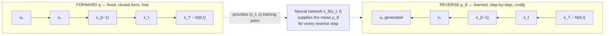

---

# 7. Why Predict Noise?

We have established that the network must produce $\mu_\theta(x_t,t)$, the mean of the reverse step. But DDPM does not have the network output $\mu_\theta$ directly. Instead it outputs **the noise**, $\epsilon_\theta(x_t, t)$, and $\mu_\theta$ is computed from it by a fixed formula.

This looks like an odd detour. This section explains why it is the right choice — not as a fact to memorise, but as something you could have arrived at yourself.

## 7.1 Three equivalent things the network could predict

Recall the bridge equation from §5.6:

$$
x_t = \sqrt{\bar\alpha_t}\,x_0 + \sqrt{1-\bar\alpha_t}\,\epsilon
$$

At training time we know all of $x_t$, $x_0$, $\epsilon$, and $\bar\alpha_t$. At sampling time we know $x_t$ and $\bar\alpha_t$ but neither $x_0$ nor $\epsilon$. Since the equation links them, predicting any one of the unknowns gives the other:

| Parameterisation | Network outputs | Recover the rest via |
|---|---|---|
| **$x_0$-prediction** | the clean image $\hat{x}_0$ | $\hat\epsilon = \dfrac{x_t - \sqrt{\bar\alpha_t}\hat{x}_0}{\sqrt{1-\bar\alpha_t}}$ |
| **$\epsilon$-prediction** | the noise $\hat\epsilon$ | $\hat{x}_0 = \dfrac{x_t - \sqrt{1-\bar\alpha_t}\,\hat\epsilon}{\sqrt{\bar\alpha_t}}$ |
| **$\mu$-prediction** | the reverse mean directly | — |

These are **mathematically equivalent** — the same information, algebraically rearranged. But they are **not equivalent for learning**, because they lead to different loss landscapes and different error amplification. That is the whole question.

## 7.2 Reason 1: the target has constant scale

Consider what each target looks like across timesteps.

- **$x_0$ as a target:** always the same clean image, regardless of $t$. Fine.
- **$\epsilon$ as a target:** always distributed as $\mathcal{N}(0,I)$, regardless of $t$. Also fine.
- **$\mu$ as a target:** its scale varies substantially with $t$.

Both $x_0$ and $\epsilon$ have stable scale, so both beat direct $\mu$-prediction. But $\epsilon$ has a special property: **it is exactly standard normal at every timestep.** Zero mean, unit variance, always. A regression target that is pre-normalised for free is exactly what makes neural network training well-behaved — no per-timestep loss reweighting is needed just to keep gradients comparable.

## 7.3 Reason 2: the difficulty is distributed evenly

This is the deeper reason. Ask: *how hard is the prediction task at each extreme?*

**At high noise ($t$ large, $\bar\alpha_t \approx 0$):**

- Predicting $x_0$ is **nearly impossible**. The input is essentially pure noise and contains almost no information about the original image. The MSE-optimal answer is close to the dataset mean — a grey blur. The network would be trained to output blurs for most timesteps.
- Predicting $\epsilon$ is **nearly trivial**. Since $x_t \approx \epsilon$, the network can almost copy its input. Easy, and correct.

**At low noise ($t$ small, $\bar\alpha_t \approx 1$):**

- Predicting $x_0$ is **nearly trivial**: $x_t \approx x_0$, so copy the input.
- Predicting $\epsilon$ is **hard**: the network must detect a faint film of static on a sharp image. But this is a *genuinely solvable* task — it is classic denoising, and a good answer exists.

Now the key comparison. Both parameterisations have an easy end and a hard end. **The difference is what happens at the hard end:**

- $x_0$-prediction's hard end is hard because *the information is not there*. No amount of training helps. The best possible answer is a useless blur.
- $\epsilon$-prediction's hard end is hard because *the signal is subtle*. The information **is** present in the input; the network just needs capacity and training to extract it. The best possible answer is a genuinely good one.

> **$\epsilon$-prediction converts an impossible task into a merely difficult one.** That is the real reason it works better in practice.

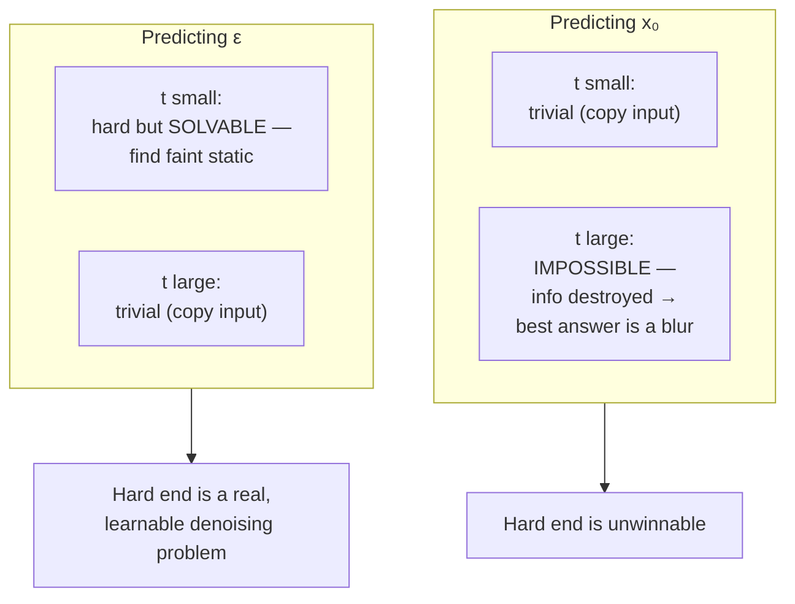

## 7.4 Reason 3: it connects to score matching

A brief but illuminating note. The **score** of a distribution is the gradient of its log-density, $\nabla_{x}\log q(x)$ — a vector field pointing "uphill" toward higher-probability regions. For our Gaussian $q(x_t\mid x_0)$ one can show

$$
\nabla_{x_t}\log q(x_t \mid x_0) = -\frac{\epsilon}{\sqrt{1-\bar{\alpha}_t}}
$$

So predicting $\epsilon$ is, up to a known constant, **predicting the score**. This means:

$$
\epsilon_\theta(x_t,t) \approx -\sqrt{1-\bar\alpha_t}\;\nabla_{x_t}\log q(x_t)
$$

The interpretation is vivid: **the predicted noise points "downhill", away from the data manifold. Subtracting it moves the sample uphill, toward higher data density.** Each denoising step is a step of gradient ascent on the log-likelihood of the data.

This also unifies two literatures — Ho et al.'s DDPM and Song & Ermon's score-based generative models turned out to be the same algorithm described in two languages, later shown by Song et al. to be discretisations of a common stochastic differential equation.

## 7.5 Why MSE here does not cause blur

A fair objection: §2.12 said MSE makes a model predict the conditional mean, and §1.6.2 blamed that for VAE blur. We are using MSE. Why no blur?

Because of *what* is being averaged.

- **VAE:** the MSE is on the **image**. The model outputs $\mathbb{E}[x_0 \mid z]$ — the average over all images consistent with the code. Averaging images in pixel space destroys high frequencies. **Blur.**
- **Diffusion:** the MSE is on the **noise**. The model outputs $\mathbb{E}[\epsilon \mid x_t, t]$ — the average over noise patterns consistent with this noisy image. This averaged quantity is then used to take *one small step*, after which **fresh random noise is added** (see §12). The sampler never renders an average as a final image.

The sharpness is preserved by the *process*, not by the loss. Each step commits to a slightly more specific image, and the injected randomness keeps the trajectory from collapsing onto a mean. By the time $t$ reaches 0, the accumulated commitments have selected one specific sharp image out of the space of possibilities.

> This is the single best answer to "why is diffusion better than a VAE?" — both minimise a squared error, but diffusion's iterative structure means no single prediction ever has to be the final image.

## 7.6 The noise-prediction objective

Assemble it. Define the **noise prediction error** at a given $(x_0, t, \epsilon)$:

$$
\left\| \epsilon - \epsilon_\theta\!\left(x_t, t\right) \right\|^2
\quad\text{where}\quad
x_t = \sqrt{\bar\alpha_t}x_0 + \sqrt{1-\bar\alpha_t}\epsilon
$$

Averaging over the data, over timesteps, and over noise draws gives the DDPM **simplified objective**:

$$
\boxed{\;
\mathcal{L}_{\text{simple}}(\theta)
=
\mathbb{E}_{\,x_0 \sim p_{\text{data}},\; t \sim \mathcal{U}\{1,\dots,T\},\; \epsilon \sim \mathcal{N}(0,I)}
\left[
\left\|
\epsilon - \epsilon_\theta\!\left(\sqrt{\bar{\alpha}_t}\,x_0 + \sqrt{1-\bar{\alpha}_t}\,\epsilon,\; t\right)
\right\|^2
\right]\;}
$$

Every symbol:

| Symbol | Meaning |
|---|---|
| $x_0 \sim p_{\text{data}}$ | a real training image drawn at random |
| $t \sim \mathcal{U}\{1,\dots,T\}$ | a timestep drawn uniformly at random |
| $\epsilon \sim \mathcal{N}(0,I)$ | the true noise, drawn at random |
| $\sqrt{\bar\alpha_t}x_0 + \sqrt{1-\bar\alpha_t}\epsilon$ | the constructed noisy image $x_t$ |
| $\epsilon_\theta(\cdot,\cdot)$ | the neural network, outputting a tensor shaped like the image |
| $\|\cdot\|^2$ | squared L2 norm — plain MSE over all pixels and channels |

**Pause on how simple this is.** It is a supervised regression problem. Corrupt an image by a known amount, ask the network what the corruption was, score it with MSE. No adversary, no sampling loop inside training, no intractable term. Section 11 will show that this innocuous-looking objective is a principled simplification of a proper variational bound — it is not a heuristic.

## 7.7 From predicted noise back to a denoising step

Finally, the link back to Section 6. Given $\epsilon_\theta(x_t,t)$, we get the reverse-step mean by a fixed formula (derived in §11.6):

$$
\mu_\theta(x_t,t) = \frac{1}{\sqrt{\alpha_t}}\left( x_t - \frac{\beta_t}{\sqrt{1-\bar{\alpha}_t}}\,\epsilon_\theta(x_t,t) \right)
$$

Read it structurally, ignoring the constants:

$$
\text{new estimate} \;=\; \frac{1}{\sqrt{\alpha_t}}\Big(\underbrace{x_t}_{\text{what we have}} \;-\; \underbrace{(\text{small factor}) \times \hat\epsilon}_{\text{remove a bit of the estimated noise}}\Big)
$$

Note the factor $\frac{\beta_t}{\sqrt{1-\bar\alpha_t}}$ is **small** — we do not subtract all the predicted noise. Subtracting all of it would jump straight to $\hat{x}_0$, which (per §7.3) would be a blurry average at high $t$. Instead we remove only one step's worth, then rescale by $1/\sqrt{\alpha_t}$ to undo that step's shrinkage. **Predicting the noise tells us the direction to move; the schedule tells us how far to go.**

---
# 8. DDPM Training Algorithm

Everything from Sections 4–7 now collapses into a training loop that fits on half a page.

## 8.1 The algorithm

```text
Algorithm 1 — TRAIN_DIFFUSION_MODEL

Given:
    dataset  D           of clean images
    schedule β₁ … β_T    (fixed, chosen in advance)
    precompute  α_t  = 1 − β_t
    precompute  ᾱ_t  = α₁ · α₂ · … · α_t        for all t
    network  ε_θ         (randomly initialised)

repeat until converged:

    1.  x₀  ←  sample a clean image from D

    2.  t   ←  sample a timestep uniformly from {1, …, T}

    3.  ε   ←  sample Gaussian noise, same shape as x₀,  ε ~ N(0, I)

    4.  x_t ←  √(ᾱ_t) · x₀  +  √(1 − ᾱ_t) · ε          # closed form, one operation

    5.  ε̂   ←  ε_θ(x_t, t)                              # one network forward pass

    6.  L   ←  mean_over_all_elements( (ε − ε̂)² )       # plain MSE

    7.  θ   ←  θ − η · ∇_θ L                            # gradient step (Adam in practice)

return θ
```

In practice steps 1–3 are done for a whole minibatch at once, with a *different* random $t$ per image in the batch.

## 8.2 Every step explained

**Step 1 — sample a clean image $x_0$.**
This is the only place the data distribution enters. The network never sees $p_{\text{data}}$ in any other form; everything it learns about "what images look like" comes through this line.

**Step 2 — sample a timestep $t$ uniformly.**
*Why random rather than looping over all $t$?* Because the loss is an expectation over $t$ (§7.6), and an unbiased estimate of an expectation is obtained by sampling (§2.13). Over many iterations every timestep gets covered. Looping over all $T=1000$ timesteps per image would be 1000× more expensive for no benefit in gradient quality.

*Why uniform?* It is the simplest unbiased choice and it works. It is not optimal — timesteps differ in how much they contribute to sample quality, and later work (importance sampling over $t$, min-SNR weighting) biases the sampling toward more informative timesteps for faster convergence. But uniform is the DDPM baseline and is perfectly serviceable.

**Step 3 — sample the noise $\epsilon$.**
This is simultaneously the **corruption** and the **label**. We are manufacturing a supervised example out of thin air. This line is why diffusion needs no human annotation and can never run out of training pairs: the same image with a different $t$ and a different $\epsilon$ is a fresh example. A dataset of $N$ images yields effectively unlimited training pairs.

**Step 4 — construct $x_t$.**
The payoff from §4.6 and §5. Two multiplications and an addition. Note this requires $\bar\alpha_t$, which is precomputed once as a lookup table of $T$ numbers.

**Step 5 — predict the noise.**
One forward pass. The network sees the corrupted image and the timestep; it does *not* see $x_0$ or $\epsilon$. Note that $t$ is a genuine input, not just bookkeeping — Section 10 explains why.

**Step 6 — compute the loss.**
MSE between the noise we drew and the noise the network guessed. Note what is **absent** compared to other generative models: no discriminator, no KL term, no reconstruction term, no sampling loop, no second network. A single squared error.

**Step 7 — update.**
Standard backpropagation. In practice: Adam, gradient clipping, and an **exponential moving average (EMA)** of the weights kept for sampling. EMA matters more than usual here — sample quality is noticeably better from EMA weights, because sampling chains together 1000 predictions and benefits from the smoother, less noisy parameter estimate.

## 8.3 Why this loop is remarkable

Three properties that no earlier generative family had all at once:

1. **It is a pure regression problem.** Convex-ish, stable, with a well-defined target. Contrast with the GAN min–max game (§1.6.3) that can diverge or collapse.
2. **Training never simulates the reverse process.** The expensive part (the $T$-step sampling chain) happens only at inference. Training touches exactly one timestep per example. This decoupling is what makes training tractable despite $T=1000$.
3. **The loss is a valid learning signal at every timestep simultaneously.** One network, one loss, all noise levels.

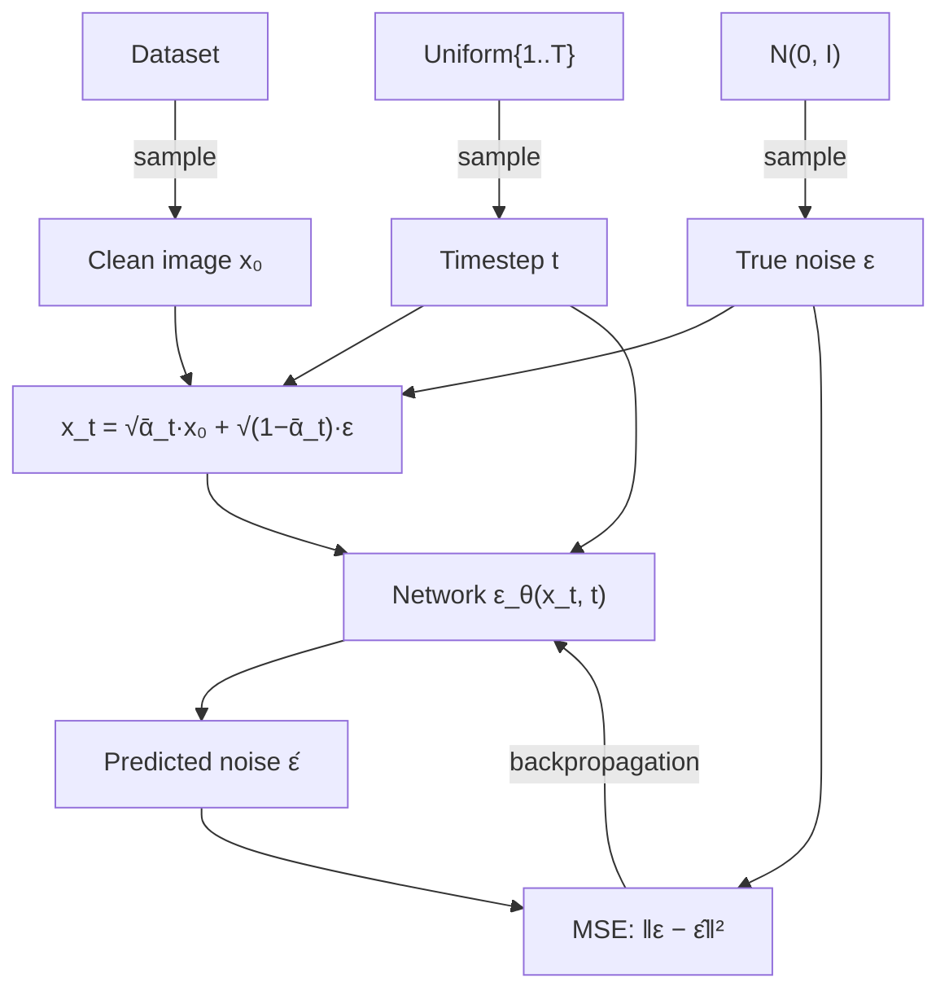

Notice that $\epsilon$ appears twice — once to build the input and once as the target. That double role is the heart of the trick.

## 8.4 Practical notes

| Concern | Typical practice | Reason |
|---|---|---|
| Data range | scale images to $[-1,1]$ | matches the unit-variance noise (§4.1) |
| $T$ | 1000 | large enough for the Gaussian reverse approximation (§6.2) |
| Schedule | linear ($10^{-4}\to0.02$) or cosine | cosine keeps SNR useful longer at high resolution (§4.5) |
| Loss | MSE on $\epsilon$; sometimes Huber | Huber is more robust to outlier gradients |
| Weights for sampling | EMA copy, decay ≈ 0.9999 | smoother weights → better samples |
| Batch composition | different random $t$ per image | better gradient coverage of timesteps |

---

# 9. U-Net Architecture

We have specified *what* the network must compute: $\epsilon_\theta(x_t, t)$, mapping a noisy image plus a timestep to a noise estimate of the same shape. Now: what architecture does that job well?

## 9.1 What the task demands

Work out the requirements from first principles before naming any architecture:

1. **Output shape = input shape.** We predict one noise value per pixel per channel. So this is an *image-to-image* network, not image-to-vector.
2. **Local precision.** The noise at pixel $(i,j)$ must be estimated using the fine texture right around it. Fine detail matters.
3. **Global context.** To decide whether a grey patch is "shadow noise" or "the edge of a face", the network needs to know what the rest of the image contains. Long-range information matters.
4. **Awareness of noise level.** The same input must be processed differently at different $t$ (§6.5).

Requirements 2 and 3 pull in opposite directions. Fine detail needs high spatial resolution; global context needs a wide receptive field, which normally means downsampling. **U-Net is precisely the architecture that satisfies both.**

## 9.2 The U-Net shape

A U-Net has three parts:

**Encoder (contracting path).** Repeated blocks that process features and then downsample (halve spatial size, roughly double channels). Going down: $64\times64 \to 32\times32 \to 16\times16 \to 8\times8$. As resolution falls, each feature "sees" a larger region of the original image, so features become more semantic and less local — from edges, to textures, to parts, to objects.

**Bottleneck.** The lowest-resolution, highest-channel point. Spatially tiny but semantically rich. This is where global reasoning happens — "this is a portrait, lit from the left". Attention blocks live here (and at other low-resolution levels), because at $8\times8$ a full all-pairs attention is cheap.

**Decoder (expanding path).** Repeated blocks that upsample back toward full resolution, ending with a final convolution producing exactly $C$ output channels — the predicted noise.

**Skip connections.** At each resolution level, the encoder's feature map is carried directly across and concatenated to the matching decoder feature map.

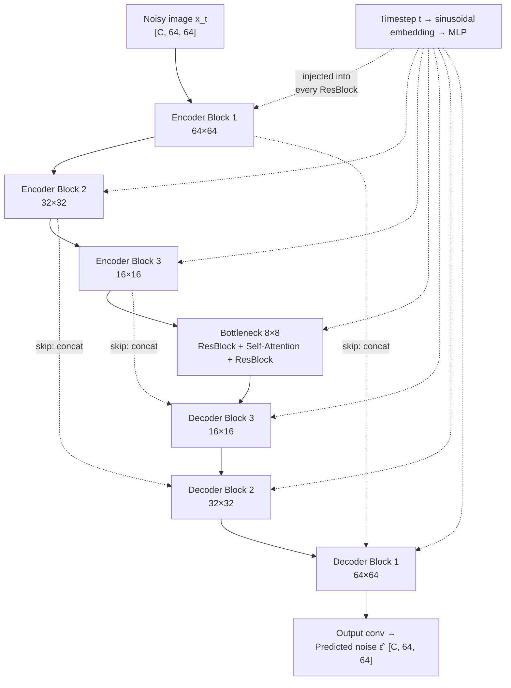

## 9.3 Why skip connections are essential here

This is the most important architectural point, and it is specific to diffusion.

Without skips, all information would have to squeeze through the bottleneck. But the bottleneck is $8\times8$ — it physically cannot represent per-pixel detail at $64\times64$. High-frequency information would be irrecoverably lost, and the output would be smooth. For a *classifier* that is fine (you want to discard detail). For **noise prediction it is fatal**: noise is *pure high frequency*. A network that discards high frequencies cannot predict noise at all.

Skip connections solve this by giving high-resolution features a direct path to the decoder. The resulting division of labour is clean and worth remembering:

| Path | Carries | Answers |
|---|---|---|
| Skip connections | high-resolution, local detail | "what is the exact pixel-level pattern here?" |
| Bottleneck path | low-resolution, global semantics | "what is this image, and what *should* be here?" |

The decoder fuses both: it uses global context to decide *what the clean image ought to contain*, and local detail to decide *exactly which high-frequency component is noise rather than texture*. Neither alone suffices.

## 9.4 Inside a block: residual blocks

The basic unit is a **residual block**:

```text
Block(h, t_emb):
    r  ← h
    h  ← GroupNorm(h) → SiLU → Conv3×3(h)
    h  ← h + Linear(SiLU(t_emb))        # time conditioning enters HERE
    h  ← GroupNorm(h) → SiLU → Dropout → Conv3×3(h)
    return h + r                        # residual connection
```

Why residual (the `h + r`)? Diffusion U-Nets are deep, and at low noise levels the correct output is close to a simple function of the input. A residual structure makes "pass the input through mostly unchanged, with a small correction" the *default* behaviour, so the network learns corrections rather than full mappings. This makes very deep stacks trainable and is standard practice.

Why GroupNorm rather than BatchNorm? Because batch statistics are unreliable here — samples in a batch have different timesteps and therefore wildly different input statistics. GroupNorm normalises per-sample and is unaffected.

## 9.5 Attention blocks

Convolutions are local: a 3×3 kernel sees 9 pixels. Stacking them grows the receptive field, but slowly, and the influence decays with distance. Some dependencies are genuinely long-range: both eyes should match; lighting must be consistent across the frame; a repeated pattern must stay coherent.

**Self-attention** lets every spatial position directly query every other. Flatten the $H\times W$ feature map into $HW$ tokens and compute

$$
\text{Attention}(Q,K,V) = \operatorname{softmax}\!\left(\frac{QK^{\top}}{\sqrt{d}}\right)V
$$

where $Q = W_Q h$, $K = W_K h$, $V = W_V h$ are linear projections of the features $h$, and $d$ is the key dimension. Every position gathers information from every other in one operation.

**Why only at low resolutions?** Attention costs $O((HW)^2)$. At $64\times64$ that is $4096^2 \approx 16.8$M pairs per head — expensive. At $16\times16$ it is $256^2 = 65$k — cheap. Since long-range reasoning is semantic anyway, placing attention at low resolutions is both cheaper and more appropriate. This is a pure engineering trade-off, and it is exactly where later work (DiT, transformer-based diffusion) pushed back by making attention affordable everywhere.

Self-attention here will later become the natural place to inject text: replace $K$ and $V$ with projections of the **text embeddings** and you have **cross-attention** (§15.4). The architecture was already the right shape for conditioning.

## 9.6 Time conditioning

Note in §9.4 that the timestep embedding is added **inside every residual block**, at every resolution. It is not fed in once at the input.

Why? Because the noise level changes what the network should do at *every* level of processing — the texture-level decisions at high resolution and the composition-level decisions at the bottleneck are both $t$-dependent. Injecting $t$ everywhere lets each layer modulate its own behaviour. Section 10 develops this.

## 9.7 Information flow summary

| Component | What flows through it | Why it is needed |
|---|---|---|
| Input conv | raw noisy image → features | lift to feature space |
| Encoder blocks | increasingly abstract, decreasingly local features | build context |
| Downsampling | trades resolution for receptive field | reach global scale |
| Bottleneck | whole-image semantics | decide what the image *is* |
| Attention | long-range dependencies | global coherence |
| Upsampling | rebuild spatial resolution | return to image shape |
| Skip connections | high-frequency detail | make noise prediction possible |
| Decoder blocks | fused global + local | produce a per-pixel estimate |
| Time embedding | "how noisy is this?" | select the right behaviour |
| Output conv | features → noise estimate | match the target shape |

---

# 10. Timestep Embeddings

## 10.1 Why $x_t$ alone is not enough

Here is the clean thought experiment that makes the necessity obvious.

Imagine two situations:

- **Situation A.** A clean image of a face, with 5% noise added. Timestep $t = 50$.
- **Situation B.** A different, mostly-destroyed image, now at $t = 900$, which happens to have produced a pixel pattern numerically similar to A.

More sharply: consider a genuinely ambiguous input — a mid-grey field with mild speckle. Was it

- a smooth grey wall at $t=100$ (so the speckle *is* the noise — answer: output the speckle), or
- a highly detailed scene at $t=800$ (so almost everything present is noise — answer: output nearly the whole input)?

**The correct output is completely different, but the input looks the same.** Without $t$, the network faces a genuinely ambiguous problem and can only produce an average of the two answers — wrong in both cases.

There is a second, more quantitative reason. The magnitude of the correct answer depends on $t$. At small $t$ the noise contributes $\sqrt{1-\bar\alpha_t}\approx 0.05$ of the input; at large $t$ it contributes $\approx 1.0$. The network must know which regime it is in just to get the scale of its answer right.

> **Summary:** $x_t$ tells the network *what it is looking at*. $t$ tells it *which question is being asked*. A single network is being asked to be $T$ different denoisers; $t$ is the selector.

## 10.2 Why not just feed the integer $t$?

Feeding the raw number (e.g. `473.0`) as a scalar works badly:

- **Poor resolution of nearby values.** A network must learn fine distinctions between 473 and 474 from a single scalar input, with a linear layer. Neural networks are bad at extracting high-frequency structure from raw scalars.
- **Bad scaling.** Values from 1 to 1000 in a network whose activations are normalised around unit scale.
- **No useful similarity structure.** We want $t=470$ and $t=473$ to produce nearly identical behaviour, while $t=100$ and $t=900$ produce very different behaviour. A raw scalar gives a linear notion of similarity, which is not what the underlying $\bar\alpha_t$ curve looks like.

We want a representation that is **high-dimensional, smoothly varying, distinguishable at multiple scales, and well-scaled.**

## 10.3 Sinusoidal embeddings

The solution, borrowed from the Transformer positional encoding, is to map the integer $t$ to a vector of sines and cosines at many different frequencies.

For an embedding of dimension $d$, define for $i = 0, 1, \dots, d/2 - 1$:

$$
\omega_i = \frac{1}{10000^{\,2i/d}}
$$

$$
\text{PE}(t)_{2i} = \sin(\omega_i\, t), \qquad \text{PE}(t)_{2i+1} = \cos(\omega_i\, t)
$$

where:

- $t$ — the timestep (an integer),
- $d$ — the embedding dimension (e.g. 128 or 256),
- $\omega_i$ — the $i$-th frequency, forming a geometric series from 1 down to $1/10000$.

**Why this works.** Each pair of dimensions is a clock ticking at its own rate:

- **High-frequency** components ($\omega_i \approx 1$) change rapidly — they distinguish $t = 473$ from $t = 474$. Fine-grained resolution.
- **Low-frequency** components ($\omega_i \approx 10^{-4}$) change slowly over the whole range — they encode "early vs middle vs late". Coarse-grained position.

Together they form a **multi-resolution code**: like a set of clock hands (seconds, minutes, hours), every $t$ in $[1,T]$ gets a unique signature that is simultaneously precise and smooth. Nearby timesteps get nearby vectors (so behaviour interpolates sensibly), distant timesteps get near-orthogonal vectors (so behaviours can differ freely). And every component is bounded in $[-1,1]$, so scaling is automatically well-behaved.

**A small concrete illustration** with $d = 4$ ($\omega_0 = 1$, $\omega_1 = 0.01$):

| $t$ | $\sin(t)$ | $\cos(t)$ | $\sin(0.01t)$ | $\cos(0.01t)$ | Comment |
|---|---|---|---|---|---|
| 10 | −0.544 | −0.839 | 0.100 | 0.995 | slow dims ≈ "early" |
| 11 | −1.000 | 0.004 | 0.110 | 0.994 | fast dims changed a lot → 10 ≠ 11 |
| 500 | −0.468 | 0.884 | 0.479 | 0.878 | slow dims ≈ "middle" |
| 900 | 0.878 | −0.479 | 0.783 | 0.622 | slow dims ≈ "late" |

The fast dimensions separate adjacent timesteps; the slow dimensions encode the overall phase. Real embeddings use 128+ dimensions spanning the full frequency range.

## 10.4 How the embedding enters the network

The raw sinusoidal vector is not used directly. It passes through a small MLP to become a learned, task-adapted conditioning vector:

```text
Algorithm — TIME_CONDITIONING

    pe      ← sinusoidal_embedding(t, dim = d)       # fixed, not learned
    t_emb   ← Linear(d → 4d) → SiLU → Linear(4d → 4d)   # learned projection

    for each residual block in the U-Net:
        scale_shift ← Linear(4d → channels_of_this_block)(SiLU(t_emb))
        h ← h + scale_shift          # broadcast over spatial dimensions
```

Two design points:

- **The sinusoidal part is fixed; the MLP is learned.** The sinusoids provide a rich, well-conditioned basis; the MLP learns what to *do* with it. Separating "good representation" from "learned use" is a recurring pattern in deep learning.
- **It is broadcast spatially.** The vector is shaped $[B, C]$ and added to a feature map of shape $[B, C, H, W]$ by broadcasting over $H, W$ — the same conditioning is applied at every spatial position, which is correct because the noise level is a global property of the image.

A common refinement is **FiLM-style modulation**: instead of just adding, the projection produces both a scale $\gamma$ and a shift $\beta$, and the block computes $\gamma \odot \text{Norm}(h) + \beta$. This lets $t$ *multiplicatively* gate features, which is more expressive than an additive bias — the network can switch entire feature channels on or off depending on the noise level.

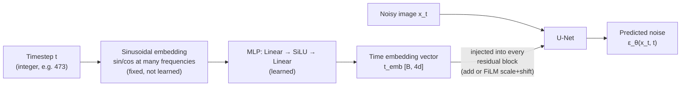

## 10.5 What the timestep embedding actually controls

Empirically, conditioning on $t$ causes the network to shift its behaviour along a spectrum:

| Regime | What the network emphasises |
|---|---|
| $t$ near $T$ (heavy noise) | global structure: layout, colour distribution, coarse shapes. Fine detail is meaningless here. |
| $t$ in the middle | object-level structure: parts, boundaries, plausible geometry. This is where the "content decision" is made. |
| $t$ near 0 (light noise) | texture and high-frequency detail: grain, edges, sharpness. Global structure is already fixed. |

This has a practical consequence worth knowing: **the middle timesteps matter most for sample quality.** Early steps only set coarse layout; late steps only polish. Techniques like min-SNR loss weighting exploit this by upweighting the middle of the range instead of sampling $t$ uniformly (§8.2).

---

# 11. DDPM Mathematical Objective

Sections 7 and 8 presented $\mathcal{L}_{\text{simple}}$ as a sensible thing to minimise. This section shows it is not a heuristic — it follows from maximum likelihood via a chain of principled steps. Follow this once and the simple loss stops feeling arbitrary.

**The route:**

$$
\text{maximise } \log p_\theta(x_0)
\;\to\;
\text{ELBO}
\;\to\;
\text{sum of KL terms}
\;\to\;
\text{MSE on means}
\;\to\;
\text{MSE on noise}
\;\to\;
\mathcal{L}_{\text{simple}}
$$

## 11.1 Symbols used in this section

| Symbol | Meaning |
|---|---|
| $x_0$ | clean data sample |
| $x_{1:T}$ | shorthand for the whole noisy sequence $x_1,\dots,x_T$ |
| $q(\cdot)$ | the **fixed** forward process (known exactly) |
| $p_\theta(\cdot)$ | the **learned** reverse process |
| $p(x_T)$ | the prior, fixed to $\mathcal{N}(0,I)$ |
| $\mathbb{E}_q[\cdot]$ | expectation over samples from the forward process |
| $D_{\mathrm{KL}}(p\|q)$ | KL divergence (§2.14) |
| $\tilde\mu_t(x_t,x_0)$ | mean of the *true* posterior $q(x_{t-1}\mid x_t,x_0)$ |
| $\tilde\beta_t$ | variance of that true posterior |

## 11.2 From likelihood to the ELBO

We want to maximise $\log p_\theta(x_0)$ (§2.15). But $x_0$ is only the endpoint of a chain with $T$ hidden variables, so:

$$
p_\theta(x_0) = \int p_\theta(x_{0:T})\, dx_{1:T}
$$

**This integral is intractable** — it runs over all possible noise trajectories, a space of dimension $T \times (\text{image size})$. We cannot compute it.

**The standard escape: a variational lower bound.** Introduce the known forward process $q(x_{1:T}\mid x_0)$ and multiply by 1:

$$
\log p_\theta(x_0)
= \log \int q(x_{1:T}\mid x_0)\,\frac{p_\theta(x_{0:T})}{q(x_{1:T}\mid x_0)}\,dx_{1:T}
= \log \mathbb{E}_{q}\!\left[\frac{p_\theta(x_{0:T})}{q(x_{1:T}\mid x_0)}\right]
$$

Now apply **Jensen's inequality** ($\log \mathbb{E}[Z] \ge \mathbb{E}[\log Z]$, since $\log$ is concave):

$$
\log p_\theta(x_0) \;\ge\; \mathbb{E}_{q}\!\left[\log \frac{p_\theta(x_{0:T})}{q(x_{1:T}\mid x_0)}\right] \;=:\; \text{ELBO}
$$

**ELBO** = Evidence Lower BOund. Since it is a lower bound, pushing it up pushes the true log-likelihood up. And unlike the original integral, the ELBO is an *expectation* — estimable by sampling (§2.13).

We minimise the negative:

$$
\mathcal{L}_{\text{VLB}} = \mathbb{E}_q\!\left[-\log \frac{p_\theta(x_{0:T})}{q(x_{1:T}\mid x_0)}\right]
$$

**Expand using the Markov factorisations** (§2.9). Numerator: $p_\theta(x_{0:T}) = p(x_T)\prod_t p_\theta(x_{t-1}\mid x_t)$. Denominator: $q(x_{1:T}\mid x_0) = \prod_t q(x_t\mid x_{t-1})$. After a standard regrouping of terms (rewriting each $q(x_t\mid x_{t-1})$ as $q(x_{t-1}\mid x_t,x_0)$ via Bayes and telescoping), one obtains:

$$
\mathcal{L}_{\text{VLB}} =
\underbrace{D_{\mathrm{KL}}\big(q(x_T\mid x_0)\,\|\,p(x_T)\big)}_{L_T}
+ \sum_{t=2}^{T}\underbrace{\mathbb{E}_q\,D_{\mathrm{KL}}\big(q(x_{t-1}\mid x_t,x_0)\,\|\,p_\theta(x_{t-1}\mid x_t)\big)}_{L_{t-1}}
\underbrace{-\,\mathbb{E}_q \log p_\theta(x_0\mid x_1)}_{L_0}
$$

**Interpret the three groups:**

| Term | Meaning | Status |
|---|---|---|
| $L_T$ | Does the forward process actually end at $\mathcal{N}(0,I)$? | **No parameters** — constant. Ignorable. |
| $L_{t-1}$ | Does the learned reverse step match the true reverse step? | **The entire learning signal.** |
| $L_0$ | Final step from $x_1$ to a discrete pixel value | Small; handled by a discretised likelihood. |

So all the learning lives in the middle sum. **Notice how the Markov property earned its keep:** it turned one intractable global objective into a *sum of $T$ independent per-step objectives*, each comparing two distributions at a single timestep.

## 11.3 The crucial escape hatch: conditioning on $x_0$

Look closely at $L_{t-1}$. It involves $q(x_{t-1}\mid x_t, \mathbf{x_0})$ — note the extra conditioning on $x_0$.

In §6.3 we showed that $q(x_{t-1}\mid x_t)$ is **intractable**. But $q(x_{t-1}\mid x_t, x_0)$ — the reverse step *when you are also told the original clean image* — **is tractable in closed form.** This is the single cleverest step in the derivation.

Why does knowing $x_0$ help? Because the intractability came from the unknown marginal $q(x_{t-1})$, which required integrating over the whole data distribution. Conditioning on $x_0$ pins that down: we now know exactly which image we started from, so everything is Gaussian algebra.

Apply Bayes:

$$
q(x_{t-1}\mid x_t, x_0) = \frac{q(x_t \mid x_{t-1})\,q(x_{t-1}\mid x_0)}{q(x_t \mid x_0)}
$$

Every term on the right is a known Gaussian (§4.2 and §4.6). The product and quotient of Gaussians is Gaussian, and completing the square gives:

$$
q(x_{t-1}\mid x_t, x_0) = \mathcal{N}\!\left(x_{t-1};\ \tilde{\mu}_t(x_t, x_0),\ \tilde{\beta}_t I\right)
$$

with

$$
\tilde{\mu}_t(x_t,x_0) = \frac{\sqrt{\bar\alpha_{t-1}}\,\beta_t}{1-\bar\alpha_t}\,x_0 \;+\; \frac{\sqrt{\alpha_t}\,(1-\bar\alpha_{t-1})}{1-\bar\alpha_t}\,x_t
$$

$$
\tilde{\beta}_t = \frac{1-\bar\alpha_{t-1}}{1-\bar\alpha_t}\,\beta_t
$$

**Read $\tilde\mu_t$ intuitively:** it is a *weighted average of the clean image $x_0$ and the current noisy image $x_t$*. The weights depend on $t$: early in the chain (small $t$) the $x_t$ term dominates (barely move); late in the chain (large $t$) the $x_0$ term carries more weight. This is the ideal denoising target — exactly what we want the network to reproduce.

**And $\tilde\beta_t$** is the variance of the true reverse step. It is a known constant, which is why DDPM can simply *fix* the model's variance rather than learn it.

> **The conceptual summary of §11.3:** during training we *do* know $x_0$ — it is the training image! So we can compute the ideal reverse step exactly and train the network to match it. At sampling time we do not know $x_0$, but by then the network has learned to approximate the answer. This is the standard "teacher forcing" pattern: train with privileged information, deploy without it.

## 11.4 KL between two Gaussians → squared distance

Now we compare:

- True: $q(x_{t-1}\mid x_t,x_0) = \mathcal{N}(\tilde\mu_t,\ \tilde\beta_t I)$
- Learned: $p_\theta(x_{t-1}\mid x_t) = \mathcal{N}(\mu_\theta(x_t,t),\ \sigma_t^2 I)$

DDPM fixes $\sigma_t^2$ to a constant (either $\beta_t$ or $\tilde\beta_t$ — both work in practice). With matched, non-learned variances, the closed-form KL from §2.14 applies:

$$
L_{t-1} = \mathbb{E}_q\!\left[\frac{1}{2\sigma_t^2}\left\|\tilde{\mu}_t(x_t,x_0) - \mu_\theta(x_t,t)\right\|^2\right] + C
$$

**This is the moment the whole objective becomes practical.** An expectation of a KL divergence between distributions over images has become a **plain squared error between two vectors**. The network's job is now explicit: *output a mean that matches the true posterior mean.*

## 11.5 Rewriting in terms of noise

We could stop here and train $\mu_\theta$ directly. Section 7 argued we should not. Let us now see the algebra that produces the noise form.

Use the bridge equation (§5.6) to express $x_0$ in terms of $x_t$ and $\epsilon$:

$$
x_0 = \frac{1}{\sqrt{\bar\alpha_t}}\left(x_t - \sqrt{1-\bar\alpha_t}\,\epsilon\right)
$$

Substitute into $\tilde\mu_t$. After collecting terms (using $\bar\alpha_t = \alpha_t\bar\alpha_{t-1}$ and $\beta_t = 1-\alpha_t$), a substantial but routine simplification yields a strikingly compact result:

$$
\boxed{\;\tilde{\mu}_t(x_t, x_0) = \frac{1}{\sqrt{\alpha_t}}\left(x_t - \frac{\beta_t}{\sqrt{1-\bar{\alpha}_t}}\,\epsilon\right)\;}
$$

**Look at what happened.** The true posterior mean depends on $x_t$ — which we have — and on $\epsilon$ — which we do not. **Everything else is a known constant.** So the *only* unknown quantity standing between us and the exact optimal denoising step is the noise $\epsilon$.

> **This is the real answer to "why predict noise?"** Section 7 gave the practical reasons (stable target scale, evenly distributed difficulty). This is the structural reason: *$\epsilon$ is literally the one missing ingredient in the exact formula.* Predicting it is not a modelling choice dressed up as a convenience — it is filling in the single hole in an otherwise fully determined equation.

Naturally, then, we define the model's mean by the same formula with $\epsilon$ replaced by the network's estimate:

$$
\mu_\theta(x_t,t) = \frac{1}{\sqrt{\alpha_t}}\left(x_t - \frac{\beta_t}{\sqrt{1-\bar{\alpha}_t}}\,\epsilon_\theta(x_t,t)\right)
$$

Now substitute both into the loss of §11.4. The $x_t$ terms cancel, leaving only the difference in the $\epsilon$ terms:

$$
\tilde\mu_t - \mu_\theta = \frac{1}{\sqrt{\alpha_t}}\cdot\frac{\beta_t}{\sqrt{1-\bar\alpha_t}}\big(\epsilon_\theta(x_t,t) - \epsilon\big)
$$

Therefore:

$$
L_{t-1} = \mathbb{E}_{x_0,\epsilon}\!\left[\frac{\beta_t^{2}}{2\sigma_t^{2}\,\alpha_t\,(1-\bar{\alpha}_t)}\left\|\epsilon - \epsilon_\theta\!\left(\sqrt{\bar\alpha_t}x_0 + \sqrt{1-\bar\alpha_t}\epsilon,\ t\right)\right\|^{2}\right]
$$

This is the **exact** variational objective, expressed as noise prediction. It is MSE on $\epsilon$, multiplied by a $t$-dependent weight.

## 11.6 The simplification

Ho et al. observed that **dropping the weight** improves sample quality:

$$
\mathcal{L}_{\text{simple}}(\theta) = \mathbb{E}_{x_0, t, \epsilon}\left[\left\|\epsilon - \epsilon_\theta(x_t, t)\right\|^2\right]
$$

That is: set every weight to 1.

**Why does discarding part of a principled objective help?** Because the two objectives optimise for different things:

- The weight $\frac{\beta_t^2}{2\sigma_t^2\alpha_t(1-\bar\alpha_t)}$ is **large at small $t$** and small at large $t$. So $\mathcal{L}_{\text{VLB}}$ heavily prioritises the final, low-noise steps.
- Those final steps mostly determine **exact pixel-level likelihood**, which is what the ELBO measures — but they contribute little to *perceptual* quality.
- The middle and higher timesteps decide **content and structure** (§10.5) — what humans actually judge.

Dropping the weight effectively **upweights the harder, more perceptually important timesteps.** So $\mathcal{L}_{\text{simple}}$ is no longer a bound on the likelihood, but it is a better proxy for sample quality.

**The honest summary:** $\mathcal{L}_{\text{simple}}$ is a *reweighted* variational bound. The derivation legitimises the *form* of the loss (MSE on noise); the reweighting is an empirical choice trading likelihood for perceptual quality.

This is worth remembering because it explains an entire line of follow-up research: min-SNR weighting, $v$-prediction, and other schemes are all attempts to find a better weight than either the ELBO's or the constant 1.

## 11.7 The derivation at a glance

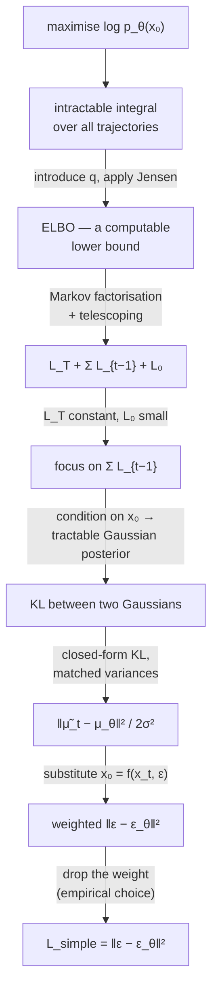

| Stage | Status |
|---|---|
| Likelihood → ELBO | Exact (Jensen's inequality) |
| ELBO → per-step KL sum | Exact (Markov property) |
| KL → squared error on means | Exact (Gaussian closed form) |
| Means → noise prediction | Exact (algebraic substitution) |
| Weighted → unweighted | **Empirical simplification** |

Only the last step is a departure from the mathematics — and it is a deliberate, documented one.

---
# 12. Complete DDPM Sampling Process

Training is done. The network can estimate the noise in any noisy image at any noise level. Now we use it to generate.

## 12.1 The idea

We reverse the chain. Start at the end of the forward process and walk backwards:

$$
x_T \sim \mathcal{N}(0, I) \;\to\; x_{T-1} \;\to\; \cdots \;\to\; x_1 \;\to\; x_0
$$

We can start from pure Gaussian noise **because the forward process was designed to end there** (§4.3, variance preservation). This is a payoff from a design decision made long before we needed it.

## 12.2 The sampling algorithm

```text
Algorithm 2 — DDPM_SAMPLE

Given:
    trained network ε_θ   (EMA weights)
    schedule β₁ … β_T, with α_t = 1 − β_t, ᾱ_t = ∏ α_s

    x_T  ←  sample from N(0, I)          # shape of the desired image

    for t = T, T−1, …, 1:

        1.  ε̂  ←  ε_θ(x_t, t)                        # predict the noise present

        2.  mean  ←  (1/√α_t) · ( x_t − (β_t / √(1−ᾱ_t)) · ε̂ )

        3.  if t > 1:
                z ← sample from N(0, I)
            else:
                z ← 0                                 # no noise on the final step

        4.  x_{t−1}  ←  mean  +  σ_t · z              # σ_t² = β_t  (or β̃_t)

    return x₀
```

## 12.3 Every step explained

**Initialisation: $x_T \sim \mathcal{N}(0,I)$.**
This is the *only* source of variation between generated images. Same seed → same image (given a deterministic network). Different seed → different image. The randomness here is what picks *which* sample from the data distribution we will produce.

**Step 1 — predict the noise.**
The network answers: "if this were a real image noised to level $t$, what noise would be in it?" Note it does not matter that $x_T$ is *not* actually a noised real image — the network answers anyway, and its answer pulls the sample toward the data manifold (§7.4, the score interpretation).

**Step 2 — compute the mean.**
This is $\mu_\theta$ from §11.5. Structurally:

$$
\mu_\theta = \underbrace{\frac{1}{\sqrt{\alpha_t}}}_{\text{undo one step of shrinkage}}\Big(\underbrace{x_t}_{\text{current}} - \underbrace{\frac{\beta_t}{\sqrt{1-\bar\alpha_t}}\hat\epsilon}_{\text{remove ONE step's worth of noise}}\Big)
$$

Two operations, each undoing one half of a forward step (§4.2): subtract a bit of noise, then rescale up. **This is exactly the inverse of the forward step, with the unknown $\epsilon$ replaced by the network's estimate.** Everything is symmetric with §4.2 — that symmetry is worth pausing on.

**Step 3 — draw fresh noise $z$ (for $t>1$).**

This is the step people find most counter-intuitive: *we are trying to remove noise, so why add some back?*

Three reasons, all important:

1. **The reverse step is a distribution, not a function** (§3.5). $p_\theta(x_{t-1}\mid x_t)$ is a Gaussian with mean $\mu_\theta$ and variance $\sigma_t^2$. Sampling from it means mean + noise. Using only the mean would not be sampling from the model we trained.
2. **It preserves diversity.** The mean is an *average* over the possible cleaner images. Always taking the average would collapse the process toward the most typical output. The injected noise is what lets each trajectory commit to a distinct specific image — this is §7.5's argument for why diffusion does not blur.
3. **It maintains the correct noise level.** We need $x_{t-1}$ to have exactly the statistics that the network expects at timestep $t-1$. Removing too much noise would give the network an out-of-distribution input at the next step, and errors would compound.

**Why $z=0$ at $t=1$?** The last step produces the final image. There is no subsequent step to clean it up, so adding noise would simply leave visible grain. We output the mean — our best estimate.

**Step 4 — form $x_{t-1}$.** Mean plus scaled noise. $\sigma_t^2 = \beta_t$ and $\sigma_t^2 = \tilde\beta_t$ (§11.3) are both used; they bracket the reasonable range and give similar quality.

## 12.4 What each phase of sampling does

Sampling is not uniform in character. It has phases:

| Phase | Timesteps | What is happening | If you looked at $x_t$ |
|---|---|---|---|
| **Early** | $T \to 0.7T$ | Global structure emerges: overall colour, rough layout, where the subject sits | Still looks like noise with a faint colour bias |
| **Middle** | $0.7T \to 0.3T$ | **Content is decided**: objects, shapes, composition become committed | Blurry recognisable forms |
| **Late** | $0.3T \to 0$ | Texture, edges, fine detail, sharpening | Recognisable image getting crisper |

**A practical implication:** decisions made in the middle phase are essentially irreversible. This is why guidance (§15) applied in the middle timesteps has the strongest effect on *what* is generated, while guidance in late steps mostly affects style and sharpness.

## 12.5 The sampling pipeline

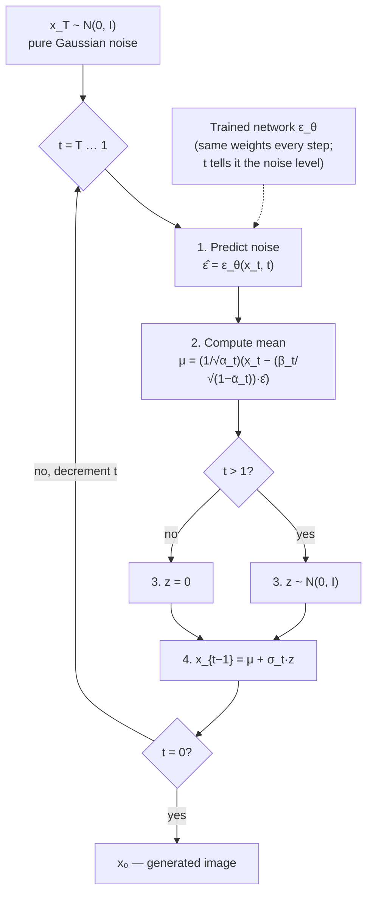

**Note the cost:** the loop body contains one network forward pass, and it runs $T$ times. With $T=1000$, generating one image costs 1000 forward passes. On a GPU, that is seconds to minutes per image — orders of magnitude slower than a GAN's single pass. **This is the price diffusion pays, and it is what Sections 14, 17 and 19 exist to reduce.**

## 12.6 A related quantity: the $\hat{x}_0$ prediction

Many implementations compute, at each step, the network's implied estimate of the final clean image:

$$
\hat{x}_0 = \frac{x_t - \sqrt{1-\bar{\alpha}_t}\,\epsilon_\theta(x_t,t)}{\sqrt{\bar{\alpha}_t}}
$$

This is the bridge equation (§5.6) with the predicted noise substituted. It is useful for three reasons:

- **Clipping.** Since we know pixel values must lie in $[-1,1]$, we can clip $\hat{x}_0$ to that range and then recompute the step. This is a cheap, effective way to keep the trajectory on the data manifold and it measurably improves quality.
- **Visualisation.** Plotting $\hat{x}_0$ across timesteps shows the generation "developing" — blurry at first, sharp at the end. It is the best way to build intuition about what the model is doing.
- **It is how DDIM is formulated** (§14).

Watching $\hat{x}_0$ evolve makes something clear: **at high $t$ the model's $\hat{x}_0$ estimate really is a blurry average** — exactly as §7.3 predicted. The sharpness emerges because we never *use* that blurry estimate directly; we only take a small step toward it and re-inject noise.

---

# 13. Training vs Sampling

These two processes are easy to confuse because they involve the same network and the same equations. They are structurally opposite.

## 13.1 Side-by-side comparison

| Aspect | Training | Sampling |
|---|---|---|
| **Starting point** | A clean image $x_0$ from the dataset | Random noise $x_T \sim \mathcal{N}(0,I)$ |
| **Direction** | Forward — add noise | Reverse — remove noise |
| **Timesteps used** | **One**, chosen at random | **All** of them, in order $T \to 1$ |
| **Order of timesteps** | Irrelevant (independent samples) | Strictly sequential — cannot parallelise |
| **Network's role** | Learns to predict noise | Uses its learned prediction |
| **Is $\epsilon$ known?** | Yes — we drew it (it is the label) | No — it must be estimated |
| **Is $x_0$ known?** | Yes — it is the input | No — it is the output |
| **Network passes per image** | 1 | $T$ (e.g. 1000) |
| **Gradients** | Computed and applied | None — inference only |
| **Randomness** | $x_0$, $t$, and $\epsilon$ are all random | $x_T$ and the per-step $z$ are random |
| **Parallelisable?** | Fully — batch across images and timesteps | Only across images, never across timesteps |
| **Goal** | Learn denoising behaviour | Generate a new sample |
| **Cost per image** | Cheap (one pass) | Expensive ($T$ passes) |

## 13.2 Why they are fundamentally different

**Training does not simulate generation.** This is the point most worth internalising. The training loop never runs the reverse chain. It never produces an image. It only ever looks at isolated (noisy image, timestep, noise) triples.

This is why training is cheap despite $T=1000$: **the $T$-step chain is an inference-time construct, not a training-time one.**

The reason this works is the closed-form $q(x_t\mid x_0)$ (§4.6). Because we can jump to any timestep directly, we can train the timesteps *independently* and in any order. The network learns each rung of the ladder separately; only at inference do we climb the ladder rung by rung.

**A consequence worth knowing — exposure bias.** Training shows the network $x_t$ built from a *real* image. Sampling feeds it $x_t$ built from its own previous imperfect outputs. These distributions are not identical, so errors can compound across the chain. In practice small steps and the injected noise keep this under control, but it is a real limitation and motivates techniques like $\hat{x}_0$-clipping (§12.6).

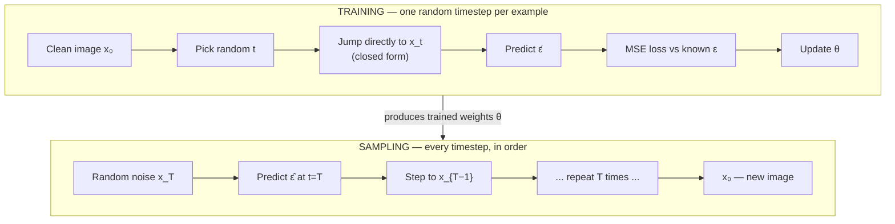

---

# 14. DDIM

*Denoising Diffusion Implicit Models* (Song, Meng & Ermon, 2020). Read this only after §12 is solid — DDIM is a modification of DDPM sampling, and it makes no sense without it.

## 14.1 The problem: DDPM sampling is slow

Generating one image needs $T = 1000$ sequential network passes. Sequential, so no parallelism helps. For a large U-Net this is seconds to minutes per image — unusable for interactive applications.

**Why can't we just skip steps in DDPM?** Because the DDPM reverse step is derived from the *Markov* chain: $p_\theta(x_{t-1}\mid x_t)$ is defined only for **adjacent** timesteps. There is no formula for jumping from $x_{1000}$ to $x_{900}$. The Markov assumption that made the training objective decompose so nicely (§11.2) has now become a constraint on sampling.

## 14.2 DDIM's insight

Here is the observation that unlocks everything:

> **The training objective $\mathcal{L}_{\text{simple}}$ depends only on the marginals $q(x_t \mid x_0)$ — never on the joint trajectory.**

Look back at the loss (§7.6): it involves $x_t = \sqrt{\bar\alpha_t}x_0 + \sqrt{1-\bar\alpha_t}\epsilon$ and nothing else. It never mentions $x_{t-1}$, or the path taken. So **many different forward processes — including non-Markovian ones — have the same marginals and therefore the same training objective.**

The consequence is remarkable: **a trained DDPM network is simultaneously a valid model for an entire family of samplers.** We are free to pick whichever member of the family we like at inference time — *without retraining*.

DDIM picks a non-Markovian family that permits step-skipping and allows the noise level to be tuned down to zero.

## 14.3 The DDIM update rule

For any pair of timesteps $t > s$ (not necessarily adjacent):

$$
x_{s} = \sqrt{\bar\alpha_{s}}\;\underbrace{\left(\frac{x_t - \sqrt{1-\bar\alpha_t}\,\epsilon_\theta(x_t,t)}{\sqrt{\bar\alpha_t}}\right)}_{\hat{x}_0 \;-\; \text{predicted clean image}} \;+\; \underbrace{\sqrt{1-\bar\alpha_{s}-\sigma^2}\;\epsilon_\theta(x_t,t)}_{\text{direction pointing to } x_{s}} \;+\; \underbrace{\sigma\,z}_{\text{optional noise}}
$$

**Read it as three parts:**

1. **Estimate the destination.** Compute $\hat{x}_0$ from $x_t$ and the predicted noise (§12.6) — the model's current guess at the final image.
2. **Re-noise to the target level.** Take that guess and add back the amount of noise appropriate for timestep $s$, *reusing the same predicted noise direction*.
3. **Optionally add fresh randomness**, controlled by $\sigma$.

So DDIM's step is: **"jump to your best guess of the clean image, then step back out to the noise level you actually want."** Because step 2 can target *any* $s$, we can skip freely.

## 14.4 The $\sigma$ parameter: one knob spanning DDPM and DDIM

The variance $\sigma$ is a free choice. Two settings matter:

$$
\sigma = \eta \cdot \sqrt{\frac{1-\bar\alpha_{s}}{1-\bar\alpha_t}}\sqrt{1 - \frac{\bar\alpha_t}{\bar\alpha_{s}}}
$$

| $\eta$ | Behaviour |
|---|---|
| $\eta = 1$ | **Exactly recovers DDPM.** The stochastic Markov sampler. |
| $\eta = 0$ | **DDIM.** Fully deterministic — no noise injected at any step. |
| $0<\eta<1$ | Interpolates between them. |

> **This is why "DDIM is a different type of model" is a misconception.** DDPM and DDIM are two points on one continuum of samplers for *the same trained network*. You can train once and switch between them freely at inference.

## 14.5 Deterministic sampling and its consequences

With $\eta = 0$, the entire generation is a deterministic function of the initial noise: $x_T \mapsto x_0$. This has several useful consequences:

- **Reproducibility.** The same seed gives exactly the same image, every time, with no per-step randomness to control.
- **A meaningful latent space.** $x_T$ becomes an encoding of the image. Interpolating between two noise vectors (spherically, via slerp) produces a smooth semantic interpolation between the two generated images. DDPM cannot do this, because its per-step noise would destroy the correspondence.
- **Invertibility.** The deterministic map can be run *forwards*: given a real image, recover the $x_T$ that would generate it. This is **DDIM inversion**, and it is the foundation of most real-image editing methods (edit the prompt, re-run from the inverted latent).

## 14.6 Fewer steps

Because any $(t, s)$ pair is valid, we choose a **subsequence** of timesteps, e.g. $\{1000, 980, 960, \dots, 20, 0\}$ — 50 steps instead of 1000. A **20× speed-up.**

Typical quality behaviour:

| Steps | DDIM quality | DDPM quality |
|---|---|---|
| 1000 | Excellent | Excellent |
| 100 | Excellent | Good |
| 50 | Very good | Noticeably degraded |
| 20 | Good | Poor |
| 10 | Acceptable, some softness | Unusable |

**Why does DDIM degrade so much more gracefully?** Because determinism removes a source of error accumulation. In DDPM each step injects fresh noise that the *next* step must remove; with few steps there is not enough remaining budget to clean it up, and residual noise survives into the output. DDIM injects nothing, so a coarse trajectory is simply a coarser approximation of a smooth path rather than an under-cleaned noisy one.

There is a deeper framing: DDIM's $\eta=0$ update is a first-order numerical solver (Euler) for an ordinary differential equation whose solution path runs from noise to data. Taking fewer steps is just using a coarser discretisation. Once you see it this way, the obvious improvement is to use a *better ODE solver* — which is exactly what DPM-Solver, Heun, and similar methods do (§19).

## 14.7 Algorithm

```text
Algorithm 3 — DDIM_SAMPLE

Given:
    trained network ε_θ
    a decreasing subsequence of timesteps  τ = [τ_K, τ_{K−1}, …, τ_1, 0]   (K ≪ T)
    η   (0 = deterministic DDIM, 1 = DDPM)

    x  ←  sample from N(0, I)

    for k = K down to 1:
        t  ←  τ_k
        s  ←  τ_{k−1}                                  # the NEXT (lower) timestep

        1.  ε̂    ←  ε_θ(x, t)

        2.  x̂₀   ←  ( x − √(1−ᾱ_t) · ε̂ ) / √(ᾱ_t)      # predicted clean image
            x̂₀   ←  clip(x̂₀, −1, 1)                     # optional but helpful

        3.  σ    ←  η · √((1−ᾱ_s)/(1−ᾱ_t)) · √(1 − ᾱ_t/ᾱ_s)

        4.  dir  ←  √(1 − ᾱ_s − σ²) · ε̂                 # direction toward x_s

        5.  z    ←  N(0, I) if η > 0 and s > 0 else 0

        6.  x    ←  √(ᾱ_s) · x̂₀  +  dir  +  σ · z

    return x
```

## 14.8 DDPM vs DDIM

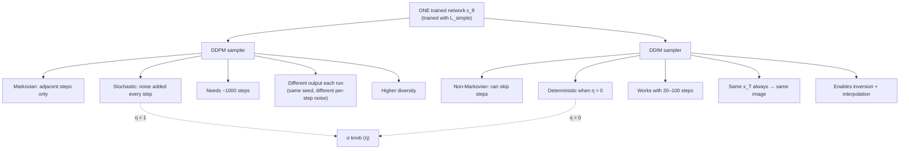

| Aspect | DDPM | DDIM |
|---|---|---|
| Process | Markovian | Non-Markovian |
| Stochastic? | Yes | No (when $\eta=0$) |
| Steps needed | ~1000 | 20–100 |
| Can skip steps? | No | Yes |
| Reproducible from seed? | Only with fixed per-step noise | Yes, inherently |
| Latent interpolation | No | Yes |
| Image inversion | No | Yes |
| Sample diversity | Higher | Slightly lower |
| Retraining required | — | **None** — same weights |

**The trade-off.** DDIM is faster and more controllable, but somewhat less diverse: removing stochasticity removes a source of variation, so outputs cluster a little more tightly around high-probability modes. For most applications the speed is worth it; when maximum diversity matters, $\eta$ can be raised toward 1.

---

# 15. Conditioning

So far the model generates *some* image from the data distribution. Useful systems need control: "generate a **cat**", "generate **a red bicycle on a beach at sunset**". That means sampling from $p(x \mid c)$ rather than $p(x)$, where $c$ is a condition.

## 15.1 What changes

Formally, almost nothing:

$$
\epsilon_\theta(x_t, t) \;\longrightarrow\; \epsilon_\theta(x_t, t, c)
$$

The network now takes a third input. Training is otherwise identical — sample an (image, condition) pair, noise the image, predict the noise, MSE. The loss becomes:

$$
\mathcal{L} = \mathbb{E}_{(x_0,c),\,t,\,\epsilon}\left[\left\|\epsilon - \epsilon_\theta(x_t, t, c)\right\|^2\right]
$$

The real questions are (a) how to *represent* $c$, and (b) how to *inject* it into the U-Net.

## 15.2 Class conditioning

The simplest case: $c$ is a label from a fixed set (e.g. one of 1000 ImageNet classes).

**Representation.** A learned embedding table maps class index → vector, exactly like a word embedding.

**Injection.** Add it to the timestep embedding and feed the sum into every residual block:

```text
c_emb  ←  ClassEmbedding[class_index]
cond   ←  t_emb + c_emb
# 'cond' is used everywhere t_emb was used before
```

This is elegantly cheap: the architecture needs no change at all, because §10.4's time-conditioning pathway already exists. A class label is a single global vector, and a global vector is exactly what that pathway carries.

## 15.3 Text conditioning: why addition is not enough

Text is different in kind. A prompt is a **sequence** of tokens with internal structure, and different parts of it should influence different parts of the image. "A red cube **next to** a blue sphere" cannot be compressed into one global vector without losing the spatial relationship.

So text conditioning has two stages.

**Stage 1 — encode the text.** A pretrained text encoder (CLIP's text tower, or T5) maps the prompt to a sequence of embeddings:

$$
c = \text{TextEncoder}(\text{prompt}) \in \mathbb{R}^{L \times d}
$$

where $L$ is the number of tokens and $d$ the embedding dimension. Shape $[L, d]$ — *not* a single vector.

Using a **pretrained, frozen** encoder is a deliberate choice: it already understands language from far more text than any image-caption dataset contains, so the diffusion model does not have to learn language from scratch. (Imagen showed that a larger frozen text encoder improves image-text alignment more than a larger U-Net does — language understanding was the bottleneck.)

**Stage 2 — inject via cross-attention.** Since $c$ has shape $[L,d]$ and image features have shape $[C,H,W]$, we need a mechanism that lets each spatial position *look up* the relevant parts of the prompt. That mechanism is attention.

## 15.4 Cross-attention

Recall self-attention (§9.5): $Q$, $K$, $V$ all come from the image features. **Cross-attention changes where $K$ and $V$ come from:**

$$
Q = W_Q\, h_{\text{image}}, \qquad K = W_K\, c_{\text{text}}, \qquad V = W_V\, c_{\text{text}}
$$

$$
\text{CrossAttn}(h, c) = \operatorname{softmax}\!\left(\frac{QK^\top}{\sqrt{d}}\right)V
$$

where $h$ is the image feature map (flattened to $HW$ positions) and $c$ the text embeddings ($L$ positions).

**What this computes.** Each spatial position forms a query — "what should be here?" — and matches it against every text token. The softmax produces attention weights: position (12, 30) might attend 0.7 to "cube", 0.2 to "red", 0.1 elsewhere. It then pulls in a weighted mix of the text values.

**The result is a soft, learned, spatially-varying alignment between words and image regions.** No one supervises this alignment; it emerges from training on image-caption pairs. (The attention maps are directly visualisable, and they are what methods like prompt-to-prompt editing manipulate.)

Cross-attention blocks are interleaved with self-attention throughout the U-Net, typically at the middle and lower resolutions:

```text
TransformerBlock(h, c, t_emb):
    h ← h + SelfAttention(  Norm(h) )        # image talks to itself
    h ← h + CrossAttention( Norm(h), c )     # image queries the text
    h ← h + FeedForward(    Norm(h) )
    return h
```

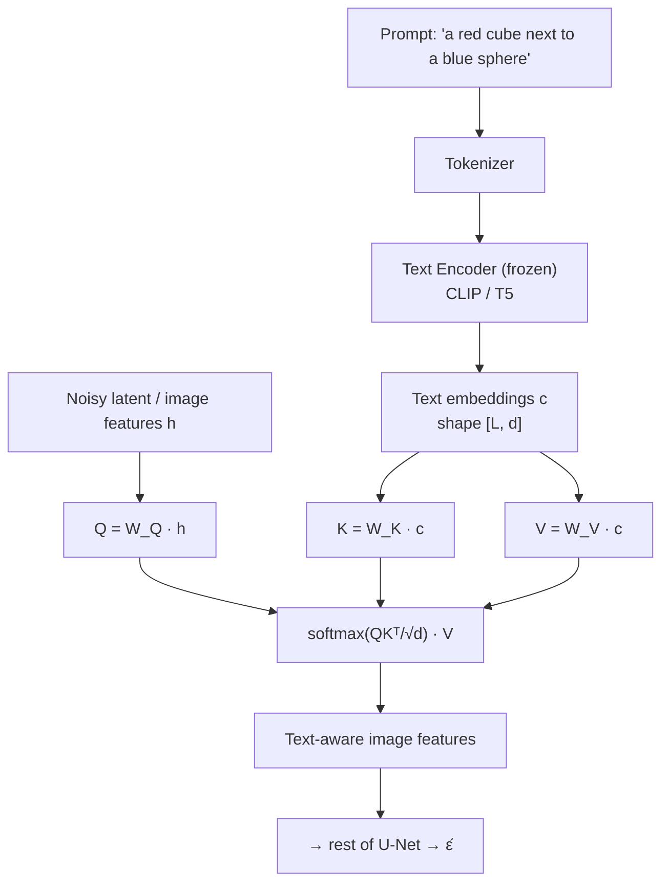

## 15.5 Classifier guidance (the predecessor)

Conditioning alone often produces images that only loosely follow the condition. Early work (Dhariwal & Nichol) fixed this with an external classifier.

**Idea.** Train a separate classifier $p_\phi(c\mid x_t)$ that works on *noisy* images. At sampling time, push the trajectory in the direction that increases the classifier's confidence:

$$
\hat\epsilon = \epsilon_\theta(x_t,t) - s\sqrt{1-\bar\alpha_t}\;\nabla_{x_t}\log p_\phi(c \mid x_t)
$$

where $s$ is the guidance scale. Via the score interpretation (§7.4), this is a gradient step uphill on class probability.

**Why it was abandoned.** It requires training a second model, that model must be trained on noisy inputs at all timesteps (an unusual, awkward requirement), it does not extend naturally to free-form text, and backpropagating through a classifier at every sampling step is slow. It works, but it is inelegant.

## 15.6 Classifier-free guidance (CFG)

Ho & Salimans found a way to get the same effect with **no second model**. This is the technique behind every modern text-to-image system, so it is worth understanding properly.

### The training trick

Train a **single** network to be both conditional and unconditional, by randomly dropping the condition:

```text
during training, for each example:
    with probability p_uncond (typically 0.1):
        c ← ∅              # the null / empty condition
    loss ← ‖ ε − ε_θ(x_t, t, c) ‖²
```

The null condition $\varnothing$ is a learned embedding (for text, usually the encoding of the empty string). After training, one network gives us both:

- $\epsilon_\theta(x_t, t, c)$ — the conditional prediction,
- $\epsilon_\theta(x_t, t, \varnothing)$ — the unconditional prediction.

### The sampling trick

At each sampling step, run the network **twice** and extrapolate:

$$
\boxed{\;\tilde{\epsilon}_\theta(x_t,t,c) = \epsilon_\theta(x_t,t,\varnothing) + w\Big(\epsilon_\theta(x_t,t,c) - \epsilon_\theta(x_t,t,\varnothing)\Big)\;}
$$

where $w$ is the **guidance scale** (often written $s$ or "CFG scale"). Use $\tilde\epsilon$ in place of $\hat\epsilon$ in the sampler.

### Why this works — read this part slowly

Focus on the difference term:

$$
\Delta = \epsilon_\theta(x_t,t,c) - \epsilon_\theta(x_t,t,\varnothing)
$$

This is **the part of the prediction that exists only because of the condition.** It isolates "what does knowing the prompt change about my estimate of the noise?" It is a direction in noise-space pointing from *generic image* toward *image matching this prompt*.

Now read the CFG formula as: *start from the unconditional prediction, then move $w$ times as far in the conditional direction as the model itself suggested.*

- $w = 0$: purely unconditional. The prompt is ignored.
- $w = 1$: $\tilde\epsilon = \epsilon_\theta(x_t,t,c)$ exactly — ordinary conditional generation, no guidance.
- $w > 1$: **extrapolation beyond** the conditional prediction. We deliberately overshoot in the prompt direction.

Formally, in score terms this samples from a sharpened distribution $\propto p(x)\,p(c\mid x)^{\,w-1}$ — the conditional likelihood raised to a power, which concentrates probability mass on samples that strongly satisfy the condition.

### Why increasing $w$ changes the output the way it does

Now the practical question — why do higher CFG scales give more prompt-faithful but more saturated, less diverse images?

Because **$w>1$ exaggerates the conditional signal beyond what the model actually predicted.** Consequences:

| Effect | Mechanism |
|---|---|
| **Better prompt adherence** | The prompt-specific direction is amplified, so every element mentioned gets pushed into the image more forcefully. |
| **Reduced diversity** | We are sampling from a sharpened distribution. Low-probability-but-valid interpretations of the prompt get suppressed; the model converges toward the most prototypical interpretation. |
| **Oversaturation, high contrast, "burned" look** | Extrapolation is not guaranteed to stay on the data manifold. Pushing too far produces $\hat{x}_0$ estimates outside the valid $[-1,1]$ pixel range; clipping then distorts colours. |
| **Loss of fine detail / artifacts** | At extreme $w$, the accumulated over-correction across many steps compounds into unnatural texture. |

| $w$ | Typical result |
|---|---|
| 1 | Weak prompt adherence, natural-looking, diverse |
| 3–7 | **The usual sweet spot** — good adherence, still natural |
| 10–15 | Strong adherence, noticeably saturated, less diverse |
| 20+ | Artifacts, blown-out colours, degraded quality |

**The cost:** two forward passes per step instead of one. CFG doubles inference cost. In practice both are batched together, so the wall-clock cost is less than 2× but the compute is genuinely doubled. This is also why "guidance distillation" (training a model to produce the guided output in one pass) is an active research direction.

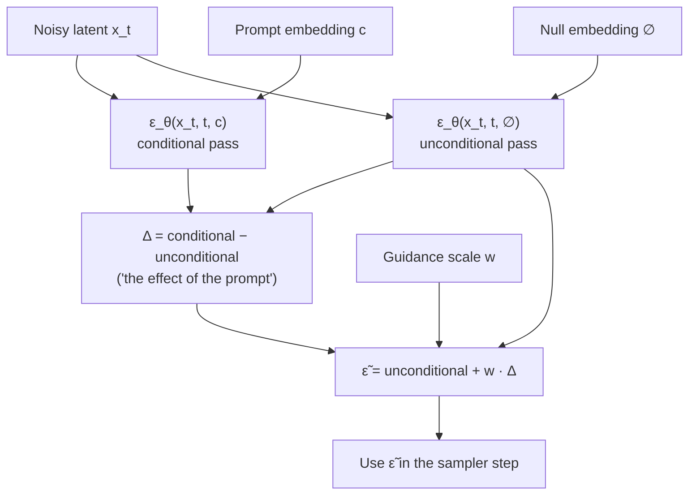

## 15.7 Other conditioning signals

The same machinery extends well beyond text:

| Signal | How it is injected |
|---|---|
| Class label | Added to the time embedding (§15.2) |
| Text | Cross-attention (§15.4) |
| Another image (img2img) | Start sampling from a partially-noised version of it instead of pure noise |
| Inpainting mask | Replace the known region with the correctly-noised original at every step |
| Depth map / edges / pose (ControlNet) | A parallel trainable copy of the encoder whose outputs are added into the U-Net's skip connections |
| Low-resolution image (super-resolution) | Concatenated to $x_t$ as extra input channels |

Note the pattern: **spatially-structured conditions enter through spatial pathways (concatenation, skip connections); global or sequential conditions enter through embeddings or attention.** Match the shape of the condition to the shape of the injection point.

---

# 16. Text-to-Image Diffusion

We now assemble the full modern system. The important message: **modern text-to-image models are the DDPM idea plus several engineering layers — related, but not identical.**

## 16.1 The high-level pipeline

$$
\text{Text} \to \text{Text Encoder} \to \text{Conditioning Representation} \to \text{Diffusion Model} \to \text{Denoising} \to \text{Image}
$$

## 16.2 Component roles

**Text encoder.**
Converts the prompt into embeddings. Typically CLIP's text encoder or T5-XXL, **frozen** (not trained with the diffusion model). It supplies language understanding — syntax, compositional meaning, world knowledge about what words refer to. Its quality directly bounds how well prompts can be followed; a model cannot render a concept its text encoder does not distinguish.

**Text embeddings.**
The tensor $c \in \mathbb{R}^{L\times d}$. The sequence structure is preserved deliberately, so cross-attention can address individual words.

**Cross-attention.**
The binding mechanism (§15.4). It answers, for every image region at every denoising step, "which words are relevant here?" This is the only place where language and pixels actually meet.

**U-Net / denoising network.**
The same $\epsilon_\theta$ as in DDPM, now also conditioned on $c$. Still just predicting noise. In modern systems this is the largest component (~860M parameters in Stable Diffusion 1.x, far larger in successors). Newer systems increasingly replace the U-Net with a transformer (DiT / MMDiT), but its *job* is unchanged.

**Scheduler.**
Decides the noise schedule and the update rule that converts $\epsilon_\theta$ into the next $x_{t-1}$ (§19). Swappable at inference without retraining.

**VAE encoder/decoder.**
Compresses images into a small latent space and back (§17). The diffusion happens entirely in the latent space; the decoder renders the final image.

## 16.3 How this differs from the original DDPM

| Aspect | Original DDPM (2020) | Modern text-to-image |
|---|---|---|
| Space | Raw pixels | VAE latent space |
| Conditioning | None (or class labels) | Free-form text via cross-attention |
| Guidance | None | Classifier-free guidance, $w\approx 3$–8 |
| Sampler | DDPM, 1000 steps | DDIM / DPM-Solver / Euler, 20–50 steps |
| Resolution | 32×32 – 256×256 | 1024×1024 and beyond |
| Text encoder | — | Frozen CLIP / T5 |
| Backbone | U-Net with attention | U-Net or transformer (DiT), much larger |
| Training data | ~10⁵–10⁶ images | 10⁸–10⁹ image-text pairs |
| Extras | — | ControlNet, LoRA, refiners, distillation |

**But the core is unchanged.** Predict the noise; subtract a bit; repeat. Everything in the right-hand column is an engineering layer wrapped around the idea derived in Sections 4–12.

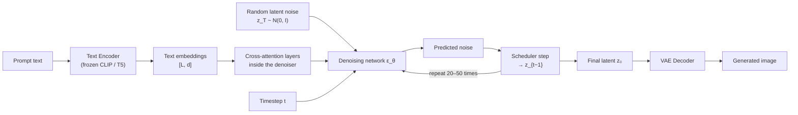

---

# 17. Latent Diffusion

## 17.1 The problem

Run the numbers for pixel-space diffusion at 512×512 RGB:

- Each $x_t$ has $512\times512\times3 = 786{,}432$ values.
- Every U-Net layer processes tensors at this scale.
- Self-attention at 512×512 would need $(512^2)^2 \approx 6.9\times10^{10}$ attention weights — completely infeasible.
- Multiply the whole forward pass by 50 sampling steps, then by 2 for CFG.

Pixel-space diffusion at high resolution is prohibitively expensive. Early systems worked around it with **cascades** — generate 64×64, then run separate super-resolution diffusion models to 256×256 and 1024×1024 (this is what Imagen and DALL·E 2 did). It works, but it means training and running three or four models.

## 17.2 The key observation

**Most pixels are perceptually redundant.**

A photograph contains a great deal of information that no human notices: exact noise in a smooth sky, precise values in a blurred background, sub-pixel texture variation. Standard image compression exploits this — a JPEG at 10:1 compression is visually near-identical to the original.

So: why spend the diffusion model's capacity modelling imperceptible detail? **Separate the two jobs:**

| Job | Best tool |
|---|---|
| Remove perceptual redundancy (compression) | An autoencoder — cheap, trained once |
| Model the semantic structure of images (the hard part) | The diffusion model |

Latent diffusion (Rombach et al., 2022 — "Stable Diffusion") does exactly this.

## 17.3 The architecture

$$
\text{Image} \to \text{VAE Encoder} \to \text{Latent} \to \text{Diffusion} \to \text{Denoised Latent} \to \text{VAE Decoder} \to \text{Image}
$$

**Stage 1 — train the autoencoder (once, separately).**
An encoder $\mathcal{E}$ maps $x \in \mathbb{R}^{3\times512\times512}$ to $z \in \mathbb{R}^{4\times64\times64}$; a decoder $\mathcal{D}$ maps back. The spatial downsampling factor is typically $f=8$.

**The compression ratio:** $\frac{3 \times 512 \times 512}{4\times64\times64} = \frac{786432}{16384} = 48\times$ fewer values.

This autoencoder is trained with a reconstruction loss plus a perceptual loss (LPIPS) plus a small adversarial loss. The perceptual and adversarial terms matter: a plain MSE autoencoder at 48× compression would produce blurry reconstructions (§1.6.2 again). The GAN term specifically restores realistic high-frequency texture. **The VAE's KL term is given a very small weight** — it is used only for mild latent regularisation, not to build a strong generative prior. The generative modelling is the diffusion model's job.

**Stage 2 — train the diffusion model in latent space.**
Everything from Sections 4–12 applies unchanged, with $z_0 = \mathcal{E}(x_0)$ in place of $x_0$:

$$
z_t = \sqrt{\bar\alpha_t}\,z_0 + \sqrt{1-\bar\alpha_t}\,\epsilon,
\qquad
\mathcal{L} = \mathbb{E}\left[\|\epsilon - \epsilon_\theta(z_t,t,c)\|^2\right]
$$

**Stage 3 — generate.** Sample $z_T \sim \mathcal{N}(0,I)$ at latent resolution, denoise to $z_0$, then decode once: $x = \mathcal{D}(z_0)$.

```mermaid
flowchart TD
    subgraph TRAIN["Training (diffusion stage)"]
        IMG["Training image<br/>3×512×512"] --> ENC["VAE Encoder ℰ<br/>(frozen)"]
        ENC --> Z0["Latent z₀<br/>4×64×64"]
        Z0 --> NOISE["Add noise → z_t"]
        NOISE --> UNET["U-Net ε_θ(z_t, t, c)"]
        TXT["Prompt → Text Encoder → c"] --> UNET
        UNET --> LOSS["MSE vs true ε"]
    end

    subgraph GEN["Generation"]
        ZT["z_T ~ N(0,I)<br/>4×64×64"] --> LOOP["Denoising loop<br/>20–50 steps"]
        TXT2["Prompt → c"] --> LOOP
        LOOP --> ZF["Denoised latent z₀"]
        ZF --> DEC["VAE Decoder 𝒟<br/>(frozen)"]
        DEC --> OUTIMG["Image 3×512×512"]
    end
```

## 17.4 Why this reduces computation so much

| Quantity | Pixel space 512² | Latent space 64² | Factor |
|---|---|---|---|
| Elements per tensor | 786,432 | 16,384 | 48× |
| Convolution cost | $\propto H\!\times\!W$ | $\propto H\!\times\!W$ | ~48× cheaper |
| Attention cost | $\propto (HW)^2$ | $\propto (HW)^2$ | ~**2300×** cheaper |
| VAE decode | — | once, at the very end | negligible |

The attention row is the decisive one. Attention scales *quadratically* with the number of spatial positions, so an 8× spatial reduction is a 64× reduction per axis pair — roughly 2300× in total. **This is what made full-resolution self-attention and cross-attention affordable, and therefore what made strong text conditioning practical.** Latent diffusion did not just make things cheaper; it enabled an architecture that pixel-space diffusion could not afford.

Note also that the VAE decode happens **once**, not once per step. Its cost is amortised across all 50 denoising steps and is negligible.

## 17.5 What is preserved and what is lost

**Preserved (this is the point):**
- Semantic content — objects, identities, scene composition
- Spatial layout (the latent retains a $64\times64$ spatial grid, so a latent position corresponds to an image region — this is why cross-attention still works spatially)
- Colour, lighting, overall structure
- Most perceptually salient texture

**Lost (this is the cost):**
- Exact pixel values — reconstruction is never bit-perfect
- Very fine high-frequency detail, especially **small text**, which is why early Stable Diffusion models rendered text so badly
- Fine regular patterns and small faces can pick up characteristic VAE artifacts
- The latent space imposes a **quality ceiling**: no matter how good the diffusion model is, output quality can never exceed $\mathcal{D}(\mathcal{E}(x))$ — the autoencoder's own reconstruction quality

> **An important consequence:** some failure modes blamed on the diffusion model are actually VAE limitations. If $\mathcal{D}(\mathcal{E}(x))$ cannot reproduce crisp small text, no amount of diffusion improvement will fix it. This is why later systems (SDXL, SD3) increased the number of latent channels from 4 to 16 — a direct attack on the autoencoder ceiling.

## 17.6 The trade-off summarised

| | Pixel diffusion | Latent diffusion |
|---|---|---|
| Compute | Very high | ~50× lower |
| Max practical resolution | Low, or needs cascades | High, directly |
| Attention | Barely affordable | Cheap |
| Fidelity ceiling | The data itself | The autoencoder's reconstruction |
| Number of models | 1 (or 3–4 cascaded) | 2 (VAE + diffusion) |
| Fine detail / small text | Better | Worse |
| Consumer-GPU inference | No | Yes |

---
# 18. Complete Modern Diffusion Pipeline

Everything, in one place.

```mermaid
flowchart TD
    P["Text Prompt<br/>'a red fox in a snowy forest, golden hour'"] --> TOK["Tokenizer<br/>text → token IDs"]
    TOK --> TE["Text Encoder (frozen)<br/>CLIP / T5"]
    TE --> EMB["Text Embeddings c<br/>[L, d]"]
    TE --> NEG["Null / negative embedding ∅<br/>(for classifier-free guidance)"]

    SEED["Random seed"] --> ZT["Initial latent noise<br/>z_T ~ N(0, I), 4×64×64"]

    ZT --> LOOP

    subgraph LOOP["DENOISING LOOP — repeat for each scheduler timestep"]
        direction TB
        IN["Current latent z_t"] --> TEMB["Timestep t → sinusoidal<br/>embedding → MLP"]
        TEMB --> UNET
        IN --> UNET["Denoising Network ε_θ<br/>(U-Net or DiT)"]
        EMB2["Text embeddings c"] --> XATT["Cross-Attention<br/>(inside every block)"]
        XATT --> UNET
        UNET --> EPSC["ε_cond = ε_θ(z_t, t, c)"]
        UNET --> EPSU["ε_uncond = ε_θ(z_t, t, ∅)"]
        EPSC --> CFG["CFG:<br/>ε̃ = ε_uncond + w(ε_cond − ε_uncond)"]
        EPSU --> CFG
        CFG --> SCH["Scheduler step<br/>(DDIM / DPM-Solver / Euler)"]
        SCH --> OUTL["z_{t−1}"]
    end

    EMB --> EMB2
    NEG --> EPSU
    LOOP --> Z0["Final denoised latent z₀<br/>4×64×64"]
    Z0 --> VAE["VAE Decoder 𝒟"]
    VAE --> IMGOUT["Generated Image<br/>3×512×512"]
```

## 18.1 Component-by-component

| Stage | What happens | Why it is there |
|---|---|---|
| **Tokenizer** | Splits the prompt into subword tokens, pads/truncates to a fixed length (e.g. 77) | The text encoder needs a fixed-shape integer input |
| **Text encoder** | Maps tokens to contextual embeddings; frozen | Supplies language understanding learned from far more text than any image dataset contains |
| **Text embeddings $c$** | Sequence of vectors, shape $[L,d]$ | Keeps per-word structure so cross-attention can address individual words |
| **Null embedding $\varnothing$** | Encoding of the empty string (or a "negative prompt") | The unconditional branch of CFG (§15.6) |
| **Seed → $z_T$** | Draws the starting latent noise | The only source of variation; determines *which* image is produced |
| **Timestep embedding** | Sinusoidal → MLP → injected into every block | Tells the network the current noise level (§10) |
| **Denoising network** | Predicts the noise in $z_t$ | The single learned generative component |
| **Cross-attention** | Each spatial position queries the text | Binds words to image regions (§15.4) |
| **CFG combination** | Extrapolates along the conditional direction | Amplifies prompt adherence (§15.6) |
| **Scheduler step** | Converts $\tilde\epsilon$ into $z_{t-1}$ | Implements the reverse process; determines step count and quality (§19) |
| **Loop** | Repeats 20–50 times | Iterative refinement — the core diffusion idea |
| **VAE decoder** | Latent → pixels, once at the end | Reverses the compression (§17) |

## 18.2 Where the cost goes

For a typical 50-step generation with CFG:

- **100 network forward passes** (50 steps × 2 for CFG) — well over 95% of the compute.
- 1 text-encoder pass — negligible, done once.
- 1 VAE decode — negligible.

This concentration is why every optimisation targets the loop: fewer steps (better schedulers, §19), cheaper steps (distillation, quantisation), or eliminating the CFG doubling (guidance distillation).

## 18.3 Negative prompts

A small but practically important detail. Instead of encoding the empty string for the unconditional branch, encode a **negative prompt** ("blurry, extra fingers, watermark"). The CFG formula becomes:

$$
\tilde\epsilon = \epsilon_\theta(z_t,t,c_{\text{neg}}) + w\big(\epsilon_\theta(z_t,t,c) - \epsilon_\theta(z_t,t,c_{\text{neg}})\big)
$$

Now the guidance direction points *away from* the negative prompt as well as *toward* the positive one. It costs nothing extra — the unconditional pass was already being computed. This is a good example of how much practical capability falls out of the CFG structure once you understand it.

---

# 19. Important Schedulers

## 19.1 What a scheduler is

The **scheduler** (or sampler, or solver) is the component that owns everything about the reverse process *except* the network. Specifically it decides:

1. **The noise schedule** — the $\beta_t$ / $\bar\alpha_t$ values (must match training).
2. **Which timesteps to visit** — all 1000, or a subsequence of 50.
3. **The update rule** — how to turn $\epsilon_\theta(x_t,t)$ into $x_{t-1}$.
4. **How much noise to inject**, if any.

Crucially: **the scheduler contains no learned parameters.** It is pure mathematics operating on the network's outputs. This is why you can swap schedulers at inference without retraining — the insight that DDIM first exposed (§14.2).

```mermaid
flowchart LR
    Z["Current latent z_t"] --> NET["Network ε_θ<br/>(LEARNED — fixed weights)"]
    NET --> E["Predicted noise ε̂"]
    E --> SCH["Scheduler<br/>(NOT learned — pure math)"]
    Z --> SCH
    SCH --> ZN["z_{t−1}"]
    SCH -.-> CTRL["decides: which timesteps,<br/>update rule, noise level"]
```

## 19.2 The useful reframing: an ODE solver

Song et al. showed that as $T \to \infty$, the diffusion process becomes a continuous stochastic differential equation, and deterministic sampling corresponds to solving an **ordinary differential equation** whose trajectory runs from noise to data:

$$
\frac{dx}{dt} = f(x, t) \quad\text{where } f \text{ is computed from } \epsilon_\theta
$$

Once you see it this way, the entire scheduler zoo becomes legible:

| Scheduler | Numerical method | Network calls per step |
|---|---|---|
| DDIM | Euler (first-order) | 1 |
| Heun | Second-order (predictor-corrector) | 2 |
| DPM-Solver++ | Higher-order, exploits the ODE's exponential structure | 1–2 |
| PNDM / LMS | Linear multistep (reuses past evaluations) | 1 |
| Ancestral / SDE samplers | Stochastic — solve the SDE, not the ODE | 1 |

**And the central trade-off becomes obvious:** a higher-order solver takes a more accurate step but may cost more network calls. The question is always whether $N$ accurate steps beat $2N$ crude ones. For diffusion, higher-order methods generally win below ~30 steps.

## 19.3 The main families

**DDPM scheduler (ancestral sampling).**
The original (§12). Stochastic, Markovian, needs ~1000 steps. Highest diversity, slowest. Mostly of theoretical interest now, but it is the reference against which others are judged.

**DDIM scheduler.**
Deterministic (at $\eta=0$), skips steps, 20–100 steps (§14). Reproducible, invertible, the default for many years. Still widely used for editing workflows because of inversion.

**DPM-Solver / DPM-Solver++.**
Exploits the *semi-linear* structure of the diffusion ODE: part of the dynamics is linear and can be solved *exactly*, so the numerical approximation only applies to the remaining nonlinear part. This is why it gets good quality in 15–25 steps where a first-order method needs 50. Currently the most common default in production systems.

**Euler / Euler-ancestral.**
Euler is a clean first-order deterministic solver, essentially DDIM in ODE clothing. Euler-ancestral adds noise each step, which makes outputs more varied and often more "creative" — but it never fully converges as steps increase, since each step re-injects randomness.

**PNDM / LMS (multistep).**
Reuse the network outputs from previous steps to construct a higher-order estimate without extra network calls. Efficient, but they need a few ordinary steps to "warm up" the history.

**Karras-style sigma schedules.**
Not a solver but a *timestep-spacing* strategy. Instead of uniform spacing in $t$, space the noise levels according to a tuned curve that allocates more steps where the trajectory curves most (the low-noise end). Often gives a visible quality gain at low step counts for free — a reminder that *where* you put your steps matters as much as how you take them.

## 19.4 Why the scheduler changes the result

| Property | How the scheduler affects it |
|---|---|
| **Speed** | Directly — it chooses how many timesteps to visit, and how many network calls each costs |
| **Inference steps** | Higher-order solvers reach acceptable quality in fewer steps |
| **Image quality** | At low step counts, discretisation error dominates; better solvers mean less error, hence sharper, more coherent results |
| **Stability** | Some solvers become unstable at high guidance scales (DPM-Solver++ was specifically designed to handle high CFG) |
| **Sampling behaviour** | Stochastic samplers keep injecting randomness, so outputs vary and never fully converge; deterministic ones converge to a fixed point as steps increase |
| **Reproducibility** | Deterministic schedulers give identical output from identical seeds; ancestral ones need the full noise sequence fixed |

**Two things a scheduler cannot do:**

1. **It cannot exceed the trained model's quality.** The scheduler only navigates the trajectory the network defines. A better solver reaches the destination more accurately; it does not move the destination.
2. **It must be consistent with the training noise schedule.** The $\bar\alpha_t$ values must match those used during training, or the network receives inputs whose noise level it misjudges.

**Practical guidance:** if outputs look noisy or incoherent, add steps or switch to a higher-order solver. If they look over-saturated, lower the CFG scale — that is a guidance problem, not a scheduler problem. Knowing which knob addresses which symptom is most of the practical skill.

---

# 20. Common Misconceptions

## "The model directly generates the image in one step."

**Why it is wrong.** The network never outputs an image. It outputs a *noise estimate* of the same shape as the image. A single forward pass produces nothing viewable — you need 20 to 1000 of them, chained through the scheduler.

**Correct mental model.** The network is a *denoising expert*, not an image generator. Generation is what happens when you apply that expert repeatedly inside a sampling loop. The image emerges from the loop, not from the network.

---

## "The model memorizes images and retrieves them."

**Why it is wrong.** The model's weights are far smaller than its training data (hundreds of millions of parameters versus billions of images) — there is no room to store them. And its actual learned function is "estimate the noise in a noisy image at level $t$", which is a smooth local mapping, not a lookup. Novel prompt combinations ("an astronaut riding a horse") produce coherent images that appear in no dataset.

**Nuance worth keeping.** Memorisation *can* occur for images duplicated many times in the training set, and researchers have extracted such examples. This is a real concern for dataset curation and an active area of study — but it is an edge case caused by duplication, not the mechanism by which the model works.

**Correct mental model.** The model learns the *statistical structure* of images — what textures, shapes, and arrangements are plausible. It generates by repeatedly nudging noise toward that learned structure. Novelty comes from the random starting point traversing a learned landscape.

---

## "The neural network itself adds and removes all the noise."

**Why it is wrong.** Noise is *added* by a fixed mathematical formula chosen by the designer — the network is not involved in the forward process at all. And during sampling, the network does not remove noise either; it only *estimates* it. The subtraction and rescaling are performed by the scheduler.

**Correct mental model.** Three separate roles: the **forward process** (fixed maths) adds noise; the **network** estimates noise; the **scheduler** (fixed maths) uses that estimate to take a step. Only the middle one is learned.

---

## "Training and generation are the same process, run in opposite directions."

**Why it is wrong.** Training never runs the reverse chain. It picks *one random timestep* per example, jumps straight to it via the closed form, makes one prediction, and updates. It produces no images at all.

**Correct mental model.** Training teaches individual rungs of a ladder, independently and in random order. Sampling climbs the ladder rung by rung. The closed-form $q(x_t\mid x_0)$ is what decouples the two — and it is precisely why training is cheap while sampling is expensive (§13).

---

## "DDIM is a completely different type of model."

**Why it is wrong.** DDIM is a **sampler**, not a model. It uses the identical network with the identical weights, trained with the identical loss. You can generate from the same checkpoint with DDPM or DDIM by changing one line of inference code. They are even the same formula with different $\eta$: $\eta=1$ is DDPM, $\eta=0$ is DDIM (§14.4).

**Correct mental model.** Train once, sample many ways. The training objective constrains only the marginals $q(x_t\mid x_0)$, which leaves an entire family of valid samplers compatible with the same weights.

---

## "Latent diffusion means diffusion no longer happens."

**Why it is wrong.** The full diffusion process — forward noising, noise prediction, iterative reverse sampling — happens exactly as described in Sections 4–12. The *only* change is the space it operates in: $4\times64\times64$ latents instead of $3\times512\times512$ pixels. Every equation is unchanged with $z$ substituted for $x$.

**Correct mental model.** The VAE is a compression wrapper. Diffusion runs inside it, unmodified. Think "diffusion in a smaller room", not "a different method".

---

## "The text encoder generates the image."

**Why it is wrong.** The text encoder produces embeddings and nothing else. It never sees pixels, never sees noise, and is usually frozen — it isn't even trained as part of the system. It cannot generate anything.

**Correct mental model.** The text encoder is a *translator*, converting language into a representation the diffusion model can consult. The diffusion model is what generates, and cross-attention is where the two meet. A useful test of understanding: a diffusion model with no text encoder still generates perfectly good images — just uncontrolled ones.

---

## "More denoising steps always give a better image."

**Why it is wrong.** Quality saturates. Past a solver-dependent point (often 30–50 steps for modern solvers), additional steps produce essentially identical output at linearly increasing cost. With stochastic samplers, more steps change the image rather than improving it, because fresh noise is injected each time.

**Correct mental model.** Steps control the *accuracy of trajectory integration*. Once the discretisation error is below the model's own error, more steps buy nothing.

---

## "Higher guidance scale always means better prompt adherence."

**Why it is wrong.** Adherence improves up to a point, then quality collapses — oversaturation, artifacts, loss of diversity (§15.6). CFG with $w>1$ *extrapolates beyond* what the model predicted, and extrapolation eventually leaves the data manifold.

**Correct mental model.** $w$ trades diversity and naturalness for prompt fidelity. There is a sweet spot (usually 3–8), not a monotonic improvement.

---

## "The noise added during sampling is a bug or an inefficiency."

**Why it is wrong.** In DDPM, the injected noise is a required part of sampling from $p_\theta(x_{t-1}\mid x_t)$, which is a *distribution*. Omitting it means always taking the mean, which collapses diversity and, at high noise levels, means tracking a blurry average (§12.3).

**Correct mental model.** The noise is what lets each trajectory commit to a specific image rather than drifting toward the average of all possible images. DDIM removes it only by reformulating the process as a deterministic ODE, not by declaring it unnecessary.

---

# 21. Limitations

It helps to sort limitations into two kinds:

- **Fundamental** — inherent to the method or to generative modelling itself. Better engineering mitigates but cannot eliminate them.
- **Engineering** — consequences of current implementations, scale, or data. These have improved rapidly and will continue to.

## 21.1 Fundamental limitations

**Iterative sampling is intrinsically sequential.**
The reverse process has no closed form (§6.3), so steps cannot be parallelised across time. You can make steps fewer or cheaper, but the sequential dependency is structural. *Caveat:* consistency models and distillation attack this by training a *different* model to shortcut the trajectory — which concedes the point, since they change the model rather than the sampler.

**The model is bounded by its training distribution.**
A generative model can only produce what its learned distribution supports. Genuinely novel concepts, unusual compositions, or rare object categories are generated poorly or not at all. This is not a flaw in diffusion specifically — it is what "learning a distribution" means.

**Bias is inherited from data.**
If the training data associates certain professions with certain demographics, the model reproduces and often amplifies that association — because amplifying high-probability modes is exactly what a well-fitted generative model does, and CFG amplifies it further. Filtering and rebalancing help, but a model cannot represent what its data never showed it.

**There is no explicit reasoning, counting, or symbolic structure.**
The model learns pixel/latent statistics. Nothing in its architecture represents "exactly five objects" or "the text must read *OPEN*". Correct counts and correct spelling arise only when they are statistically common in training. This is why "exactly five red balls" and rendered text fail so characteristically: **the model has no mechanism that could enforce a discrete constraint.**

**Sampling is approximate.**
Each reverse step assumes the true posterior is Gaussian (§6.2), which is only exact in the limit of infinitesimal steps. Combined with network error and exposure bias (§13.2), small errors compound across the chain.

**Conditioning is soft, never guaranteed.**
Cross-attention biases generation; it does not constrain it. There is no way to *guarantee* the output contains a specific element. Adding constraints (ControlNet, inpainting masks) strengthens control but never makes it absolute.

## 21.2 Engineering limitations

**Sampling speed.**
20–50 network passes, doubled by CFG. Far slower than a GAN's single pass. Rapidly improving via better solvers, distillation, and consistency models.

**Training cost.**
Large text-to-image models require thousands of GPU-days and hundreds of millions of image-text pairs. This concentrates training in well-resourced organisations, though fine-tuning (LoRA, DreamBooth) has democratised *adaptation*.

**Memory.**
Inference needs the U-Net, text encoder, and VAE resident simultaneously; CFG doubles activation memory. Training needs far more. Mitigated by quantisation, attention optimisations, and model offloading.

**Dataset quality.**
Web-scraped image-text pairs are noisy — captions are often inaccurate or irrelevant. Recaptioning datasets with vision-language models produced large, direct gains (DALL·E 3's main reported improvement), showing how much headroom lay in data rather than architecture.

**Prompt sensitivity.**
Small wording changes can substantially alter results, and effective prompting is partly an empirical skill. This reflects an imperfectly-shaped conditioning space; better text encoders and recaptioned training data steadily reduce it.

**Fine detail.**
Hands, teeth, small faces, complex machinery, and text are classic failure cases. Causes: under-representation in data, the latent autoencoder's ceiling (§17.5), and limited capacity at high spatial frequencies. Measurably improving with scale and better autoencoders.

**Hallucinated details.**
The model fills in plausible-looking detail that is factually wrong — an extra finger, an impossible reflection, mangled architecture. It is optimising for plausibility, not correctness, and it has no verification mechanism.

**Reproducibility.**
Same seed and same settings give the same image only within an identical software and hardware stack. Different GPUs, precisions, or library versions produce different floating-point results, which compound across the chain. Practically annoying, not fundamental.

## 21.3 Summary

| Limitation | Kind | Trend |
|---|---|---|
| Sequential sampling | Fundamental | Mitigated (distillation, consistency models) |
| Bounded by training distribution | Fundamental | Improves only with data |
| Data bias | Fundamental | Partially mitigable |
| No symbolic reasoning / counting | Fundamental | Improving via data, not architecture |
| Approximate reverse process | Fundamental | Mitigated by more/better steps |
| Soft conditioning | Fundamental | Strengthened by ControlNet etc. |
| Sampling speed | Engineering | Improving fast |
| Training cost | Engineering | Rising, but fine-tuning is cheap |
| Memory | Engineering | Improving fast |
| Data quality | Engineering | Improving fast (recaptioning) |
| Prompt sensitivity | Engineering | Improving |
| Fine detail / text | Engineering | Improving fast |
| Reproducibility | Engineering | Stable, managed |

---

# 22. Important Trade-offs

Design choices, and — more usefully — *when each one matters*. None of these has a universally correct answer.

## 22.1 More diffusion steps vs fewer

| More steps | Fewer steps |
|---|---|
| Lower discretisation error, more accurate trajectory | Much faster, cheaper |
| Better at high guidance scales | May show softness or artifacts |
| Diminishing returns past ~30–50 | Quality depends heavily on the solver |

**When it matters:** interactive tools and real-time previews demand few steps. Final renders, high guidance, or unusual prompts benefit from more. **The honest rule:** increase steps until the output stops changing; that is your saturation point, and it differs per model and solver.

## 22.2 Pixel-space vs latent-space diffusion

| Pixel space | Latent space |
|---|---|
| No autoencoder ceiling — maximum fidelity | ~50× cheaper; enables high resolution directly |
| Needs cascades for high resolution | Attention becomes affordable (§17.4) |
| Simpler conceptually, one model | Two models; fine detail and small text suffer |

**When it matters:** scientific or medical imaging, where exact pixel fidelity is the point, favours pixel space. Consumer-scale text-to-image at 1024² is effectively impossible without latents.

## 22.3 Larger model vs smaller model

| Larger | Smaller |
|---|---|
| Better prompt understanding, compositional ability, detail | Faster inference, lower memory, deployable on-device |
| Higher training and inference cost | Easier and cheaper to fine-tune |

**When it matters:** the bottleneck is often *not* the U-Net. Imagen found scaling the **text encoder** improved alignment more than scaling the U-Net; DALL·E 3 found improving **captions** mattered more than either. Diagnose which component is actually limiting before scaling the obvious one.

## 22.4 Stronger guidance vs weaker guidance

| Stronger ($w$ high) | Weaker ($w$ low) |
|---|---|
| Closer prompt adherence | More natural, less saturated |
| Lower diversity, saturation, artifacts | Prompt may be partially ignored |

**When it matters:** complex multi-element prompts need higher $w$ to get every element rendered. Photorealism and artistic subtlety need lower $w$. Generating many varied options from one prompt needs lower $w$. **Note the asymmetry:** the cost of too-low $w$ is a missed element (recoverable by rerolling); the cost of too-high $w$ is a degraded image (not recoverable). Err low.

## 22.5 More training compute vs faster inference

| Invest in training | Invest in inference speed |
|---|---|
| A better base model improves everything downstream | Distillation/consistency models cut steps to 1–4 |
| Training cost is paid once | Distilled models typically lose some quality and diversity |

**When it matters:** this is an amortisation question. A model serving millions of requests should pay heavily at training time — including distillation — because inference cost dominates the lifetime total. A research model generating a few thousand samples should not.

## 22.6 Higher resolution vs computational cost

| Higher resolution | Lower resolution |
|---|---|
| More detail, more usable output | Quadratically cheaper (and worse for attention) |
| Needs more training data at that resolution | Can be upscaled afterwards |

**When it matters:** generating at low resolution and upscaling with a separate model is often the better economic choice, since the upscaler is cheap and specialised. But native high-resolution generation produces better *global* composition, because the model plans the whole image at full scale. Choose based on whether the weakness is detail (upscale) or composition (generate natively).

## 22.7 Deterministic vs stochastic sampling

| Deterministic (DDIM, $\eta=0$) | Stochastic (DDPM, ancestral) |
|---|---|
| Reproducible; enables inversion and interpolation | Higher diversity |
| Slightly lower diversity | Can self-correct small errors via re-noising |
| Converges as steps increase | Never fully converges |

**When it matters:** editing workflows require determinism (you must be able to invert and re-run). Exploratory generation benefits from stochasticity.

---

# 23. Complete End-to-End Mental Model

**This is the section to return to.** It restates the whole method as one connected story.

## 23.1 The basic diffusion model

```text
Data
 ↓   We have a dataset of real images. They occupy a thin, complicated region
 ↓   in a very high-dimensional space. We cannot write down that region, but
 ↓   we can sample from it — we have examples.
 ↓
Forward Noise Process
 ↓   We define a FIXED procedure that gradually destroys an image by adding
 ↓   Gaussian noise over T steps. It is designed to be variance-preserving,
 ↓   so after T steps we reliably land at N(0, I) — a distribution we can
 ↓   sample from trivially. Because Gaussian variances add, the whole chain
 ↓   collapses into one formula:
 ↓         x_t = √ᾱ_t · x₀ + √(1−ᾱ_t) · ε
 ↓   This lets us jump to ANY noise level instantly.
 ↓
Noisy Training Examples
 ↓   That formula manufactures unlimited labelled training data for free.
 ↓   Take any image, pick any t, draw any ε — you now have an input (x_t, t)
 ↓   and a perfect target (ε). No human labelling. No adversary.
 ↓
Neural Network Learns Noise Prediction
 ↓   A U-Net takes (x_t, t) and predicts ε. Training is plain MSE regression,
 ↓   one random timestep per example. We predict the noise rather than the
 ↓   image because ε is the ONE unknown in the exact formula for the optimal
 ↓   reverse step — and because it is a target of constant scale whose hard
 ↓   cases are genuinely solvable.
 ↓   Skip connections carry high-frequency detail (noise IS high frequency).
 ↓   Timestep embeddings tell the network which of T different jobs to do.
 ↓
Learned Reverse Process
 ↓   Small forward steps ⟹ the true reverse step is approximately Gaussian.
 ↓   So the network only needs to supply a MEAN, computed from ε̂ by a fixed
 ↓   formula. We cannot compute the true reverse directly (that would require
 ↓   already knowing the data distribution), so we learn it instead.
 ↓
Random Noise During Sampling
 ↓   At generation time, start from x_T ~ N(0, I). This is legitimate because
 ↓   the forward process was DESIGNED to end there. The random draw is what
 ↓   decides WHICH image we get.
 ↓
Repeated Denoising
 ↓   For t = T … 1:  predict ε̂ → subtract a small amount → rescale →
 ↓   add a little fresh noise. Each step is a small, easy correction.
 ↓   Early steps fix global layout; middle steps decide content;
 ↓   late steps add texture. No single step ever has to invent an image.
 ↓
Clean Sample
     A new image that was not in the training set, drawn from the learned
     distribution.
```

**The one-paragraph version.** Destroying an image with noise is easy and requires no learning, and it generates perfect supervised training data for free. Train a network to undo one small step of that destruction. Then, to generate, start from pure noise and apply that network a thousand times. The network supplies the knowledge of what images look like; the random starting point supplies the choice of which image.

## 23.2 Extending to modern text-to-image

```text
Text Prompt
 ↓   "a red fox in a snowy forest, golden hour"
 ↓
Text Encoder (frozen CLIP or T5)
 ↓   Converts the prompt to a SEQUENCE of embeddings [L, d].
 ↓   Frozen, because it already understands language from far more text
 ↓   than any image dataset contains. We keep the sequence structure so
 ↓   individual words remain addressable.
 ↓
Latent Space (the VAE)
 ↓   Instead of diffusing over 3×512×512 pixels, first compress to
 ↓   4×64×64 with a VAE encoder — 48× fewer numbers. Most pixel detail is
 ↓   perceptually redundant, so we let a cheap autoencoder handle
 ↓   compression and let the diffusion model handle the hard part:
 ↓   semantic structure. Attention becomes ~2300× cheaper, which is what
 ↓   made strong text conditioning affordable in the first place.
 ↓
Conditioned Denoising Loop
 ↓   Exactly the process from §23.1, with z in place of x, plus:
 ↓
 ↓   • CROSS-ATTENTION — at every block, each spatial position asks
 ↓     "which words are relevant to what should be here?" This is the
 ↓     only place language and pixels actually meet.
 ↓
 ↓   • CLASSIFIER-FREE GUIDANCE — run the network twice, once with the
 ↓     prompt and once with a null prompt. Their difference is "the
 ↓     effect of the prompt". Move w times as far in that direction.
 ↓     w > 1 deliberately overshoots: more prompt adherence, less
 ↓     diversity, eventually saturation artifacts.
 ↓
 ↓   • A FAST SCHEDULER — DDIM or DPM-Solver, 20–50 steps instead of
 ↓     1000, by exploiting the fact that the training objective only
 ↓     constrains the marginals, leaving a whole family of valid
 ↓     samplers for the SAME weights.
 ↓
Denoised Latent z₀
 ↓
VAE Decoder
 ↓   Latent → pixels, ONCE at the very end. Negligible cost.
 ↓
Generated Image
```

**The one-paragraph version.** Modern text-to-image is the same DDPM idea with four wrappers: do the diffusion in a compressed latent space so it is affordable; encode the prompt with a frozen language model; let each image region attend to the prompt via cross-attention; and amplify the prompt's effect with classifier-free guidance. Remove all four wrappers and you are left with Section 12 — unchanged.

## 23.3 The three things that make it all work

If you remember nothing else:

1. **The closed-form forward process.** $x_t = \sqrt{\bar\alpha_t}x_0 + \sqrt{1-\bar\alpha_t}\epsilon$. This makes training cheap, makes labels free, and is the reason the method is practical.
2. **Small steps make the reverse Gaussian.** This is why the network only needs to output a mean, and why diffusion does not blur the way a one-shot model does.
3. **$\epsilon$ is the one missing ingredient.** The exact optimal reverse step is fully determined except for the noise. Predicting it is not a heuristic — it fills the single hole in a known formula.

---

# 24. Final Knowledge Map

```mermaid
mindmap
  root((Diffusion Models))
    Foundations
      Generative models
        learn p_data
        sample new x
      Probability
        Gaussian distribution
        conditional probability
        Bayes theorem
        KL divergence
        maximum likelihood
      Markov chains
        memoryless transitions
        factorised joint
    Forward Process
      fixed and known
      noise schedule beta_t
      alpha_t and alpha_bar_t
      reparameterization
      closed form q of x_t given x_0
      variance preserving
      signal to noise ratio
    Reverse Process
      learned by a network
      intractable without data
      Gaussian if steps are small
      p_theta of x_t-1 given x_t
    DDPM
      ELBO derivation
      KL to squared error
      noise prediction epsilon_theta
      L_simple objective
      ancestral sampling
    Neural Network
      U-Net
        encoder
        bottleneck
        decoder
        skip connections
        residual blocks
      Timestep embedding
        sinusoidal
        injected in every block
      Attention
        self attention
        cross attention
    Faster Sampling
      DDIM
        non Markovian
        deterministic at eta 0
        step skipping
        inversion
      Schedulers
        ODE solvers
        DPM-Solver
        Euler and Heun
        Karras sigmas
    Conditioning
      class conditioning
      text conditioning
      cross attention
      classifier guidance
      classifier free guidance
        two passes
        guidance scale w
    Modern Systems
      Latent diffusion
        VAE encoder
        VAE decoder
        compression ratio
      Text encoder
        CLIP
        T5
      Text to image pipeline
      ControlNet and LoRA
    Limitations
      sequential sampling
      training distribution bound
      counting and text
      bias
      autoencoder ceiling
```

## 24.1 The dependency graph

How the ideas build on each other:

```mermaid
graph TD
    PROB["Probability + Gaussians"] --> FWD["Forward diffusion"]
    MARK["Markov chains"] --> FWD
    REP["Reparameterization"] --> FWD
    FWD --> CLOSED["Closed form q(x_t|x₀)"]
    CLOSED --> TRAIN["Cheap training"]
    FWD --> REV["Reverse process needed"]
    BAYES["Bayes theorem"] --> REV
    REV --> INTRACT["Reverse is intractable"]
    INTRACT --> NN["Neural network required"]
    NN --> UNET["U-Net + skip connections"]
    NN --> TEMB["Timestep embedding"]
    ELBO["ELBO / variational inference"] --> OBJ["DDPM objective"]
    KL["KL divergence"] --> OBJ
    OBJ --> EPS["Noise prediction ε_θ"]
    CLOSED --> EPS
    EPS --> TRAIN
    EPS --> SAMP["DDPM sampling"]
    SAMP --> SLOW["Too slow"]
    SLOW --> DDIM["DDIM / fast schedulers"]
    SAMP --> COND["Conditioning"]
    COND --> XATT["Cross-attention"]
    COND --> CFG["Classifier-free guidance"]
    SLOW --> LATENT["Latent diffusion + VAE"]
    XATT --> T2I["Text-to-image systems"]
    CFG --> T2I
    LATENT --> T2I
    DDIM --> T2I
```

---

# 25. Knowledge Check

Answer these before looking at the key. If an answer takes more than three sentences, you are probably reconstructing rather than recalling — which is fine, and is the point.

## Basic

1. What is the difference between a discriminative and a generative model?
2. In the forward process, what do $\beta_t$, $\alpha_t$, and $\bar{\alpha}_t$ each represent?
3. Write the closed-form expression for $x_t$ in terms of $x_0$ and $\epsilon$, and name each coefficient.
4. Why is the forward diffusion process considered "easy" and the reverse process "hard"?
5. What does the neural network output in a DDPM? What does it *not* output?
6. Why must the network receive the timestep $t$ as an input?
7. What is the DDPM training loss, in words and in symbols?
8. Where does the randomness that makes each generated image different come from?

## Intermediate

9. Explain why the forward process uses the factor $\sqrt{1-\beta_t}$ rather than simply adding noise. What would break otherwise?
10. Why are skip connections essential in a diffusion U-Net specifically — more so than in a classifier?
11. Training uses only one randomly chosen timestep per image, while sampling uses all of them in order. Why is this asymmetry possible, and what makes it valuable?
12. Explain why predicting $\epsilon$ is preferable to predicting $x_0$. Give both a practical and a structural reason.
13. Why is fresh noise added at each DDPM sampling step, when the goal is to remove noise?
14. What exactly does the difference $\epsilon_\theta(x_t,t,c) - \epsilon_\theta(x_t,t,\varnothing)$ represent, and why does scaling it by $w>1$ improve prompt adherence?
15. Latent diffusion reduces spatial dimensions by 8× per axis. Why does this reduce attention cost by far more than 8×, and why does that particular saving matter so much?

## Advanced

16. DDIM can skip timesteps but DDPM cannot. Explain precisely what property of the training objective makes this possible, and why it means no retraining is needed.
17. The DDPM paper derives a weighted noise-prediction loss from the ELBO, then discards the weights. Explain what the weighting emphasises, why discarding it *improves* perceptual sample quality, and what is lost by doing so.
18. A user reports that at guidance scale 20 their images are highly prompt-faithful but look oversaturated and "burned". Explain the mechanism, and describe two different interventions that would help.
19. Explain why diffusion models struggle to render "exactly five apples" or legible text, and argue whether this is a fundamental or an engineering limitation. What evidence would change your view?
20. Both VAEs and diffusion models minimise a squared error, yet VAEs produce blurry images and diffusion models produce sharp ones. Explain why, being precise about *what* is being averaged in each case.
21. Suppose you train a diffusion model with $T=10$ instead of $T=1000$, keeping everything else the same. Predict what would go wrong and explain the theoretical reason.
22. You have a latent diffusion model that cannot render small text legibly. You have budget to improve exactly one component. Which do you choose, and how would you verify your diagnosis first?

---

## Answer Key

<details>
<summary><b>Basic — answers 1 to 8</b></summary>

**1.** A discriminative model learns $p(y\mid x)$ — a mapping from input to label, sufficient for decisions. A generative model learns $p(x)$ — the structure of the data itself — and can produce new samples. Generative is harder: classifying a cat needs a few distinguishing features; generating one needs full knowledge of how cats, fur, light, and scenes are put together. (§1.1)

**2.** $\beta_t$ is the variance of noise injected at step $t$ — the schedule, chosen by us. $\alpha_t = 1-\beta_t$ is the signal variance retained at that single step. $\bar\alpha_t = \prod_{s\le t}\alpha_s$ is the signal retained cumulatively from the start, running from 1 down to ≈0. $\bar\alpha_t$ is the single number that characterises "how noisy is timestep $t$". (§4.4)

**3.** $x_t = \sqrt{\bar\alpha_t}\,x_0 + \sqrt{1-\bar\alpha_t}\,\epsilon$ with $\epsilon\sim\mathcal{N}(0,I)$. $\sqrt{\bar\alpha_t}$ is the signal scale (1→0); $\sqrt{1-\bar\alpha_t}$ is the noise scale (0→1). Their squares sum to 1 — a crossfade that preserves total variance. (§4.6, §5.4)

**4.** Forward is easy because it is a fixed formula requiring no learning, and because Gaussian variances add, letting us jump to any $t$ in one operation. Reverse is hard because noising destroys information, so many clean images could produce the same noisy image — the reverse is a distribution over possibilities, and computing it exactly would require already knowing the data distribution. (§3.4, §3.5, §6.3)

**5.** It outputs $\epsilon_\theta(x_t,t)$ — an estimate of the noise present, a tensor with the same shape as the image. It does **not** output an image, and it does not remove the noise; the scheduler performs the subtraction and rescaling. (§7, §20)

**6.** Because the same input can require completely different responses at different noise levels — a mid-grey speckled field might be a smooth wall at $t=100$ (output the speckle) or a destroyed detailed scene at $t=800$ (output nearly everything). Also the correct output *magnitude* scales with $\sqrt{1-\bar\alpha_t}$. One network is doing $T$ different jobs; $t$ is the selector. (§10.1)

**7.** In words: corrupt a training image by a known random amount, ask the network what the corruption was, and score it with mean squared error. In symbols: $\mathcal{L}_{\text{simple}} = \mathbb{E}_{x_0,t,\epsilon}\big[\|\epsilon - \epsilon_\theta(\sqrt{\bar\alpha_t}x_0+\sqrt{1-\bar\alpha_t}\epsilon,\,t)\|^2\big]$. (§7.6)

**8.** From the initial noise draw $x_T \sim \mathcal{N}(0,I)$ (and, in stochastic samplers, from the per-step noise $z$). The network is deterministic; the seed decides *which* image, while the network decides *what realistic means*. (§3.3, §12.3)

</details>

<details>
<summary><b>Intermediate — answers 9 to 15</b></summary>

**9.** The factor makes the process **variance-preserving**. If $\operatorname{Var}(x_{t-1})=1$, then $\operatorname{Var}(x_t) = (1-\beta_t)\cdot 1 + \beta_t = 1$ exactly. Without the shrink, variance would grow as $\operatorname{Var}(x_0) + \sum\beta_t$, so $x_T$ would be a Gaussian of unknown, schedule-dependent scale — and at generation time we would not know what distribution to start sampling from. The shrink is what guarantees we land at $\mathcal{N}(0,I)$. (§4.3)

**10.** Because **noise is pure high frequency**. The bottleneck is spatially tiny (e.g. 8×8) and physically cannot represent per-pixel detail at full resolution. For a classifier, discarding high frequencies is desirable. For noise prediction it is fatal — a network that discards high frequencies cannot predict noise at all. Skips give high-resolution detail a direct route to the decoder, so global context decides *what should be there* while local detail decides *exactly which high-frequency component is noise rather than texture*. (§9.3)

**11.** Possible because of the closed form $q(x_t\mid x_0)$ (§4.6): any timestep costs the same to construct, so timesteps can be trained independently and in any order. Valuable because it means training never simulates the $T$-step chain — training is one forward pass per example regardless of $T$. That single fact is why DDPM training is tractable despite $T=1000$, and it is the root of the training/sampling cost asymmetry. (§13.2)

**12.** *Practical:* $\epsilon$ is exactly $\mathcal{N}(0,I)$ at every timestep — a pre-normalised target of constant scale. More importantly, the two parameterisations have their hard end in different places: $x_0$-prediction is *impossible* at high noise (information is gone; the MSE-optimal answer is a grey blur), whereas $\epsilon$-prediction is merely *difficult* at low noise (the signal is subtle but genuinely present). $\epsilon$-prediction converts an unwinnable task into a learnable one. *Structural:* substituting into the true posterior mean gives $\tilde\mu_t = \frac{1}{\sqrt{\alpha_t}}(x_t - \frac{\beta_t}{\sqrt{1-\bar\alpha_t}}\epsilon)$ — everything is known except $\epsilon$. It is literally the one missing ingredient in the exact formula. (§7.3, §11.5)

**13.** Three reasons. (a) $p_\theta(x_{t-1}\mid x_t)$ is a *distribution*, and sampling from a Gaussian means mean + noise; using only the mean is not sampling from the trained model. (b) The mean is an average over possible cleaner images; always taking it would collapse diversity and, at high $t$, track a blurry average. The noise lets each trajectory commit to a specific image. (c) It keeps $x_{t-1}$ at the noise level the network expects at the next step, preventing out-of-distribution inputs and compounding error. (§12.3)

**14.** It is the part of the noise prediction that exists *only because of the condition* — a direction in noise-space pointing from "generic image" toward "image matching this prompt". CFG restarts from the unconditional prediction and moves $w$ times as far in that direction. With $w>1$ we deliberately **extrapolate beyond** what the model predicted, which amplifies every prompt-specific element. Formally it samples from $\propto p(x)p(c\mid x)^{w-1}$, a sharpened distribution — which is also why diversity drops and, at high $w$, why samples leave the data manifold and oversaturate. (§15.6)

**15.** Convolution cost scales linearly with the number of spatial positions $HW$, so an 8× reduction per axis gives ~64× there (48× counting channels). But attention scales as $O((HW)^2)$, so reducing $HW$ by 64× reduces attention cost by ~$64^2 \approx 4096$× (≈2300× in the realistic accounting of §17.4). This matters enormously because attention is exactly the mechanism used for **cross-attention text conditioning**. Latent diffusion did not merely make things cheaper — it made an architecture affordable that pixel-space diffusion could not support, which is what enabled strong text conditioning. (§17.4)

</details>

<details>
<summary><b>Advanced — answers 16 to 22</b></summary>

**16.** $\mathcal{L}_{\text{simple}}$ depends only on the **marginals** $q(x_t\mid x_0)$ — inspect it and you find $x_t = \sqrt{\bar\alpha_t}x_0+\sqrt{1-\bar\alpha_t}\epsilon$ and nothing about $x_{t-1}$ or the trajectory. Therefore *every* forward process sharing those marginals — including non-Markovian ones — induces the identical training objective. DDIM chooses a non-Markovian member of that family, which admits jumps between arbitrary $(t,s)$ and a tunable noise level $\sigma$. Since the objective never distinguished them, the trained weights are valid for the whole family, so no retraining is needed. The $\eta$ parameter interpolates: $\eta=1$ recovers DDPM exactly, $\eta=0$ gives deterministic DDIM. (§14.2, §14.4)

**17.** The ELBO weight $\frac{\beta_t^2}{2\sigma_t^2\alpha_t(1-\bar\alpha_t)}$ is large at small $t$, so $\mathcal{L}_{\text{VLB}}$ heavily prioritises the final low-noise steps. Those steps determine exact pixel-level likelihood — which is what the ELBO measures — but contribute little to perceptual quality; the middle timesteps decide content and structure, which is what humans judge. Setting all weights to 1 effectively upweights those harder, perceptually decisive timesteps. What is lost: $\mathcal{L}_{\text{simple}}$ is no longer a valid bound on the log-likelihood, so reported likelihoods are worse even as samples look better. It is a deliberate trade of likelihood for perceptual quality — and the fact that the *right* weighting is an open question is precisely what motivates min-SNR weighting and $v$-prediction. (§11.6)

**18.** *Mechanism:* CFG with $w=20$ extrapolates far beyond the model's own conditional prediction. There is no guarantee the extrapolated $\tilde\epsilon$ corresponds to a point on the data manifold. The implied $\hat x_0$ estimates exceed the valid $[-1,1]$ range, clipping distorts colours toward the extremes, and the over-correction compounds across every step. Diversity also collapses because the sampled distribution $\propto p(x)p(c\mid x)^{19}$ is extremely sharpened. *Interventions:* (a) lower $w$ to 5–8 — the direct fix, trading a little adherence for a lot of naturalness; (b) apply dynamic/percentile thresholding of $\hat x_0$, or a scheduler designed for high guidance such as DPM-Solver++, which keeps the trajectory on-manifold without lowering $w$. A third option: use a *negative prompt* to get directional control without raising $w$. (§15.6, §19.4)

**19.** Nothing in the architecture represents discrete quantity or symbolic identity. The model learns statistics of latents; "five" is not a variable it can bind and check. Correct counts and correct spelling appear only when they are statistically common in the training data, and there is no verification step that could catch an error. For *latent* models, small text is additionally capped by the autoencoder's reconstruction ceiling (§17.5) — if $\mathcal{D}(\mathcal{E}(x))$ cannot reproduce crisp glyphs, no diffusion improvement will. **Argument:** it is fundamental in mechanism but has proven partially tractable by engineering — larger text encoders, recaptioned data, and more latent channels have all improved text rendering substantially. A reasonable position: *the absence of a constraint mechanism is fundamental; the observed error rate is largely an engineering limitation.* **Evidence that would change the view:** if a model with no architectural change for counting achieved near-perfect counting on out-of-distribution counts (e.g. "exactly 17 objects"), that would suggest the statistical approach suffices after all. (§21.1, §21.2)

**20.** The difference is *what gets averaged*. A VAE's MSE is on the **image**, so the decoder outputs $\mathbb{E}[x_0\mid z]$ — the mean over all images consistent with the code. Averaging images in pixel space cancels high frequencies, giving blur, and that average *is* the final output. A diffusion model's MSE is on the **noise**, so the network outputs $\mathbb{E}[\epsilon\mid x_t,t]$ — and that averaged quantity is used only to take **one small step**, after which fresh noise is re-injected. The sampler never renders an average as a final image. Sharpness comes from the *process*, not the loss: each step commits slightly more, the injected randomness prevents collapse to the mean, and by $t=0$ the accumulated commitments have selected one specific sharp image. (§7.5) You can observe this directly by plotting $\hat x_0$ during sampling: it genuinely *is* blurry at high $t$, and sharpens only because it is never used directly (§12.6).

**21.** With $T=10$, each $\beta_t$ must be large to still reach $\bar\alpha_T\approx 0$. But Feller's result (§6.2) guarantees the true reverse step is approximately Gaussian only when $\beta_t$ is **small**. With large steps, $q(x_{t-1}\mid x_t)$ becomes genuinely **multi-modal** — "this smudge was either a nose or a shadow" are distinct modes, not a single Gaussian cloud. Forcing a unimodal Gaussian onto a multi-modal target makes the model predict the *mean of the modes*, which is not a valid image. The result would be blurry, averaged outputs — exactly the VAE failure mode of §1.6.2, for exactly the same reason. This is the theoretical statement of "make each step tiny", and it is why $T$ must be large at training time even though *sampling* can later use few steps (DDIM works because the underlying trajectory is smooth, not because large single steps are individually well-modelled).

**22.** **Diagnose first, and the diagnosis is cheap:** encode a real image containing small text with the VAE and immediately decode it — compute $\mathcal{D}(\mathcal{E}(x))$ and inspect the text. This isolates the autoencoder's contribution completely, because it involves no diffusion at all. If the round-trip already destroys the text, the autoencoder is the ceiling and no amount of U-Net or text-encoder improvement can help (§17.5); spend the budget on a better autoencoder — more latent channels (4→16, as SDXL and SD3 did) or a lower downsampling factor. If the round-trip preserves the text cleanly, the ceiling is elsewhere: the diffusion model is not producing latents that decode to correct glyphs, which points to training data (how many legible-text images did it see?) or text-encoder capacity for character-level information. The general lesson is §22.3's: identify the actual bottleneck component before scaling the obvious one.

</details>

---

# 26. Final Cheat Sheet

## Core Concepts

- **Forward process** — fixed, known, gradually adds Gaussian noise. No learning.
- **Reverse process** — learned, gradually removes noise. One neural network.
- **Key asymmetry** — forward has a closed form (cheap training); reverse does not (expensive sampling).
- **The network predicts noise, not images.** It never outputs an image.
- **The scheduler, not the network, removes the noise.**
- **Small steps ⟹ the reverse step is Gaussian ⟹ the network only needs to output a mean.**
- **Novelty comes from the initial random noise**, not from the network.

## Important Equations

**Single forward step:**
$$q(x_t\mid x_{t-1}) = \mathcal{N}\!\left(x_t;\ \sqrt{1-\beta_t}\,x_{t-1},\ \beta_t I\right)$$

**Closed form (the most important equation):**
$$x_t = \sqrt{\bar\alpha_t}\,x_0 + \sqrt{1-\bar\alpha_t}\,\epsilon,\qquad \epsilon\sim\mathcal{N}(0,I)$$

**Recovering the clean image (the bridge equation):**
$$\hat{x}_0 = \frac{x_t - \sqrt{1-\bar\alpha_t}\,\epsilon_\theta(x_t,t)}{\sqrt{\bar\alpha_t}}$$

**Training objective:**
$$\mathcal{L}_{\text{simple}} = \mathbb{E}_{x_0,t,\epsilon}\left[\left\|\epsilon - \epsilon_\theta\!\left(\sqrt{\bar\alpha_t}x_0+\sqrt{1-\bar\alpha_t}\epsilon,\ t\right)\right\|^2\right]$$

**Reverse-step mean:**
$$\mu_\theta(x_t,t) = \frac{1}{\sqrt{\alpha_t}}\left(x_t - \frac{\beta_t}{\sqrt{1-\bar\alpha_t}}\,\epsilon_\theta(x_t,t)\right)$$

**DDPM sampling step:**
$$x_{t-1} = \mu_\theta(x_t,t) + \sigma_t z,\qquad z\sim\mathcal{N}(0,I)\ \ (z=0\text{ at }t=1)$$

**DDIM step ($t \to s$):**
$$x_s = \sqrt{\bar\alpha_s}\,\hat{x}_0 + \sqrt{1-\bar\alpha_s-\sigma^2}\,\epsilon_\theta(x_t,t) + \sigma z$$

**Classifier-free guidance:**
$$\tilde\epsilon = \epsilon_\theta(x_t,t,\varnothing) + w\big(\epsilon_\theta(x_t,t,c) - \epsilon_\theta(x_t,t,\varnothing)\big)$$

**True posterior (the training target):**
$$q(x_{t-1}\mid x_t,x_0) = \mathcal{N}\!\left(x_{t-1};\ \tilde\mu_t(x_t,x_0),\ \tilde\beta_t I\right)$$

## Important Symbols

| Symbol | Meaning |
|---|---|
| $x_0$ | clean data sample |
| $x_t$ | noisy sample at timestep $t$ |
| $x_T$ | fully noised sample, $\approx\mathcal{N}(0,I)$ |
| $T$ | total diffusion steps (typically 1000) |
| $t$ | timestep / noise-level index |
| $\epsilon$ | true Gaussian noise, $\mathcal{N}(0,I)$ |
| $\epsilon_\theta(x_t,t)$ | network's noise prediction |
| $\beta_t$ | noise variance added at step $t$ |
| $\alpha_t$ | $1-\beta_t$ |
| $\bar\alpha_t$ | $\prod_{s=1}^{t}\alpha_s$ — cumulative signal retained |
| $\tilde\beta_t$ | variance of the true posterior |
| $\tilde\mu_t$ | mean of the true posterior |
| $\mu_\theta$ | model's predicted reverse mean |
| $q(\cdot)$ | fixed forward process |
| $p_\theta(\cdot)$ | learned reverse process |
| $c$ | conditioning (text embeddings, class) |
| $\varnothing$ | null / unconditional embedding |
| $w$ | CFG guidance scale |
| $\eta$ | DDIM stochasticity (0 = deterministic, 1 = DDPM) |
| $z$ | latent (in latent diffusion) or fresh noise (in sampling) |
| $\mathcal{E}, \mathcal{D}$ | VAE encoder, decoder |

## Training Algorithm

```text
repeat:
    x₀  ← sample image from dataset
    t   ← sample uniformly from {1, …, T}
    ε   ← sample from N(0, I)
    x_t ← √(ᾱ_t)·x₀ + √(1−ᾱ_t)·ε
    L   ← ‖ ε − ε_θ(x_t, t) ‖²
    θ   ← θ − η·∇_θ L
```
One timestep per example. Never simulates the reverse chain. Keep an EMA copy of $\theta$ for sampling.

## Sampling Algorithm

```text
x_T ← sample from N(0, I)

for t = T … 1:
    ε̂ ← ε_θ(x_t, t)
    μ ← (1/√α_t)·( x_t − (β_t/√(1−ᾱ_t))·ε̂ )
    z ← N(0, I) if t > 1 else 0
    x_{t−1} ← μ + σ_t·z

return x₀
```
$T$ sequential network passes. Doubled if using CFG.

## DDPM vs DDIM

| | DDPM | DDIM |
|---|---|---|
| Process | Markovian | Non-Markovian |
| Stochastic | Yes | No ($\eta=0$) |
| Steps | ~1000 | 20–100 |
| Skip steps | No | Yes |
| Deterministic from seed | No | Yes |
| Inversion / interpolation | No | Yes |
| Diversity | Higher | Slightly lower |
| Retraining needed | — | **None — same weights** |

Both are the same formula with $\eta=1$ and $\eta=0$ respectively.

## Pixel Diffusion vs Latent Diffusion

| | Pixel | Latent |
|---|---|---|
| Operates on | $3\times512\times512$ | $4\times64\times64$ |
| Elements | 786,432 | 16,384 (48× fewer) |
| Attention cost | prohibitive | ~2300× cheaper |
| Quality ceiling | the data | the autoencoder's reconstruction |
| Fine detail / small text | better | worse |
| Models required | 1 (or cascade of 3–4) | 2 (VAE + diffusion) |
| High-res on consumer GPU | no | yes |

**Everything about the diffusion maths is unchanged** — only $x$ is replaced by $z$.

## Conditioning

| Signal | Injection method |
|---|---|
| Class label | embedding added to $t_{\text{emb}}$ |
| Text | cross-attention ($Q$ from image, $K,V$ from text) |
| Image (img2img) | start from a partially-noised version of it |
| Mask (inpainting) | overwrite the known region each step |
| Depth / edges / pose | ControlNet — parallel encoder into the skips |
| Low-res image | concatenate as extra input channels |

**Rule of thumb:** spatial conditions enter through spatial pathways; global or sequential conditions enter through embeddings or attention.

## Classifier-Free Guidance

$$\tilde\epsilon = \epsilon_{\varnothing} + w(\epsilon_c - \epsilon_{\varnothing})$$

- **Training:** randomly drop the condition ~10% of the time so one network learns both branches.
- **Inference:** two forward passes per step; extrapolate along the conditional direction.
- $\Delta = \epsilon_c - \epsilon_\varnothing$ **is "the effect of the prompt."**
- $w=1$: no guidance. $w=3$–8: sweet spot. $w>15$: saturation, artifacts, low diversity.
- Higher $w$ ⟹ sharper conditional distribution ⟹ better adherence, less diversity, risk of leaving the data manifold.
- Costs 2× compute. Negative prompts are free — replace $\varnothing$ with the negative embedding.

## Important Components

| Component | Job | Learned? |
|---|---|---|
| Noise schedule | defines how noise is added | No |
| Forward process | corrupts images, makes training data | No |
| U-Net / DiT | predicts the noise | **Yes** |
| Skip connections | carry high-frequency detail | (structural) |
| Timestep embedding | tells the network the noise level | partly (MLP) |
| Self-attention | global coherence within the image | **Yes** |
| Cross-attention | binds text tokens to image regions | **Yes** |
| Text encoder | language → embeddings | usually frozen |
| Scheduler | converts $\hat\epsilon$ into the next step | No |
| VAE encoder/decoder | compress / decompress | **Yes**, trained separately |

## Common Mistakes

- Thinking the network outputs an image (it outputs noise).
- Thinking the network removes the noise (the scheduler does).
- Thinking training runs the reverse chain (it uses one random timestep).
- Thinking DDIM is a different model (it is a different sampler, same weights).
- Thinking latent diffusion replaces diffusion (it relocates it).
- Thinking the text encoder generates anything (it translates).
- Forgetting the $\bar\alpha_t$ vs $\alpha_t$ distinction (cumulative vs single-step).
- Forgetting that variances add, not standard deviations.
- Assuming more steps or higher guidance is monotonically better (both saturate, then degrade).
- Blaming the diffusion model for artifacts the VAE actually caused.

## Important Trade-offs

| Choice | Favours one side when… |
|---|---|
| More vs fewer steps | more: high guidance, final renders. fewer: interactive use |
| Pixel vs latent | pixel: exact fidelity needed. latent: high resolution, affordability |
| Bigger vs smaller model | diagnose the real bottleneck first — often text encoder or data, not the U-Net |
| High vs low guidance | high: complex multi-element prompts. low: photorealism, diversity. **Err low** |
| Train compute vs inference speed | an amortisation question — high-volume serving justifies distillation |
| Native high-res vs upscaling | composition problems → native. detail problems → upscale |
| Deterministic vs stochastic | editing/inversion → deterministic. exploration → stochastic |

---

# 27. References

**Foundational papers**

- Sohl-Dickstein, J., Weiss, E., Maheswaranathan, N., & Ganguli, S. (2015). *Deep Unsupervised Learning using Nonequilibrium Thermodynamics.* — the original diffusion formulation.
- Ho, J., Jain, A., & Abbeel, P. (2020). *Denoising Diffusion Probabilistic Models (DDPM).* — the noise-prediction objective and the practical recipe this document follows.
- Song, J., Meng, C., & Ermon, S. (2020). *Denoising Diffusion Implicit Models (DDIM).* — non-Markovian sampling, step skipping, deterministic generation.
- Song, Y., & Ermon, S. (2019). *Generative Modeling by Estimating Gradients of the Data Distribution.* — score matching, the other half of the unified view.
- Song, Y., et al. (2021). *Score-Based Generative Modeling through Stochastic Differential Equations.* — unifies DDPM and score matching as SDE discretisations.

**Architecture and objectives**

- Ronneberger, O., Fischer, P., & Brox, T. (2015). *U-Net: Convolutional Networks for Biomedical Image Segmentation.* — the origin of the architecture.
- Nichol, A., & Dhariwal, P. (2021). *Improved Denoising Diffusion Probabilistic Models.* — cosine schedule, learned variances.
- Dhariwal, P., & Nichol, A. (2021). *Diffusion Models Beat GANs on Image Synthesis.* — classifier guidance, architectural improvements.
- Peebles, W., & Xie, S. (2023). *Scalable Diffusion Models with Transformers (DiT).* — replacing the U-Net with a transformer.
- Hang, T., et al. (2023). *Efficient Diffusion Training via Min-SNR Weighting Strategy.* — better loss weighting than either the ELBO's or constant 1.

**Conditioning and text-to-image**

- Ho, J., & Salimans, T. (2022). *Classifier-Free Diffusion Guidance.*
- Rombach, R., Blattmann, A., Lorenz, D., Esser, P., & Ommer, B. (2022). *High-Resolution Image Synthesis with Latent Diffusion Models.* — Stable Diffusion.
- Saharia, C., et al. (2022). *Photorealistic Text-to-Image Diffusion Models with Deep Language Understanding (Imagen).* — frozen T5, cascaded super-resolution.
- Ramesh, A., et al. (2022). *Hierarchical Text-Conditional Image Generation with CLIP Latents (DALL·E 2).*
- Betker, J., et al. (2023). *Improving Image Generation with Better Captions (DALL·E 3).* — data quality over architecture.
- Zhang, L., Rao, A., & Agrawala, M. (2023). *Adding Conditional Control to Text-to-Image Diffusion Models (ControlNet).*
- Podell, D., et al. (2023). *SDXL: Improving Latent Diffusion Models for High-Resolution Image Synthesis.*

**Fast sampling**

- Lu, C., et al. (2022). *DPM-Solver: A Fast ODE Solver for Diffusion Probabilistic Model Sampling in Around 10 Steps.*
- Karras, T., Aittala, M., Aila, T., & Laine, S. (2022). *Elucidating the Design Space of Diffusion-Based Generative Models.* — the clearest treatment of schedules, scaling, and samplers as separable design axes.
- Song, Y., Dhariwal, P., Chen, M., & Sutskever, I. (2023). *Consistency Models.* — one-to-four step generation.
- Salimans, T., & Ho, J. (2022). *Progressive Distillation for Fast Sampling of Diffusion Models.*

**Background**

- Kingma, D. P., & Welling, M. (2013). *Auto-Encoding Variational Bayes (VAE).*
- Goodfellow, I., et al. (2014). *Generative Adversarial Networks.*
- Vaswani, A., et al. (2017). *Attention Is All You Need.* — sinusoidal embeddings, attention.
- Radford, A., et al. (2021). *Learning Transferable Visual Models From Natural Language Supervision (CLIP).*

---

*End of document.*

