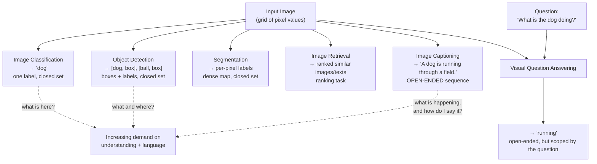
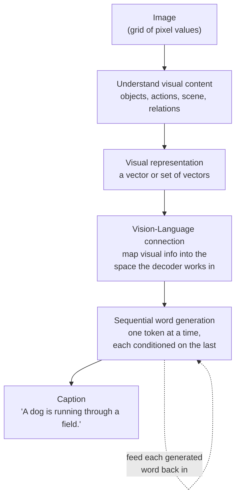
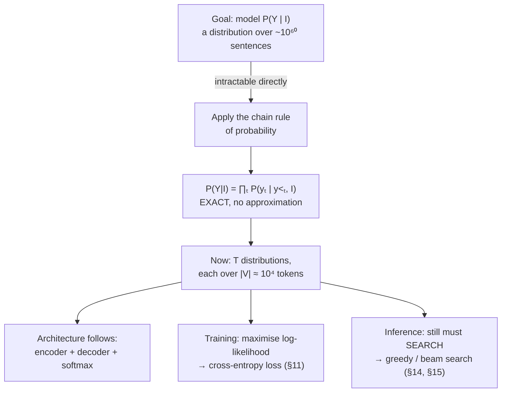

# Image Captioning Models — From Pixels to Sentences

> A complete study note. Read top to bottom the first time. Afterwards, Section 36 (Complete Mental Model) and Section 39 (Cheat Sheet) are the fastest way to reload the whole picture.

---

## Table of Contents

1. [The Fundamental Problem](#1-the-fundamental-problem)
2. [Prerequisites](#2-prerequisites)
3. [Core Intuition](#3-core-intuition)
4. [Formal Problem Definition](#4-formal-problem-definition)
5. [The First Architecture: Encoder → Decoder](#5-the-first-architecture-encoder--decoder)
6. [Image Encoder](#6-image-encoder)
7. [Language Decoder](#7-language-decoder)
8. [RNN-Based Captioning](#8-rnn-based-captioning)
9. [CNN + LSTM Captioning](#9-cnn--lstm-captioning)
10. [Training the Captioning Model](#10-training-the-captioning-model)
11. [Cross-Entropy Loss](#11-cross-entropy-loss)
12. [Training Algorithm](#12-training-algorithm)
13. [Inference / Caption Generation](#13-inference--caption-generation)
14. [Greedy Decoding](#14-greedy-decoding)
15. [Beam Search](#15-beam-search)
16. [Attention Mechanism](#16-attention-mechanism)
17. [Attention Mathematics](#17-attention-mathematics)
18. [Transformer-Based Image Captioning](#18-transformer-based-image-captioning)
19. [Vision Transformers for Captioning](#19-vision-transformers-for-captioning)
20. [Encoder-Decoder Transformer Architecture](#20-encoder-decoder-transformer-architecture)
21. [Modern Vision-Language Models](#21-modern-vision-language-models)
22. [Image-Text Alignment](#22-image-text-alignment)
23. [Captioning Objectives](#23-captioning-objectives)
24. [Exposure Bias](#24-exposure-bias)
25. [Hallucination in Image Captioning](#25-hallucination-in-image-captioning)
26. [Evaluation Metrics](#26-evaluation-metrics)
27. [Human Evaluation](#27-human-evaluation)
28. [Datasets](#28-datasets)
29. [Complete End-to-End Training Pipeline](#29-complete-end-to-end-training-pipeline)
30. [Complete End-to-End Inference Pipeline](#30-complete-end-to-end-inference-pipeline)
31. [Comparing Major Architectures](#31-comparing-major-architectures)
32. [Important Trade-offs](#32-important-trade-offs)
33. [Common Misconceptions](#33-common-misconceptions)
34. [Limitations](#34-limitations)
35. [Advanced Topics](#35-advanced-topics)
36. [Complete Mental Model](#36-complete-mental-model)
37. [Final Concept Map](#37-final-concept-map)
38. [Knowledge Check](#38-knowledge-check)
39. [Final Cheat Sheet](#39-final-cheat-sheet)
40. [References](#40-references)

---

# 1. The Fundamental Problem

> **How can a computer convert pixels into a meaningful sentence?**

Everything in this document is an answer to that one question. Before designing anything, we must understand exactly why it is hard.

## 1.1 What is an image, from a machine's perspective?

To a computer, an image is **a grid of numbers**. Nothing more.

A 224×224 colour photograph is a three-dimensional array of shape $[3, 224, 224]$ — three colour channels (red, green, blue), each a 224×224 grid of intensity values, typically integers from 0 to 255 or floats from 0 to 1. That is $3 \times 224 \times 224 = 150{,}528$ numbers.

The machine does **not** see a dog. It sees something like:

```text
channel R, row 100:   [ 142, 139, 145, 151, 148, 133, 97, 88, ... ]
```

Crucially, these numbers have three properties that shape everything:

1. **They are spatially arranged.** Pixel $(100, 50)$ is next to pixel $(100, 51)$, and that adjacency is meaningful. Nearby pixels are strongly correlated.
2. **They are continuous and dense.** Every position has a value. There are no gaps, no structure markers, no "this is where the dog ends".
3. **They carry no labels.** Nothing in the array says "dog", "grass", or "running". Meaning is *implicit* in the pattern of values.

An image is simultaneously **everything at once** — all the information is present in parallel, with no ordering.

## 1.2 What is a sentence, from a machine's perspective?

A sentence is a **sequence of discrete symbols**.

"A dog is running through a field." becomes, after tokenization, something like:

```text
[<START>, "a", "dog", "is", "running", "through", "a", "field", ".", <END>]
```

and then a sequence of integer indices into a vocabulary:

```text
[1, 5, 892, 14, 2301, 77, 5, 1140, 4, 2]
```

Its properties are almost the opposite of an image's:

1. **It is one-dimensional and ordered.** "Dog bites man" and "man bites dog" use the same tokens and mean different things. Order is meaning.
2. **It is discrete and sparse.** Each position holds exactly one symbol from a finite vocabulary (typically 10,000–50,000 entries). There is no "halfway between *dog* and *cat*" token.
3. **It has explicit structure.** Grammar imposes hard rules. "A dog running is through field the" is not a valid output even though it uses valid words.
4. **It is variable-length.** Captions can be 5 tokens or 30.

## 1.3 Why these are fundamentally different kinds of data

Put the two side by side:

| Property | Image | Sentence |
|---|---|---|
| Structure | 2-D spatial grid | 1-D ordered sequence |
| Values | continuous (intensities) | discrete (vocabulary indices) |
| Size | fixed (after resizing) | variable length |
| Ordering | none — all at once | strict — order is meaning |
| Density | dense (every pixel filled) | sparse (one symbol per slot) |
| Meaning | implicit in patterns | explicit in symbols and grammar |
| Redundancy | very high | low — every word matters |

**This mismatch is the entire problem.** We must build a bridge between a continuous, unordered, spatial object and a discrete, ordered, symbolic one. Neither can be trivially converted to the other.

The bridge, as we will see, is a **shared vector space** — a representation both modalities can be mapped into, where "the concept of a dog" has a location that both the image side and the language side can reach.

## 1.4 Why recognizing objects is not enough

A natural first idea: run an object detector, get a list of objects, and string them together.

```text
Detector output:  [dog: 0.97, grass: 0.91, tree: 0.62]
Naive caption:    "dog grass tree"
```

This fails, and understanding *why* it fails tells you what captioning actually requires:

**1. Missing actions.** The dog is *running*. Actions are not objects — they are properties of, and relations between, objects over space (and, implicitly, time). "Dog, grass" says nothing about running.

**2. Missing relationships.** Is the dog *on* the grass, *behind* the grass, *jumping over* the grass? Detection gives boxes, not relations. "A man riding a horse" and "a man standing next to a horse" contain identical objects.

**3. Missing salience.** A photo may contain 20 detectable objects. A good caption mentions two or three — the ones that matter. Deciding **what to leave out** is a judgment call that detection cannot make.

**4. Missing grammar and fluency.** Humans need a sentence, not a list. That requires articles, verb conjugation, prepositions, and word order.

**5. Missing world knowledge.** A caption may reasonably say "a dog playing fetch" based on a ball in the frame and the dog's posture — an inference about *intent* that no detector outputs.

> **The key realisation:** captioning is not *recognition* followed by *formatting*. It is a **generation** task, in which a model must decide what is worth saying and then say it well. Recognition is necessary but nowhere near sufficient.

## 1.5 Why both vision and language are required

Consider what happens if either side is weak:

| Strong vision, weak language | Weak vision, strong language |
|---|---|
| Correct objects, broken sentences | Fluent, confident, and **wrong** |
| "dog grass running field" | "A beautiful golden retriever plays happily in the park" — for an image of a cat |

The second failure mode is far more dangerous, and it is the root of **hallucination** (§25). A model with a strong language component and weak visual grounding will produce text that *sounds* right — it has learned that dogs are often "golden retrievers" and often "in the park" — while describing something that is not in the image.

**Image captioning sits exactly at the intersection.** The vision side must supply grounded facts; the language side must turn those facts into a well-formed sentence; and the connection between them must be tight enough that the language is constrained by the vision rather than by prior statistics about what captions usually say.

## 1.6 Related tasks, and how captioning differs

It is worth placing captioning among its neighbours, because the differences reveal what is special about it.

| Task | Input | Output | Output type |
|---|---|---|---|
| **Image classification** | image | one label from a fixed set | single discrete choice |
| **Object detection** | image | list of (box, label, score) | structured, fixed vocabulary |
| **Semantic segmentation** | image | per-pixel label map | dense, fixed vocabulary |
| **Image retrieval** | image or text query | ranked list of matches | ranking over a database |
| **Image captioning** | image | free-form sentence | **open-ended generated sequence** |
| **Visual question answering (VQA)** | image + question | answer | short text, conditioned on a question |

The decisive difference: **classification, detection, and segmentation all choose from a closed set. Captioning generates from an open-ended space.** With a vocabulary of 10,000 tokens and a caption length of 15, the output space has roughly $10^{60}$ possibilities. There is no "correct answer" to select — a sentence must be *constructed*.

And unlike VQA, captioning has **no question to narrow the scope**. VQA is told what to look at ("What colour is the car?"). Captioning must decide for itself what is worth describing. That makes it both harder and more open to disagreement about what counts as correct.



## 1.7 What makes captioning genuinely difficult — summary

| Difficulty | Why |
|---|---|
| **Modality gap** | Continuous spatial grid vs discrete ordered symbols |
| **Open-ended output** | Astronomically large output space; no answer to select |
| **No single correct answer** | Many valid captions describe the same image |
| **Requires relations, not just objects** | Actions and spatial relations carry most of the meaning |
| **Requires salience judgment** | Deciding what *not* to say |
| **Requires fluency** | Output must be grammatical natural language |
| **Fluency can mask error** | A wrong caption can be perfectly well-formed |
| **Evaluation is hard** | Automatic metrics compare against a few references and miss valid paraphrases |

Keep this table in mind — Sections 25, 26 and 34 are largely about the last three rows.

---

# 2. Prerequisites

Only the concepts actually needed. Each follows the same pattern: simple explanation → formal definition → small example → why captioning needs it.

## 2.A Computer Vision Prerequisites

### 2.A.1 Pixels

**Simple.** The smallest unit of an image — one coloured dot, described by numbers.

**Formal.** For a colour image, a pixel at position $(i,j)$ is a triple $(r, g, b)$ with each component in $[0,255]$ (or normalised to $[0,1]$).

**Example.** $(255, 0, 0)$ is pure red. $(128,128,128)$ is mid-grey. $(0,0,0)$ is black.

**Why captioning needs it.** Pixels are the raw input — the only thing the model actually receives. Every visual concept the model ever uses is built up from these numbers by learned transformations.

### 2.A.2 Image tensors, channels, spatial dimensions

**Simple.** An image is stored as a multi-dimensional box of numbers.

**Formal.** An image tensor has shape $[C, H, W]$:
- $C$ = **channels** (3 for RGB; 1 for greyscale; but in intermediate network layers $C$ can be 64, 256, 2048…)
- $H$ = **height** in pixels
- $W$ = **width** in pixels

A *batch* of images has shape $[B, C, H, W]$.

**Example.** A batch of 32 RGB images at 224×224 has shape $[32, 3, 224, 224]$ — 4.8 million numbers.

**Why captioning needs it.** Shapes are how you track what is happening inside the model. The whole captioning pipeline is a series of shape transformations: $[3,224,224] \to [2048,7,7] \to [49, 2048] \to$ language. Being able to read those shapes tells you what information is available at each stage.

**An important distinction.** Early channels correspond to *colour*. Deeper channels correspond to *learned features* — channel 137 in a deep layer might respond to "fur texture". The word "channel" means "one feature map", not "one colour", once you are past the input layer.

### 2.A.3 Convolution

**Simple.** Slide a small window over the image and, at each position, compute a weighted sum of the pixels under it. Doing this with a well-chosen set of weights detects a specific pattern.

**Formal.** For input $X$ and a kernel $K$ of size $k \times k$, the output at position $(i,j)$ is:

$$
(X * K)(i,j) = \sum_{m=0}^{k-1}\sum_{n=0}^{k-1} X(i+m,\; j+n)\cdot K(m,n)
$$

The kernel weights $K$ are **learned**, not designed.

**Example.** A 3×3 vertical-edge detector:

$$
K = \begin{bmatrix} -1 & 0 & 1 \\ -1 & 0 & 1 \\ -1 & 0 & 1 \end{bmatrix}
$$

Apply it to a region that is dark on the left and bright on the right, and the output is large and positive. Apply it to a uniform region and the output is zero (the weights cancel). The kernel *responds* to vertical edges.

**Why captioning needs it.** Convolution gives two properties that make vision learnable:

- **Locality.** A pattern is detected from nearby pixels, matching how visual structure actually works.
- **Weight sharing.** The *same* kernel is applied everywhere, so "an edge is an edge" regardless of position. This makes the model **translation-equivariant** — a dog in the corner is detected by the same weights as a dog in the centre.

Without weight sharing, a network would need to learn "dog" separately for every possible position — hopelessly data-inefficient.

### 2.A.4 Feature maps

**Simple.** The output of applying one kernel across the whole image: a map showing *where* that pattern was found.

**Formal.** Applying $C_{\text{out}}$ kernels to an input of shape $[C_{\text{in}}, H, W]$ gives an output of shape $[C_{\text{out}}, H', W']$. Each of the $C_{\text{out}}$ slices is one feature map.

**Example.** A layer with 64 kernels produces 64 feature maps. Map #12 might light up at horizontal edges; map #37 at a particular colour blob.

**Why captioning needs it.** Feature maps **preserve spatial layout**. The value at position $(i,j)$ of a feature map corresponds to a region of the original image. This is what makes visual attention possible (§16) — the model can point at *where* in the image a feature was found, which is exactly what is needed to align "dog" in the caption with the dog in the picture.

### 2.A.5 Pooling

**Simple.** Shrink a feature map by summarising each small region with a single number.

**Formal.**
- **Max pooling** over a $2\times2$ window: output = maximum of the four values.
- **Average pooling**: output = their mean.
- **Global average pooling**: average over the *entire* spatial extent, collapsing $[C,H,W]$ to $[C]$.

**Example.** $2\times2$ max pooling on

$$\begin{bmatrix} 1 & 3 \\ 2 & 8\end{bmatrix} \;\to\; 8$$

**Why captioning needs it.** Two roles:

1. **Progressive downsampling** in the CNN, so deeper layers cover larger regions of the image with the same kernel size (growing the *receptive field*).
2. **Global average pooling is how the classic CNN+LSTM model creates its single image vector** — collapsing $[2048, 7, 7]$ into a $2048$-dimensional vector. **And that collapse is exactly the bottleneck that attention was invented to remove** (§16). Remember this; it is the hinge of the whole architectural story.

### 2.A.6 CNNs and hierarchical visual representation

**Simple.** Stack convolution + nonlinearity + pooling repeatedly. Each stack builds more abstract features from the previous ones.

**Formal.** A CNN computes

$$
h_0 = I, \qquad h_\ell = \text{Pool}\big(\sigma(W_\ell * h_{\ell-1} + b_\ell)\big)
$$

where $*$ is convolution, $\sigma$ a nonlinearity such as ReLU ($\max(0,z)$), and $W_\ell, b_\ell$ are learned.

**Example — what emerges at each depth (this is empirically observed, not designed):**

```text
Layer 1–2   → edges, colour gradients, simple orientations
Layer 3–5   → textures, corners, repeated patterns (fur, grass, brick)
Layer 6–10  → object parts (eyes, wheels, legs, windows)
Layer 11+   → whole objects and scene-level semantics (dog, beach, kitchen)
```

**Why captioning needs it.** **Deep-layer features are close to the level of abstraction that words operate at.** A word like "dog" corresponds to a semantic concept, not an edge. The CNN's job in a captioning system is to climb from pixels to a level of abstraction where a language model can consume the result. Section 6 develops this.

### 2.A.7 Learned visual representations and transfer learning

**Simple.** A CNN trained on a large labelled dataset learns generally useful visual features that can be reused for other tasks.

**Formal.** Train a CNN on ImageNet classification, then discard the final classification layer and use the penultimate activations as a general-purpose feature vector $v \in \mathbb{R}^{d}$ (e.g. $d=2048$ for ResNet-50).

**Why captioning needs it.** Captioning datasets are small — COCO has ~120k images, ImageNet has 1.4M, and web-scale image-text datasets have billions. Training a visual encoder from scratch on 120k images produces weak features. **Almost every captioning system starts from a pretrained visual encoder.** This is not an optimisation; it is a necessity. The quality of your captions is bounded by the quality of your visual features.

## 2.B Natural Language Processing Prerequisites

### 2.B.1 Tokens and vocabulary

**Simple.** Text is chopped into small pieces called tokens, and each distinct token gets a number.

**Formal.** A **vocabulary** $V$ is a finite set of tokens. A **tokenizer** maps a string to a sequence of indices into $V$. Modern systems use **subword** tokenization (BPE, WordPiece), where common words are single tokens and rare words split into pieces.

**Example.**

```text
"A dog is running."
  → ["a", "dog", "is", "running", "."]         (word-level)
  → [5, 892, 14, 2301, 4]                       (indices)

"unbelievable"
  → ["un", "believ", "able"]                    (subword)
```

**Why captioning needs it.** The decoder must output a choice from a finite set at each step. $|V|$ determines the size of the final output layer and therefore the shape of every probability distribution the model produces. Subword tokenization matters because it guarantees **no word is ever unrepresentable** — a rare breed name can always be spelled out from pieces, avoiding the `<UNK>` token that plagued early word-level captioning systems.

**Special tokens** you will see constantly:

| Token | Purpose |
|---|---|
| `<START>` (or `<BOS>`) | Signals the decoder to begin. Gives step 1 something to condition on. |
| `<END>` (or `<EOS>`) | The model emits this to say "the caption is complete". |
| `<PAD>` | Fills short sequences so a batch has uniform length; masked out of the loss. |
| `<UNK>` | Stands in for out-of-vocabulary words (mostly obsolete with subwords). |

### 2.B.2 Token embeddings

**Simple.** Turn each token index into a vector of learned numbers, so that similar words get similar vectors.

**Formal.** An embedding matrix $E \in \mathbb{R}^{|V| \times d}$. Token $i$ maps to row $E_i \in \mathbb{R}^{d}$. The matrix is learned by gradient descent along with everything else.

**Example.** With $d = 4$ (real models use 256–4096):

```text
"dog"   → [ 0.21, -0.43,  0.88,  0.12]
"puppy" → [ 0.19, -0.40,  0.91,  0.15]     ← close to "dog"
"car"   → [-0.77,  0.52, -0.11,  0.63]     ← far from "dog"
```

**Why captioning needs it.** Three reasons:

1. **Indices are meaningless as numbers.** Token 892 ("dog") is not "more" than token 891. Feeding raw indices to a network is nonsense. Embeddings give tokens a usable numeric form.
2. **They create a similarity structure.** The model can generalise: having learned something about "dog", it partially transfers to "puppy".
3. **Most importantly for us: embeddings put words in a continuous vector space — the same kind of space that image features live in.** This is the mathematical basis of the bridge between modalities. Without it, there would be nowhere for vision and language to meet.

### 2.B.3 Sequence representation and context

**Simple.** A sentence is represented as a list of embedding vectors; the meaning of each word depends on the words around it.

**Formal.** A sequence of $T$ tokens becomes a tensor of shape $[T, d]$. A **contextual** representation replaces each token's vector with one that depends on the whole sequence.

**Example.** "bank" in "river bank" versus "savings bank" — same token, same static embedding, but the correct meaning differs. Contextual models (RNNs, Transformers) produce different vectors for the two cases.

**Why captioning needs it.** The decoder must track what it has already said. After generating "A dog is", the state of the model must encode that a verb is expected next and the subject is singular. That is contextual representation doing its job.

### 2.B.4 Language modeling

**Simple.** A model that predicts the next word given the words so far.

**Formal.** A language model assigns

$$
P(y_t \mid y_1, \dots, y_{t-1})
$$

— a probability distribution over the entire vocabulary for the next token.

**Example.** After "A dog is", a good language model produces something like:

```text
P("running")  = 0.31
P("sitting")  = 0.18
P("sleeping") = 0.09
P("playing")  = 0.08
P("purple")   = 0.00003
...            (sums to 1.0 over all |V| tokens)
```

**Why captioning needs it.** **A caption generator is a language model with an extra input.** Everything a language model knows — grammar, word order, plausible phrasing — is exactly what makes a caption fluent. The only change captioning makes is to condition on an image as well:

$$
P(y_t \mid y_{<t}) \;\longrightarrow\; P(y_t \mid y_{<t}, I)
$$

Keep this framing. It explains both the strength of captioning models (they inherit fluency from language modeling) and their characteristic failure (they also inherit *language priors*, which is where hallucination comes from — §25).

### 2.B.5 Autoregressive generation

**Simple.** Generate one token, feed it back in, generate the next, and repeat.

**Formal.** At step $t$, sample or select $y_t$ from $P(y_t\mid y_{<t}, I)$, append it to the sequence, and continue until `<END>`.

**Example.**

```text
step 1: input [<START>]                 → output "A"
step 2: input [<START>, A]              → output "dog"
step 3: input [<START>, A, dog]         → output "is"
step 4: input [<START>, A, dog, is]     → output "running"
...
step n: input [...]                     → output <END>   → stop
```

**Why captioning needs it.** It is the mechanism by which a *fixed-size* model produces a *variable-length* output. It also handles the fundamental constraint that word choice at step $t$ depends on what was said at steps $1..t-1$ — "A dog" must be followed by a singular verb.

**And it has a cost worth naming now:** generation is inherently **sequential**. You cannot produce token 5 before token 4. This is why inference is slow relative to training, and it is the origin of both **exposure bias** (§24) and the need for smarter decoding strategies (§14, §15).

## 2.C Deep Learning Prerequisites

### 2.C.1 Neural networks and parameters

**Simple.** A large function built from layers of weighted sums and simple nonlinearities, whose weights are adjusted to fit data.

**Formal.** For a feed-forward layer: $h = \sigma(Wx + b)$, where $W$ and $b$ are learned **parameters** and $\sigma$ is a nonlinearity. The complete set of parameters is written $\theta$.

**Example.** A layer mapping $\mathbb{R}^{2048} \to \mathbb{R}^{512}$ has $2048\times512 + 512 \approx 1.05$M parameters.

**Why captioning needs it.** Every learned component — CNN, embeddings, RNN/Transformer, attention, output layer — is parameterised this way, and all of them are trained together by the same mechanism.

### 2.C.2 Forward pass

**Simple.** Push the input through the network to get an output.

**Formal.** Compute $\hat{y} = f_\theta(x)$ by evaluating each layer in order.

**Why captioning needs it.** One forward pass of a captioning model at training time consumes an image plus the ground-truth caption and produces a probability distribution over the vocabulary *at every position*. At inference time, one forward pass produces the distribution for a *single* next token. That asymmetry is important (§13).

### 2.C.3 Loss functions

**Simple.** A single number measuring how wrong the model's output is. Lower is better.

**Formal.** $\mathcal{L}(\theta) = \ell(f_\theta(x), y)$ for a target $y$. For captioning, $\ell$ is cross-entropy (§11).

**Why captioning needs it.** The loss defines what "good" means. Note this carefully: captioning's standard loss rewards **matching the reference caption token by token**, not "being a correct description". Those are not the same thing, and the gap between them explains much of Sections 23, 25, and 26.

### 2.C.4 Backpropagation and gradient descent

**Simple.** Work out how much each parameter contributed to the error, then nudge each one in the direction that reduces it.

**Formal.** Backpropagation applies the chain rule to compute $\nabla_\theta \mathcal{L}$ efficiently. Gradient descent then updates:

$$
\theta \leftarrow \theta - \eta \nabla_\theta \mathcal{L}
$$

with learning rate $\eta$. In practice: minibatches and an adaptive optimiser (Adam).

**Example.** $\mathcal{L}=\theta^2$, $\nabla\mathcal{L} = 2\theta$. From $\theta=3$ with $\eta=0.1$: $\theta \leftarrow 3 - 0.6 = 2.4$.

**Why captioning needs it.** Gradients flow **end-to-end**: from the loss on a predicted word, back through the decoder, back through the attention mechanism, and (if unfrozen) back into the CNN. This is what makes the visual encoder learn features that are useful *for describing*, not merely for classifying. The connection between vision and language is learned, not designed.

### 2.C.5 Training vs inference

| | Training | Inference |
|---|---|---|
| Caption available? | Yes (ground truth) | No |
| Previous token comes from | the reference caption | the model's own output |
| All positions computed | in parallel (Transformers) | one at a time |
| Gradients | computed and applied | none |
| Output | a loss value | a caption |

**Why captioning needs it.** This distinction is so consequential that it has its own section (§24, exposure bias). Training and inference feed the decoder *different things*, and the mismatch is a genuine source of error.

## 2.D Probability Prerequisites

### 2.D.1 Probability distribution

**Simple.** An assignment of chances to each possible outcome, summing to 1.

**Formal.** Over a finite set $V$: $P(v) \ge 0$ for all $v\in V$, and $\sum_{v\in V}P(v)=1$.

**Example.** Over a 4-word vocabulary: $P = [0.7, 0.2, 0.08, 0.02]$.

**Why captioning needs it.** The decoder's output at every step **is** a probability distribution over the vocabulary, produced by a **softmax**:

$$
P(y_t = v) = \frac{\exp(z_v)}{\sum_{v'\in V}\exp(z_{v'})}
$$

where $z_v$ is the raw score (**logit**) for token $v$. Softmax turns arbitrary real scores into a valid distribution — all positive, summing to 1.

### 2.D.2 Conditional probability

**Simple.** The chance of something, given that you already know something else.

**Formal.** $P(A\mid B) = \dfrac{P(A,B)}{P(B)}$.

**Example.** $P(\text{"running"})$ is low overall. $P(\text{"running"} \mid \text{"A dog is"})$ is much higher.

**Why captioning needs it.** Captioning is *entirely* a conditional probability problem. Every quantity we compute has the form $P(y_t \mid y_{<t}, I)$ — conditioned on both the words so far and the image. Section 4 builds the whole formalism from this one idea.

### 2.D.3 Maximum likelihood

**Simple.** Pick the parameters that make the observed data as probable as possible.

**Formal.**

$$
\theta^\star = \arg\max_\theta \sum_{i} \log P_\theta\big(Y^{(i)} \mid I^{(i)}\big)
$$

over all image-caption pairs $(I^{(i)}, Y^{(i)})$ in the dataset. We use logs because they turn products into sums (numerically stable, and the product of many probabilities underflows to zero).

**Why captioning needs it.** This *is* the standard training objective. Cross-entropy loss (§11) is exactly negative log-likelihood, so "minimise the loss" and "maximise the probability of the reference captions" are the same instruction.

### 2.D.4 Cross-entropy

**Simple.** A measure of how surprised the model is by the correct answer. Low when it assigned high probability to the truth.

**Formal.** For a true distribution $p$ and a predicted distribution $q$ over $V$:

$$
H(p,q) = -\sum_{v\in V} p(v)\log q(v)
$$

When the truth is a single known token $y$ (so $p$ is one-hot), this collapses to:

$$
H(p,q) = -\log q(y)
$$

**Example.** Truth is "dog". If the model gave $P(\text{dog})=0.9$, loss $= -\log 0.9 = 0.105$. If it gave $P(\text{dog})=0.1$, loss $= -\log 0.1 = 2.303$. Twenty times worse.

**Why captioning needs it.** It is the per-token loss, summed over the caption. Section 11 works through this in detail, including why the $-\log$ shape is the right choice.

## 2.E Prerequisite → usage map

| Prerequisite | Where it is used |
|---|---|
| Pixels, tensors, channels | The model's raw input (§6) |
| Convolution, feature maps | CNN visual encoder (§6) |
| Pooling (esp. global average) | Creating the single image vector — **and the bottleneck attention fixes** (§9, §16) |
| Hierarchical CNN features | Why deep layers connect to words (§6) |
| Pretrained visual encoders | Why captioning works at all on small datasets (§6, §21) |
| Tokens, vocabulary | Decoder output space (§7) |
| Token embeddings | The shared vector space where vision meets language (§7, §22) |
| Language modeling | The decoder's core competence — and its prior-driven failure mode (§7, §25) |
| Autoregressive generation | The generation mechanism; cause of exposure bias (§7, §13, §24) |
| Softmax, distributions | Every decoder output (§7, §11) |
| Conditional probability | The formal problem statement (§4) |
| Maximum likelihood | The training objective (§10, §23) |
| Cross-entropy | The loss function (§11) |
| Backprop, gradient descent | End-to-end learning of the vision-language link (§12) |
| Training vs inference | Exposure bias (§24) |

---

# 3. Core Intuition

Put all mathematics aside. This section is the idea.

## 3.1 The chain of transformations

```text
Image
  ↓
Understand visual content
  ↓
Create visual representation
  ↓
Connect visual information with language
  ↓
Generate words sequentially
  ↓
Caption
```

Each arrow solves a specific problem:

| Arrow | Problem it solves |
|---|---|
| Image → understand content | Raw pixels carry no meaning; we need features that correspond to concepts |
| Understand → representation | The understanding must be in a *numeric form* a language model can consume |
| Representation → connect to language | Vision vectors and word vectors live in different spaces; they must be aligned |
| Connect → generate sequentially | The output is a variable-length ordered sequence, so it must be built step by step |
| Generate → caption | Assemble the tokens into a sentence |



## 3.2 A worked example

**Input image:** a dog running through grass.
**Target caption:** *"A dog is running through a field."*

Walk through everything the model must get right:

**1. Identify the main object: "dog".**
The CNN must produce features that, somewhere in their 2048 dimensions, encode "dog-ness" — four legs, fur, a snout, a canine body plan. This is the recognition part, and it is the easiest part.

**2. Identify the action: "running".**
Much harder than recognition. From a *single still image*, the model must infer motion from posture: legs extended, body stretched, perhaps motion blur, ears back. There is no motion in a still image — only evidence of it. This is inference, not detection.

**3. Identify the setting: "field" / "grass".**
The background must be recognised as a *scene type*, not just a green texture. Note it chose "field" rather than "grass" — a judgment about how to describe it.

**4. Understand the relationship: the dog is *in/through* the field.**
Not "a dog next to a field" or "a field on a dog". The spatial relationship — the dog is surrounded by, and moving across, the grass — must be extracted and rendered as the preposition "through".

**5. Decide what to mention.**
The image may also contain: a sky, a tree, a fence, a cloud, a distant building, the dog's collar. A good caption **omits** almost all of it. The model must judge salience.

**6. Produce grammatical English.**
- Article: "A dog", not "Dog".
- Agreement: "A dog **is**", not "A dog **are**".
- Progressive aspect: "is running", which correctly conveys ongoing action.
- Word order: subject, verb, prepositional phrase.

**7. Produce the words in the right order, one at a time.**
It cannot write "running" first and fill in the rest. Each word must be chosen given everything before it.

**8. Know when to stop.**
After "field", it must emit `<END>`. Stopping is a learned decision, not a rule.

> **The essential insight:** steps 1–5 are *vision and reasoning*. Steps 6–8 are *language*. The whole architecture of every captioning system is a way of letting these two halves talk to each other.

## 3.3 Where the two halves meet

Here is the intuition for the bridge, which the rest of the document makes precise.

The CNN converts an image into a vector (or a set of vectors) — say 2048 numbers. Those numbers are meaningless to a human, but they encode the visual content in a form where *similar images produce similar vectors*.

The decoder is a language model. It normally predicts the next word from the previous words. But it can also accept **extra input** — and if we feed it the image vector, its predictions become conditioned on the image.

That is the entire trick:

```text
Ordinary language model:   "A dog is" → P(next word)
Captioning model:          "A dog is" + [image vector] → P(next word)
```

The image vector shifts the probability distribution. Without it, after "A dog is" the model might say "sleeping" (a common thing dogs do). With a vector encoding extended legs and blurred grass, "running" becomes far more probable.

**Training is what makes this work.** By showing the model hundreds of thousands of (image, caption) pairs and penalising it whenever it assigns low probability to the correct next word, gradient descent shapes both the CNN's features *and* the decoder's use of them until the image vector reliably steers generation.

## 3.4 The two failure modes, previewed

This intuition already predicts the two ways captioning goes wrong:

**If the image vector is too weak or too compressed**, the decoder falls back on what captions *usually* say. It generates a fluent, generic, plausible sentence unconstrained by the actual image. That is **hallucination** (§25) — and note that it is a *structural* consequence of combining a strong language model with a weak visual signal.

**If the image vector is a single fixed vector**, it must encode everything at once — every object, action, and relation — and the decoder gets the same vector at every timestep. Intuitively, when generating "dog" the model would rather look at the dog; when generating "field" it would rather look at the grass. It cannot. That limitation is the **bottleneck** that motivates **attention** (§16).

Both problems, and their solutions, follow directly from the intuition in this section.

---

# 4. Formal Problem Definition

Now we state precisely what we are building.

## 4.1 Symbols

Define everything before using it:

| Symbol | Meaning |
|---|---|
| $I$ | The **input image**. Formally a tensor in $\mathbb{R}^{3\times H\times W}$. |
| $V$ | The **vocabulary** — the finite set of tokens the model can emit. $\|V\|$ is its size, typically 10,000–50,000. |
| $y_t$ | The **token at position $t$**, an element of $V$. |
| $T$ | The **length** of the caption in tokens (variable — decided by the model at inference). |
| $Y$ | The **complete caption**, $Y = (y_1, y_2, \dots, y_T)$, a sequence of $T$ tokens. |
| $y_{<t}$ | Shorthand for all tokens before position $t$: $(y_1,\dots,y_{t-1})$. |
| $\theta$ | The model's learned parameters. |
| $P_\theta(\cdot)$ | A probability computed by the model with parameters $\theta$. |

By convention $y_0 = \texttt{<START>}$ and the caption ends when the model emits $\texttt{<END>}$.

## 4.2 The goal

Given an image $I$, we want to produce a caption $Y$ that is a good description.

Formally, we model the conditional distribution

$$
P(Y \mid I)
$$

**In plain English:** "the probability that this particular sentence is a description of this particular image."

Note carefully that this is a distribution over *entire sentences*. That is the source of the difficulty: with $|V| = 10{,}000$ and $T = 15$, there are $10{,}000^{15} = 10^{60}$ possible sequences. We cannot enumerate them, cannot store the distribution, and cannot directly compute a softmax over them.

**We need a way to break this enormous distribution into manageable pieces.** That is what the next subsection does.

## 4.3 Autoregressive decomposition — derived

Start from the definition of conditional probability (§2.D.2), which can be rearranged as the **chain rule of probability**:

$$
P(A, B) = P(A)\,P(B \mid A)
$$

Extend it to three variables:

$$
P(A,B,C) = P(A)\,P(B\mid A)\,P(C\mid A,B)
$$

The pattern is clear: the joint probability of a sequence equals the product of each element's probability given all previous elements. Applying this to our caption $Y = (y_1,\dots,y_T)$, with everything additionally conditioned on the image $I$:

$$
P(Y\mid I) = P(y_1\mid I)\cdot P(y_2\mid y_1, I)\cdot P(y_3\mid y_1,y_2,I)\cdots P(y_T\mid y_1,\dots,y_{T-1},I)
$$

which we write compactly as:

$$
\boxed{\;P(Y\mid I) = \prod_{t=1}^{T} P(y_t \mid y_{<t}, I)\;}
$$

**Note that this is exact.** No approximation, no assumption. It is a consequence of the chain rule alone.

## 4.4 What this equation means in plain English

> **"The probability of the whole caption is the product of the probabilities of each word, where each word's probability is computed knowing the image and all the words that came before it."**

Read term by term for our example caption:

| Term | In words |
|---|---|
| $P(y_1 = \text{"A"} \mid I)$ | Given the image, how likely is "A" as the first word? |
| $P(y_2 = \text{"dog"} \mid \text{"A"}, I)$ | Given the image and that we started with "A", how likely is "dog"? |
| $P(y_3 = \text{"is"} \mid \text{"A dog"}, I)$ | Given the image and "A dog", how likely is "is"? |
| $\vdots$ | $\vdots$ |
| $P(y_T = \texttt{<END>} \mid \text{"A dog is running through a field."}, I)$ | Is the caption complete? |

## 4.5 Why this decomposition is the key move

It converts one impossible problem into $T$ easy ones.

| | Before decomposition | After decomposition |
|---|---|---|
| What must be modelled | a distribution over $10^{60}$ sentences | $T$ distributions over $10^4$ tokens |
| Output layer size | impossible | $\|V\|$ — a single softmax |
| Can we compute it? | no | yes, trivially |
| Training signal | one number per sentence | one loss term per token — much richer |

The last row deserves emphasis. Because the decomposition gives us a prediction at *every position*, a single caption of 15 tokens provides **15 separate supervised learning signals**, not one. That density of supervision is a large part of why these models train efficiently.

**And this is where the architecture comes from.** The equation tells us exactly what to build:

- Something that processes $I$ into a usable form → the **image encoder** (§6).
- Something that consumes $y_{<t}$ and produces a distribution over $V$ → the **language decoder** (§7).
- A way for the image information to reach the decoder → the **vision-language connection** (§16–§20).
- A loop over $t$ → **autoregressive generation** (§13).

Every architecture in this document is a different answer to "how should we implement $P_\theta(y_t\mid y_{<t}, I)$?"

## 4.6 Training and inference, stated formally

**Training (maximum likelihood, §2.D.3).** Given a dataset $\mathcal{D} = \{(I^{(i)}, Y^{(i)})\}$, find:

$$
\theta^\star = \arg\max_\theta \sum_{i}\sum_{t=1}^{T_i} \log P_\theta\big(y_t^{(i)} \mid y_{<t}^{(i)}, I^{(i)}\big)
$$

The inner sum is the log of the product from §4.3 — logs turn the product into a sum.

**Inference.** Ideally we would find the most probable caption:

$$
\hat{Y} = \arg\max_{Y} P_\theta(Y\mid I)
$$

But this maximisation is over all $10^{60}$ sequences — **intractable**. We therefore use approximate search: greedy decoding (§14) or beam search (§15).

> **This gap is worth flagging now.** The decomposition made *training* exact and easy, but it did **not** make *finding the best sentence* easy. Scoring a given sentence is cheap; searching for the best one is not. Sections 14 and 15 are entirely about living with that.



---
<!-- SECTION-MARKER -->
